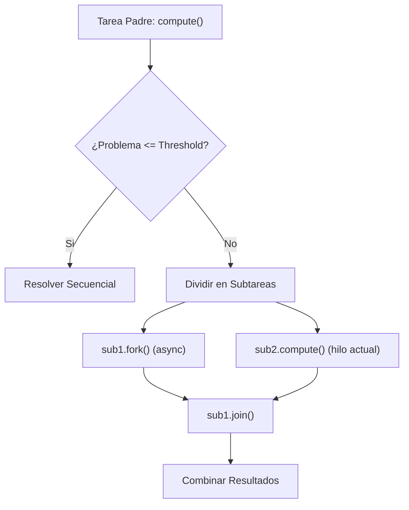

# Plantilla y Ejemplo de Ficha Tecnica (Cheat Sheet)

Guia de referencia que muestra la anatomia exacta de un apunte de alta densidad para las materias de `2026-2`.

Reglas visuales obligatorias:
- Cero tablas de contenidos (TOC).
- Enlace de retorno siempre normalizado a `[← Volver a Curso.md](../Curso.md)`.
- Uso de viñetas telegraficas, formulas KaTeX, tablas compactas y diagramas Mermaid.

---

## Ejemplo Completo de Ficha Tecnica

```markdown
[← Volver a Curso.md](../Curso.md)

# Framework Fork-Join y Concurrencia de Tareas

> **Materia**: Paralela y Distribuida | **Fuente**: [Capitulo2_Concurrencia.pdf](../Documentos/Capitulo2_Concurrencia.pdf)  
> `ForkJoinPool`, `RecursiveTask<V>`, `RecursiveAction`, `Work-Stealing`, `Threshold`

---

## 1. Modelo Computacional y Primitivas

- **Fork**: Bifurcacion asincrona que despacha una subtarea independiente al pool (`async`).
- **Join**: Barrera de sincronizacion que bloquea el hilo invocador hasta obtener el resultado de la subtarea.
- **Umbral Secuencial (Threshold)**: Tamaño critico de grano por debajo del cual no se divide; se resuelve secuencialmente.
  - Regla practica: 10.000 a 100.000 operaciones basicas por tarea hoja para amortizar el sobrecosto de gestion.
  - Riesgo: Umbrales demasiado pequeños ($< 100$) degradan el rendimiento por saturacion del scheduler.



---

## 2. Tipos de Tarea: RecursiveAction vs. RecursiveTask

| Propiedad | `RecursiveAction` | `RecursiveTask<V>` |
| :--- | :--- | :--- |
| **Tipo de Retorno** | `void` (sin valor devuelto) | Objeto generico parametrizado `V` |
| **Metodo de Computo** | `protected void compute()` | `protected V compute()` |
| **Patron de Uso** | Modificaciones in-place (ej. ordenamiento de arreglos) | Reducciones matematicas, conteo y busqueda |

---

## 3. Mecanismo de Work-Stealing

- **Estructura Interna**: Cada hilo de trabajo (*worker thread*) posee una cola de doble extremo (**Deque**).
- **Politica de Acceso**:
  - **Cabeza (LIFO)**: El hilo propietario extrae tareas de la cabeza; maximiza localidad temporal y reduce fallos de cache L1/L2.
  - **Cola (FIFO)**: Hilos ociosos roban tareas del fondo de colas ajenas; reduce la contencion de cerrojos y balancea la carga global.

---

## 4. Puntos Criticos de Examen y Trampas Frecuentes

- **Optimizacion de Hilos en Bifurcacion**:
  - Error tipico: Invocar `sub1.fork()` y `sub2.fork()`.
  - Patron correcto: Invocar `sub1.fork()` y luego `sub2.compute()` directamente en el hilo actual. Ahorra la creacion y asignacion de un hilo extra en el pool.
- **Intercepcion de Excepciones**:
  - `compute()` no puede lanzar excepciones chequeadas directamente; se envuelven en `RuntimeException` o se recuperan en el punto de `join()`.
```
