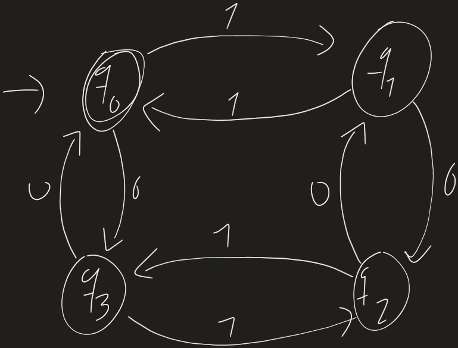

# Apuntes: Autómatas Finitos Deterministas (AFD) y Análisis de Modelo

---

## 1. ¿Qué es un Autómata Finito Determinista (AFD)?

Un **Autómata Finito Determinista** (AFD, o *DFA* por sus siglas en inglés: *Deterministic Finite Automaton*) es un modelo matemático de computación que representa una máquina de estados abstracta con memoria finita. 

Se denomina **determinista** porque para cada estado en el que se encuentre la máquina y para cada símbolo de entrada recibido, existe **una y exactamente una** transición hacia un siguiente estado. No existen transiciones espontáneas (vacías o $\epsilon$) ni bifurcaciones ambiguas.

### 1.1 Definición Formal (La 5-tupla)

Formalmente, un AFD se define como una tupla de cinco elementos:

$$M = (Q, \Sigma, \delta, q_0, F)$$

Donde:
1. **$Q$**: Conjunto finito y no vacío de **estados**.
2. **$\Sigma$**: Conjunto finito y no vacío de símbolos de entrada, conocido como **alfabeto**.
3. **$\delta$**: **Función de transición**, definida como:
   $$\delta: Q \times \Sigma \to Q$$
   Dado un estado actual $q \in Q$ y un símbolo $a \in \Sigma$, $\delta(q, a)$ devuelve el único estado siguiente.
4. **$q_0$**: **Estado inicial** ($q_0 \in Q$), donde inicia la lectura de la cadena.
5. **$F$**: Conjunto de **estados finales o de aceptación** ($F \subseteq Q$). Si al terminar de leer la cadena el autómata se detiene en un estado $q \in F$, la cadena es aceptada.

---

### 1.2 Función de Transición Extendida ($\hat{\delta}$ o $\delta^*$)

Para procesar cadenas completas en lugar de símbolos individuales, se extiende $\delta$ a una función $\hat{\delta}: Q \times \Sigma^* \to Q$ definida inductivamente:

- **Caso base:** $\hat{\delta}(q, \epsilon) = q$ (con $\epsilon$ como la cadena vacía).
- **Paso inductivo:** Para toda cadena $w = xa$ (con $x \in \Sigma^*$ y $a \in \Sigma$):
  $$\hat{\delta}(q, xa) = \delta(\hat{\delta}(q, x), a)$$

### 1.3 Lenguaje Reconocido por un AFD

El lenguaje regular $L(M)$ aceptado por un AFD $M$ es el conjunto de todas las cadenas sobre $\Sigma$ que conducen desde el estado inicial a un estado de aceptación:

$$L(M) = \{ w \in \Sigma^* \mid \hat{\delta}(q_0, w) \in F \}$$

---

## 2. Análisis del Autómata de la Imagen (`image.png`)

A continuación se realiza el análisis técnico y descriptivo del autómata manuscrito que se encuentra en el archivo `image.png`.

---

### 2.1 Componentes Identificados

A partir del diagrama de transición:

1. **Estados ($Q$):**
   $$Q = \{q_0, q_1, q_2, q_3\}$$
   Existen 4 estados organizados en una disposición cuadrangular simétrica.

2. **Estado Inicial ($q_0$):**
   El estado $q_0$ posee la flecha de entrada sin origen (`→ q0`), por lo que es el punto de inicio de cualquier cómputo.

3. **Estados de Aceptación ($F$):**
   $$F = \{q_0\}$$
   $q_0$ es el único estado con **doble círculo concéntrico**, lo que indica que es el único estado de aceptación.

4. **Alfabeto ($\Sigma$):**
   $$\Sigma = \{0, 1\}$$
   Es un alfabeto binario compuesto exclusivamente por los dígitos `0` y `1`.

---

### 2.2 Tabla de Transiciones ($\delta$)

Observando minuciosamente cada arista y su dirección:

| Estado Actual ($q$) | Entrada `0` | Entrada `1` | ¿Es Aceptación? |
| :---: | :---: | :---: | :---: |
| $\rightarrow * \mathbf{q_0}$ | $q_3$ | $q_1$ | **Sí** (Estado inicial y final) |
| $\mathbf{q_1}$ | $q_2$ | $q_0$ | No |
| $\mathbf{q_2}$ | $q_1$ | $q_3$ | No |
| $\mathbf{q_3}$ | $q_0$ | $q_2$ | No |

#### Observación de Simetría en las Transiciones:
- Los movimientos **horizontales** ($q_0 \leftrightarrow q_1$ y $q_3 \leftrightarrow q_2$) son activados por el símbolo **`1`**.
- Los movimientos **verticales** ($q_0 \leftrightarrow q_3$ y $q_1 \leftrightarrow q_2$) son activados por el símbolo **`0`**.

---

### 2.3 Semántica y Significado de los Estados

Cada estado del autómata almacena en su memoria la **paridad** (par o impar) de la cantidad de ceros (`0`) y la cantidad de unos (`1`) leídos hasta el momento:

| Estado | Cantidad de `0`s leídos | Cantidad de `1`s leídos | Condición de Paridad |
| :---: | :---: | :---: | :---: |
| **$q_0$** | **Par** | **Par** | $|w|_0 \equiv 0 \pmod 2 \quad\land\quad |w|_1 \equiv 0 \pmod 2$ |
| **$q_1$** | **Par** | **Impar** | $|w|_0 \equiv 0 \pmod 2 \quad\land\quad |w|_1 \equiv 1 \pmod 2$ |
| **$q_2$** | **Impar** | **Impar** | $|w|_0 \equiv 1 \pmod 2 \quad\land\quad |w|_1 \equiv 1 \pmod 2$ |
| **$q_3$** | **Impar** | **Par** | $|w|_0 \equiv 1 \pmod 2 \quad\land\quad |w|_1 \equiv 0 \pmod 2$ |

- Al leer un `0`: cambia la paridad de los ceros (transición vertical entre $q_0 \leftrightarrow q_3$ o entre $q_1 \leftrightarrow q_2$).
- Al leer un `1`: cambia la paridad de los unos (transición horizontal entre $q_0 \leftrightarrow q_1$ o entre $q_3 \leftrightarrow q_2$).

---

### 2.4 ¿Qué hace este Autómata? (Lenguaje que Reconoce)

> **Propósito del autómata:**
> Este autómata reconoce el lenguaje de todas las cadenas binarias que contienen un **número par de ceros ('0') Y un número par de unos ('1')**.

Formalmente:
$$L = \left\{ w \in \{0, 1\}^* \;\middle|\; |w|_0 \equiv 0 \pmod 2 \;\;\text{y}\;\; |w|_1 \equiv 0 \pmod 2 \right\}$$

#### Casos clave:
- **Cadena vacía ($\epsilon$):** Contiene 0 ceros y 0 unos. Como 0 es un número par, el autómata comienza en $q_0$ y no se mueve; dado que $q_0 \in F$, la cadena vacía **es aceptada**.
- **Cadenas de longitud impar:** Jamás pueden ser aceptadas, pues la suma de dos enteros pares siempre da un número par.
- **Ejemplos aceptados:** `""` (vacía), `"00"`, `"11"`, `"0101"`, `"1010"`, `"0110"`, `"1001"`, `"0011"`, `"1100"`.
- **Ejemplos rechazados:** `"0"` (impar de 0s), `"1"` (impar de 1s), `"01"` (impar de 0s e impar de 1s), `"000"`, `"111"`, `"001"`.

---

### 2.5 Trazas de Ejecución de Ejemplo

#### Ejemplo 1: Cadena `"0101"` (2 ceros y 2 unos $\rightarrow$ Aceptada)
1. Inicio en $q_0$ (par 0s, par 1s).
2. Lee `'0'`: $\delta(q_0, 0) = q_3$ (impar 0s, par 1s).
3. Lee `'1'`: $\delta(q_3, 1) = q_2$ (impar 0s, impar 1s).
4. Lee `'0'`: $\delta(q_2, 0) = q_1$ (par 0s, impar 1s).
5. Lee `'1'`: $\delta(q_1, 1) = q_0$ (par 0s, par 1s).
6. Fin de cadena en $q_0 \in F$ $\implies$ **CADENA ACEPTADA**.

#### Ejemplo 2: Cadena `"100"` (2 ceros y 1 uno $\rightarrow$ Rechazada)
1. Inicio en $q_0$.
2. Lee `'1'`: $\delta(q_0, 1) = q_1$.
3. Lee `'0'`: $\delta(q_1, 0) = q_2$.
4. Lee `'0'`: $\delta(q_2, 0) = q_1$.
5. Fin de cadena en $q_1 \notin F$ $\implies$ **CADENA RECHAZADA**.
