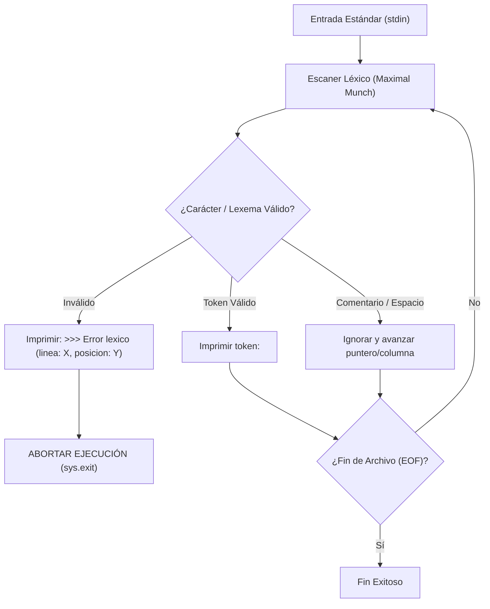

[← Volver a Curso.md](../Curso.md)

# Práctica 1: Analizador Léxico - Lenguaje Lua

> **Materia**: Lenguajes de Programación | **Fuente**: [Analizador Léxico - Lenguaje Lua.pdf](./Analizador%20L%C3%A9xico%20-%20Lenguaje%20Lua.pdf)  
> **Términos Core**: `analizador léxico`, `token`, `lexema`, `palabras reservadas`, `id`, `tkn_num`, `tkn_str`, `subcadena más larga`, `error léxico`, `fila y columna`

---

## 1. Parámetros Operativos de la Práctica

- **Lenguaje de Implementación**: Python 3.9 (estándar de la materia).
- **Canal de Entrada**: Entrada estándar (`stdin` / consola). Código fuente Lua en texto plano.
- **Canal de Salida**: Salida estándar (`stdout` / consola). Lista de tokens línea por línea.
- **Alcance**: Fase léxica pura. No validar sintaxis ni semántica.
- **Indexación de Coordenadas**: Todas las posiciones `fila` y `columna` inician en $1$ (`1-based`).
- **Política de Falla (Fail-Fast)**: Ante el primer error léxico, emitir los tokens previos acumulados, imprimir el mensaje de error normalizado y **abortar inmediatamente** la ejecución.



---

## 2. Catálogo Completo de Tokens Válidos en Lua

### A. Palabras Reservadas (Keywords)
- **Formato de Salida**: `<palabra_reservada,fila,columna>` (el tipo y el lexema coinciden; no llevan prefijo `tkn_`).
- **Propiedades Léxicas**:
  - **Sensibilidad**: Estrictamente **case sensitive** (`while` es reservada, pero `WHILE` o `While` son identificadores `id`).
  - **Prioridad**: Tienen precedencia sobre los identificadores (`id`). Toda coincidencia exacta con este conjunto se clasifica como palabra reservada.
  - **Discrepancia `return` / `retornar`**: La especificación general exige `<palabra_reservada,f,c>`, pero la pág. 2 muestra `return` $\rightarrow$ `<retornar,6,6>`. Se debe permitir soporte configurable.

| Lexema | Tipo Token de Salida | Propósito y Semántica en Lua |
| :--- | :--- | :--- |
| `and` | `<and,f,c>` | Operador lógico de conjunción con cortocircuito |
| `break` | `<break,f,c>` | Sentencia de interrupción de ciclos (`for`, `while`, `repeat`) |
| `do` | `<do,f,c>` | Apertura de bloques explícitos y delimitador en ciclos `while`/`for` |
| `else` | `<else,f,c>` | Rama alternativa en sentencias condicionales `if` |
| `elseif` | `<elseif,f,c>` | Rama condicional intermedia encadenada |
| `end` | `<end,f,c>` | Clausura de bloques de control, funciones y condiciones |
| `false` | `<false,f,c>` | Literal booleano de falsedad |
| `for` | `<for,f,c>` | Encabezado de bucle numérico o genérico |
| `function` | `<function,f,c>` | Declaración y definición de funciones y clausuras |
| `global` | `<global,f,c>` | Declaración de variables globales (**Novedad Lua 5.5**, pág. 1) |
| `goto` | `<goto,f,c>` | Salto incondicional hacia etiquetas `::etiqueta::` |
| `if` | `<if,f,c>` | Apertura de bifurcación condicional |
| `in` | `<in,f,c>` | Delimitador de iteradores en ciclos `for` genéricos |
| `local` | `<local,f,c>` | Declaración de ámbito léxico local para variables |
| `nil` | `<nil,f,c>` | Literal de valor nulo / ausencia de valor |
| `not` | `<not,f,c>` | Operador lógico unario de negación |
| `or` | `<or,f,c>` | Operador lógico de disyunción con cortocircuito |
| `print` | `<print,f,c>` | Salida estándar (**Palabra reservada requerida por la práctica**, págs. 1-4) |
| `repeat` | `<repeat,f,c>` | Apertura de bucle post-prueba (repite hasta `until`) |
| `return` | `<return,f,c>` / `<retornar,f,c>` | Retorno de valores desde un bloque o función |
| `then` | `<then,f,c>` | Delimitador del cuerpo tras la condición en `if`/`elseif` |
| `true` | `<true,f,c>` | Literal booleano de verdad |
| `until` | `<until,f,c>` | Condición de terminación del bucle `repeat` |
| `while` | `<while,f,c>` | Encabezado de bucle condicional pre-prueba |

---

### B. Identificadores (`id`)
- **Formato de Salida**: `<id,lexema,fila,columna>`
- **Patrón Regex**: `[a-zA-Z_][a-zA-Z0-9_]*` (excluyendo el conjunto de palabras reservadas).
- **Propiedades Léxicas**:
  - Inicia obligatoriamente con una letra latina (`a-z`, `A-Z`) o un guión bajo (`_`).
  - Caracteres subsiguientes pueden ser letras, dígitos arábigos (`0-9`) o guiones bajos.
  - Distingue mayúsculas y minúsculas: `PRINT` $\rightarrow$ `<id,PRINT,1,1>`; `Mi_Variable` $\rightarrow$ `<id,Mi_Variable,3,7>`.
  - Prohibido el uso de caracteres extendidos o acentuados (ej. `ñ`, `á` disparan error léxico).

---

### C. Literales Numéricos (`tkn_num`)
- **Formato de Salida**: `<tkn_num,lexema,fila,columna>`
- **Patrón Regex**: `[0-9]+(\.[0-9]+)?` (enteros y números en punto flotante).
- **Propiedades Léxicas**:
  - **Lexema de salida**: Cadena exacta de dígitos y su punto decimal si aplica (ej. `16`, `3.145`, `120.075`).
  - **Sin signo integrado**: Lua no incorpora el signo en el token numérico. El `-` se reconoce como un token independiente previo `<tkn_minus,f,c>` y el valor numérico como `<tkn_num,valor,f,c+1>`.
  - **Ausencia de signo positivo**: Lua no admite prefijo `+` para números; si precede a un dígito, `+` se emite como `<tkn_plus,f,c>`.
  - **Desambiguación de Puntos Decimales Consecutivos (Maximal Munch)**:
    - En secuencias como `120.075.389`:
      1. Se consume el prefijo numérico más largo: `120.075` $\rightarrow$ `<tkn_num,120.075,f,c1>`
      2. El siguiente carácter es `.`, que no forma número con `389` (no inicia en dígito): se emite `<tkn_period,f,c2>`
      3. Se procesa el número restante: `389` $\rightarrow$ `<tkn_num,389,f,c3>`

---

### D. Literales de Cadena de Caracteres (`tkn_str`)
- **Formato de Salida**: `<tkn_str,lexema,fila,columna>`
- **Delimitadores**: Comillas dobles (`"..."`) o comillas simples (`'...'`).
- **Propiedades Léxicas**:
  - **Exclusión de Delimitadores**: El lexema reportado contiene únicamente el texto interno **sin las comillas exteriores**.
  - **Fidelidad**: Conserva de forma idéntica mayúsculas, minúsculas, espacios y caracteres especiales internos.
  - **Comillas anidadas directas**:
    - Delimitador `"` permite `'` sin escapar: `"Eres 'mayor' de edad"` $\rightarrow$ `lexema = Eres 'mayor' de edad`.
    - Delimitador `'` permite `"` sin escapar: `'Texto con "comillas"'` $\rightarrow$ `lexema = Texto con "comillas"`.
  - **Secuencias de escape**: Comillas del mismo tipo del delimitador deben estar escapadas (`\"` o `\'`). Se admiten escapes estándar (`\\`, `\n`, `\t`).

---

### E. Operadores Aritméticos
Formato: `<tkn_nombre_token,fila,columna>`

| Símbolo | Nombre de Token (`nombre_token`) | Propiedades y Reglas de Precedencia Léxica |
| :---: | :--- | :--- |
| `+` | `tkn_plus` | Operador binario de adición |
| `-` | `tkn_minus` | Operador de sustracción o negación unaria |
| `*` | `tkn_times` | Operador de multiplicación |
| `/` | `tkn_div` | División en punto flotante |
| `//` | `tkn_floor_div` | División entera truncada. **Prioridad sobre `/`** (Maximal Munch) |
| `%` | `tkn_mod` | Operador de módulo / residuo |
| `^` | `tkn_power` | Operador de exponenciación |

---

### F. Operadores Relacionales
Formato: `<tkn_nombre_token,fila,columna>`

| Símbolo | Nombre de Token (`nombre_token`) | Propiedades y Reglas de Precedencia Léxica |
| :---: | :--- | :--- |
| `==` | `tkn_equal` | Comparación de igualdad. **Prioridad sobre `=`** |
| `~=` | `tkn_neq` | Comparación de desigualdad. **Prioridad sobre `~`** |
| `<` | `tkn_less` | Comparación menor estricto |
| `<=` | `tkn_leq` | Comparación menor o igual. **Prioridad sobre `<`** |
| `>` | `tkn_greater` | Comparación mayor estricto |
| `>=` | `tkn_geq` | Comparación mayor o igual. **Prioridad sobre `>`** |

---

### G. Operadores Bit a Bit (Bitwise)
Formato: `<tkn_nombre_token,fila,columna>`

| Símbolo | Nombre de Token (`nombre_token`) | Propiedades y Reglas de Precedencia Léxica |
| :---: | :--- | :--- |
| `&` | `tkn_bit_and` | Conjunción bit a bit |
| `\|` | `tkn_bit_or` | Disyunción bit a bit |
| `~` | `tkn_bitex_or` | Disyunción exclusiva (XOR) o negación unaria (NOT bit a bit) |
| `>>` | `tkn_right_shift` | Desplazamiento de bits a la derecha. **Prioridad sobre `>`** |
| `<<` | `tkn_left_shift` | Desplazamiento de bits a la izquierda. **Prioridad sobre `<`** |

---

### H. Operadores de Secuencias, Cadenas y Etiquetas
Formato: `<tkn_nombre_token,fila,columna>`

| Símbolo | Nombre de Token (`nombre_token`) | Propiedades y Reglas de Precedencia Léxica |
| :---: | :--- | :--- |
| `#` | `tkn_length` | Operador unario de longitud (cadenas y tablas) |
| `..` | `tkn_concat` | Operador binario de concatenación de cadenas |
| `...` | `tkn_varargs` | Especificador de argumentos variables. **Prioridad sobre `..` y `.`** |
| `::` | `tkn_goto` | Delimitador de etiquetas de salto (`::etiqueta::`). **Prioridad sobre `:`** |
| `=` | `tkn_assign` | Operador de asignación destructiva |

---

### I. Símbolos de Puntuación y Delimitadores
Formato: `<tkn_nombre_token,fila,columna>`

| Símbolo | Nombre de Token (`nombre_token`) | Propiedades y Función Estructural |
| :---: | :--- | :--- |
| `;` | `tkn_semicolon` | Separador de sentencias opcional |
| `:` | `tkn_colon` | Separador para invocación de métodos con paso de `self` |
| `,` | `tkn_comma` | Separador de elementos en listas, tablas y argumentos |
| `.` | `tkn_period` | Selector de campos de tabla o componente decimal |
| `(` | `tkn_opening_par` | Apertura de expresiones y listas de argumentos |
| `)` | `tkn_closing_par` | Clausura de expresiones y listas de argumentos |
| `[` | `tkn_opening_bra` | Apertura de indexación de tablas y claves explícitas |
| `]` | `tkn_closing_bra` | Clausura de indexación de tablas y claves explícitas |
| `{` | `tkn_opening_key` | Apertura de constructor de tablas |
| `}` | `tkn_closing_key` | Clausura de constructor de tablas |

---

## 3. Elementos No-Token (Descartables)

- **Espacios en Blanco**: Espacio estándar (` `), tabulaciones (`\t`), retornos de carro (`\r`) y saltos de línea (`\n`). No generan token; actualizan las coordenadas `(fila, columna)`.
- **Comentarios de una Línea**:
  - Inician con `--` y consumen todos los caracteres hasta el final de la línea actual (`\n`).
  - Ejemplo: `nil -- comentario` emite `<nil,1,1>` y descarta el comentario contiguo.
- **Comentarios de Bloque / Multilínea**:
  - Inician con `--[[` y finalizan con `]]`.
  - Pueden extenderse a lo largo de múltiples líneas sin emitir tokens.
  - Actualizan el conteo de filas y resetean la columna correspondiente.

---

## 4. Jerarquía de Maximal Munch (Resolución de Conflictos)

Al analizar caracteres que comparten prefijo, el motor debe aplicar este orden estricto de coincidencia:

```text
1. Comentarios de Bloque:   --[[ ... ]]
2. Comentarios de Línea:    -- ...
3. Puntuación Triple:       ...  (tkn_varargs)
4. Símbolos Dobles:         ..   (tkn_concat)
                            ::   (tkn_goto)
                            //   (tkn_floor_div)
                            ==   (tkn_equal)
                            ~=   (tkn_neq)
                            <=   (tkn_leq)
                            >=   (tkn_geq)
                            >>   (tkn_right_shift)
                            <<   (tkn_left_shift)
5. Símbolos Simples:        . , ; : + - * / % ^ & | ~ # < > = ( ) [ ] { }
```

---

## 5. Especificación del Error Léxico

- **Criterio**: Todo carácter que no encaje en ninguna de las especificaciones anteriores fuera de una cadena o comentario (ej. `@`, `!`, `ñ`, tildes, caracteres especiales no contemplados).
- **Formato Obligatorio**:
  ```text
  >>> Error lexico (linea: X, posicion: Y)
  ```
  Donde `X` = fila (1-based) e `Y` = columna (1-based) del primer carácter ofensivo.
- **Comportamiento Secuencial**:
  1. Se imprimen todos los tokens legítimos reconocidos hasta antes del error.
  2. Se imprime la línea de error léxico con la posición exacta del inicio del carácter no reconocido.
  3. **Aborto total**: No se procesa ningún carácter posterior en el archivo de entrada.
- **Ejemplo con Maximal Munch**:
  - Entrada: `8.9!62834127`
  - Salida:
    ```text
    <tkn_num,8.9,1,1>
    >>> Error lexico (linea: 1, posicion: 4)
    ```
