[← Volver a Curso.md](./Curso.md)

# 03. Método Gráfico de Programación Lineal

> **Fuente**: [03 MÉTODO GRÁFICO_OPTIMIZACIÓN.pdf](../Documentos/03%20M%C3%89TODO%20GR%C3%81FICO_OPTIMIZACI%C3%93N.pdf)  
> **Tema**: Resolución bidimensional de PPL, delimitación de la región factible, evaluación de vértices extremos, análisis de holguras/recursos y taxonomía de soluciones (única, múltiple, no acotada, infactible).

---

## 📌 1. Alcance y Fundamentos del Método Gráfico

- **Alcance dimensional**: Aplicable exclusivamente a modelos de **2 variables de decisión ($X_1, X_2$)** para representación en el plano cartesiano $\mathbb{R}^2$.
- **Procedimiento en dos etapas**:
  1. **Delimitar la Región Factible ($\mathcal{F}$)**: Determinar el polígono/poliedro resultante de la intersección simultánea de todas las restricciones y las condiciones de no negatividad ($X_1 \ge 0, X_2 \ge 0$).
  2. **Determinar la Solución Óptima**: Identificar el vértice o segmento donde la función objetivo alcanza su valor más favorable.

```
[ Graficar Restricciones ] ───> [ Región Factible (Infinidad de Puntos) ] ───> [ Vértices Extremos (Finitos) ] ───> [ Evaluar F.O. (Óptimo) ]
```

### Regla del Semiplano y Punto de Prueba $(0,0)$
Para graficar cada desigualdad $a_1 X_1 + a_2 X_2 \le b$ o $\ge b$:
1. Trazar la recta frontera asociada: $a_1 X_1 + a_2 X_2 = b$ mediante sus intersecciones con los ejes:
   - Corte con eje $X_2$: $(0, \, b / a_2)$ (haciendo $X_1 = 0$).
   - Corte con eje $X_1$: $(b / a_1, \, 0)$ (haciendo $X_2 = 0$).
2. Evaluar el punto de prueba $(0,0)$ en la desigualdad:
   - Si satisface (ej. $0 \le 300$, **Verdadero**): la región factible incluye el semiplano que contiene al origen $(0,0)$ (hacia abajo / izquierda).
   - Si no satisface (ej. $0 \ge 150$, **Falso**): la región factible se aleja del origen (hacia arriba / derecha).
   - *Nota*: Si la recta pasa por el origen ($b=0$), usar como prueba $(1,0)$ o $(0,1)$.

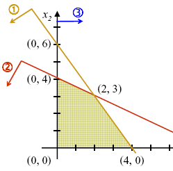
- *La región factible (área sombreada) es la intersección simultánea de todos los semiplanos generados por las restricciones y el primer cuadrante.*

---

## ⚙️ 2. Teoremas y Propiedades Fundamentales de PPL

- **Geometría del conjunto factible**: En un PPL, la región factible es siempre un **conjunto convexo**. Si está acotada, forma un **politopo**; si no está acotada, es un **poliedro convexo**.
- **Optimalidad Global**: En programación lineal no existen óptimos locales aislados: **todo óptimo local es automáticamente un óptimo global**.
- **Teorema Fundamental de los Puntos Extremos**: La solución óptima de un PPL se alcanza siempre en, al menos, **un vértice (punto extremo)** de la región factible.
- **Teorema de Existencia**: Si la región factible está **acotada y no vacía**, el problema siempre tiene al menos una solución óptima (condición suficiente, pero no necesaria).
- **Segmento de Múltiples Óptimos**: Si dos puntos extremos $X_A$ y $X_B$ son óptimos con $Z(X_A) = Z(X_B) = Z^*$, entonces **cualquier combinación lineal convexa** de ellos también es óptima:
  $$X = \alpha X_A + (1 - \alpha) X_B, \quad \forall \alpha \in [0, 1] \implies Z(X) = Z^*$$

---

## 🏷️ 3. Taxonomía de Restricciones y Análisis de Holguras

| Tipo de Restricción | Definición Geométrica | Holgura / Exceso ($s_i / e_i$) | Impacto al Eliminarla |
| :--- | :--- | :---: | :--- |
| **Activa (Ligante)** | Pasa exactamente por el vértice óptimo ($a_1 X_1^* + a_2 X_2^* = b_i$). | **Cero ($0$)** | Altera el vértice óptimo y el valor de $Z^*$. Recurso agotado o cota estricta. |
| **Inactiva (No ligante)** | Delimita la región factible pero **no** toca el vértice óptimo. | **Positivo ($> 0$)** | No afecta la solución óptima actual. Queda recurso sobrante o exceso de meta. |
| **Redundante** | Queda por fuera o detrás de otras restricciones más estrictas. | $> 0$ o no restrictiva | **No altera ni la región factible ni la solución óptima**. Puede eliminarse. |

---

## 📊 4. Taxonomía de Soluciones en Programación Lineal (Los 4 Casos)

| Caso | Condición Geométrica | Comportamiento de la F.O. ($Z$) | Causa Estructural |
| :--- | :--- | :--- | :--- |
| **1. Solución Única** | Un solo vértice extremo maximiza o minimiza la F.O. | Valor finito $Z^*$ alcanzado en un único punto $(X_1^*, X_2^*)$. | La pendiente de la F.O. es distinta a la de todas las restricciones activas en el óptimo. |
| **2. Solución Múltiple** | La línea de isonivel de la F.O. coincide con una arista completa de la frontera factible. | Infinitas soluciones óptimas con idéntico valor $Z^*$. | La pendiente de la F.O. es idéntica a la pendiente de una restricción activa acotante ($m_Z = m_i$). |
| **3. Solución No Acotada** | La región factible es abierta en la dirección de optimización de la F.O. | $Z \to +\infty$ (Maximización) o $Z \to -\infty$ (Minimización). | Ausencia de restricciones que limiten el crecimiento de variables con coeficientes favorables en $Z$. |
| **4. Sin Solución (Infactible)** | La intersección de todas las restricciones es un conjunto vacío ($\mathcal{F} = \emptyset$). | No existe solución posible. | Restricciones mutuamente contradictorias (ej. requerimiento mínimo superior a la capacidad máxima). |

---

### Casos Teóricos de Contraste (Modelo Base)

Dado el modelo base:
$$\max Z = 3X_1 + X_2$$
$$\text{s.a.} \quad -X_1 + X_2 \le 2 \, (C_1), \quad X_1 + X_2 \le 6 \, (C_2), \quad X_1 \le 3 \, (C_3), \quad 2X_1 - X_2 \le 4 \, (C_4), \quad X_1, X_2 \ge 0$$

| Caso | Gráfica Ilustrativa | Diagnóstico Geométrico |
| :---: | :---: | :--- |
| **Solución Única** | 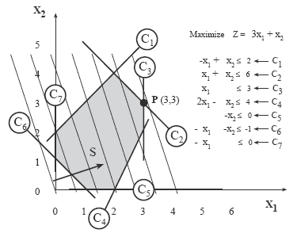 | - El punto $P = (3,3)$ es el último punto de contacto al desplazar la recta de nivel $Z = 3X_1 + X_2$.<br>- **Solución única**: $X^* = (3,3)$ con $Z^* = 12$. |
| **Solución Múltiple** | 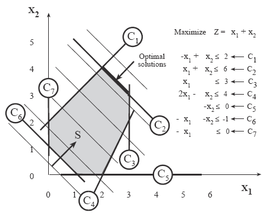 | - Si la F.O. cambia a $\max Z = X_1 + X_2$, su pendiente ($m = -1$) iguala a la de la restricción $C_2: X_1 + X_2 = 6$.<br>- **Infinitos óptimos** sobre todo el segmento entre $(2,4)$ y $(3,3)$ con $Z^* = 6$. |
| **Solución No Acotada** | 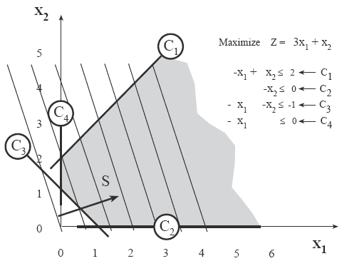 | - Al eliminar las restricciones de tope ($C_2, C_3, C_4$), la región queda abierta hacia el infinito.<br>- La recta de nivel puede desplazarse indefinidamente $\implies Z \to +\infty$. |

---

## 📝 5. Catálogo de Problemas Aplicados Resueltos Paso a Paso

---

### Problema 1: Compañía Sigma (Maximización – Solución Única)
- **Contexto**: Producción mensual de bibliotecas ($X_1$) y escritorios ($X_2$) con precios de venta de \$9.000 y \$10.000. Disponibilidad mensual: 700 m de madera, 800 m de tubo y 900 pliegos de lija.
- **Modelo**:
  $$\max Z = 9.000 X_1 + 10.000 X_2$$
  $$\text{s.a.} \quad 7 X_1 + 10 X_2 \le 700 \quad \text{(Madera)}$$
  $$10 X_1 + 8 X_2 \le 800 \quad \text{(Tubo)}$$
  $$6 X_1 + 15 X_2 \le 900 \quad \text{(Lija)}$$
  $$X_1, X_2 \ge 0$$

- **Puntos de Corte de Restricciones**:
  - Madera: $(0, 70)$ y $(100, 0)$
  - Tubo: $(0, 100)$ y $(80, 0)$
  - Lija: $(0, 60)$ y $(150, 0)$

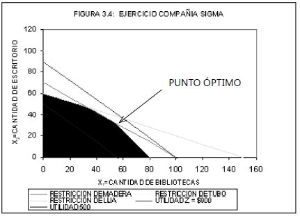
- *Vértice óptimo definido por la intersección de las restricciones de Madera y Tubo.*

- **Cálculo del Vértice Óptimo (Madera $\cap$ Tubo)**:
  $$\begin{cases} 7 X_1 + 10 X_2 = 700 & \times (-10) \\ 10 X_1 + 8 X_2 = 800 & \times (7) \end{cases} \implies -44 X_2 = -1.400 \implies X_2^* = \frac{350}{11} \approx 31{,}82$$
  $$7 X_1 + 10\left(\frac{350}{11}\right) = 700 \implies 7 X_1 = 700 - \frac{3.500}{11} = \frac{4.200}{11} \implies X_1^* = \frac{600}{11} \approx 54{,}55$$
  $$Z^* = 9.000\left(\frac{600}{11}\right) + 10.000\left(\frac{350}{11}\right) = \frac{8.900.000}{11} \approx \$809.090{,}91$$

- **Balance de Recursos**:
  | Recurso | Disponible | Consumo Real | Sobrante (Holgura) | Estado |
  | :--- | :---: | :---: | :---: | :---: |
  | **Madera** | $700$ m | $7(600/11) + 10(350/11) = 700$ | $0$ | **Activa** |
  | **Tubo** | $800$ m | $10(600/11) + 8(350/11) = 800$ | $0$ | **Activa** |
  | **Lija** | $900$ pliegos | $6(600/11) + 15(350/11) = \frac{8.850}{11} \approx 804{,}55$ | $\frac{1.050}{11} \approx 95{,}45$ | **Inactiva** |

---

### Problema 2: Fábrica de Artesanías (Maximización – Solución No Acotada)
- **Contexto**: Producción de bolsos ($X_1$, utilidad \$2.000) y chaquetas ($X_2$, utilidad \$3.000). Consumo: 5 h/bolso y 9 h/chaqueta. Política: no mantener ocio, mínimo 450 h de mano de obra/mes. Mercado: mínimo 20 chaquetas/mes, máximo 30 bolsos/mes.
- **Modelo**:
  $$\max Z = 2.000 X_1 + 3.000 X_2$$
  $$\text{s.a.} \quad 5 X_1 + 9 X_2 \ge 450 \quad \text{(Mano de obra mínima)}$$
  $$X_1 \le 30 \quad \text{(Venta máxima de bolsos)}$$
  $$X_2 \ge 20 \quad \text{(Venta mínima de chaquetas)}$$
  $$X_1, X_2 \ge 0$$

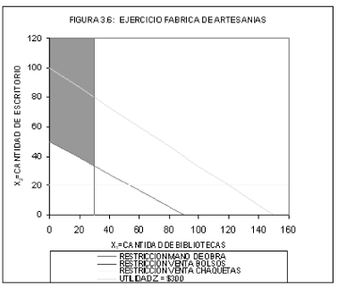
- *La región sombreada está limitada lateralmente por $X_1 \le 30$, pero no tiene límite superior en el eje $X_2$.*

- **Diagnóstico**:
  - $X_1$ está restringido al intervalo $[0, 30]$.
  - $X_2$ carece de cota superior ($X_2 \to +\infty$).
  - Dado que el coeficiente de $X_2$ en la F.O. es $+3.000 > 0$, la utilidad crece sin límite $\implies Z^* \to +\infty$ (**Solución No Acotada**).

---

### Problema 3: Compañía Epsilon (Maximización – Infactible / Sin Solución)
- **Contexto**: Producción semanal de baldosas ($X_1$, utilidad \$5.000/$m^2$) y tabletas ($X_2$, utilidad \$4.000/$m^2$). Disponibilidad: 200 $m^2$ de arena y 240 $m^2$ de cemento. Consumos: baldosa (4 arena, 3 cemento), tableta (5 arena, 8 cemento). Compromiso de venta: mínimo 50 $m^2$ de tableta.
- **Modelo**:
  $$\max Z = 5.000 X_1 + 4.000 X_2$$
  $$\text{s.a.} \quad 4 X_1 + 5 X_2 \le 200 \quad \text{(Arena)}$$
  $$3 X_1 + 8 X_2 \le 240 \quad \text{(Cemento)}$$
  $$X_2 \ge 50 \quad \text{(Demanda mínima de tableta)}$$
  $$X_1, X_2 \ge 0$$

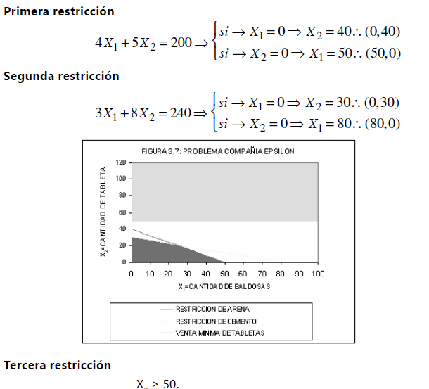
- *Incompatibilidad directa: el área permitida por la arena y el cemento queda por debajo de $X_2 = 30$, mientras la demanda exige $X_2 \ge 50$.*

- **Diagnóstico**:
  - Máxima tableta con arena disponible ($X_1 = 0$): $X_2 \le 200 / 5 = 40$.
  - Máxima tableta con cemento disponible ($X_1 = 0$): $X_2 \le 240 / 8 = 30$.
  - La restricción de demanda exige $X_2 \ge 50$, lo cual contradice ambas capacidades físicas.
  - $\mathcal{F} = \emptyset \implies$ **Problema No Factible (Sin Solución)**.

---

### Problema 4: Criadero "Los Horses" (Minimización – Solución Única)
- **Contexto**: Dieta diaria para caballos basada en matas de pasto ($X_1$, costo \$300/mata) y libras de mineral ($X_2$, costo \$500/libra). Requerimientos mínimos diarios: 200 mg Vitamina A, 160 mg Vitamina B, 150 mg Vitamina C. Aportes: pasto (4 A, 2 B, 5 C), mineral (5 A, 8 B, 3 C).
- **Modelo**:
  $$\min Z = 300 X_1 + 500 X_2$$
  $$\text{s.a.} \quad 4 X_1 + 5 X_2 \ge 200 \quad \text{(Vitamina A)}$$
  $$2 X_1 + 8 X_2 \ge 160 \quad \text{(Vitamina B)}$$
  $$5 X_1 + 3 X_2 \ge 150 \quad \text{(Vitamina C)}$$
  $$X_1, X_2 \ge 0$$

- **Puntos de Corte de Restricciones**:
  - Vitamina A: $(0, 40)$ y $(50, 0)$
  - Vitamina B: $(0, 20)$ y $(80, 0)$
  - Vitamina C: $(0, 50)$ y $(30, 0)$

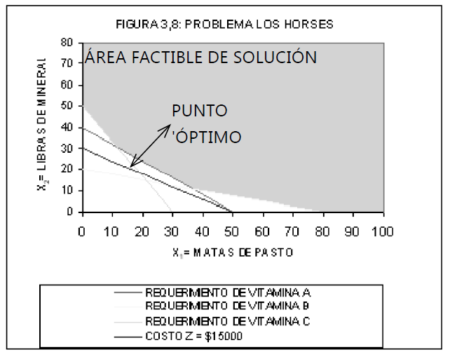
- *Región factible abierta hacia el infinito (problema de mínimos). El vértice óptimo se forma en la intersección de Vitamina A y Vitamina B.*

- **Cálculo del Vértice Óptimo (Vit. A $\cap$ Vit. B)**:
  $$\begin{cases} 4 X_1 + 5 X_2 = 200 \\ 2 X_1 + 8 X_2 = 160 & \times (-2) \end{cases} \implies -11 X_2 = -120 \implies X_2^* = \frac{120}{11} \approx 10{,}91$$
  $$4 X_1 + 5\left(\frac{120}{11}\right) = 200 \implies 4 X_1 = \frac{1.600}{11} \implies X_1^* = \frac{400}{11} \approx 36{,}36$$
  $$Z^* = 300\left(\frac{400}{11}\right) + 500\left(\frac{120}{11}\right) = \frac{180.000}{11} \approx \$16.363{,}64$$

- **Balance de Requerimientos Nutricionales**:
  | Vitamina | Requerimiento Mínimo | Consumo Real | Exceso sobre el Mínimo | Estado |
  | :--- | :---: | :---: | :---: | :---: |
  | **Vitamina A** | $200$ mg | $4(400/11) + 5(120/11) = 200$ | $0$ | **Activa** |
  | **Vitamina B** | $160$ mg | $2(400/11) + 8(120/11) = 160$ | $0$ | **Activa** |
  | **Vitamina C** | $150$ mg | $5(400/11) + 3(120/11) = \frac{2.360}{11} \approx 214{,}55$ | $\frac{710}{11} \approx 64{,}55$ | **Inactiva** |

---

### Problema 5: Combustibles Dextra (Minimización – Soluciones Múltiples)
- **Contexto**: Producción mensual de gasolina ($X_1$, costo \$2.000/gal) y ACPM ($X_2$, costo \$4.000/gal). Consumos y cotas: mínimo 320 horas-hombre (gasolina 4, ACPM 8), mínimo 300 horas-máquina (gasolina 6, ACPM 5), máximo 800 litros de petróleo disponibles (gasolina 8, ACPM 10).
- **Modelo**:
  $$\min Z = 2.000 X_1 + 4.000 X_2$$
  $$\text{s.a.} \quad 4 X_1 + 8 X_2 \ge 320 \quad \text{(Horas-Hombre)}$$
  $$6 X_1 + 5 X_2 \ge 300 \quad \text{(Horas-Máquina)}$$
  $$8 X_1 + 10 X_2 \le 800 \quad \text{(Petróleo)}$$
  $$X_1, X_2 \ge 0$$

- **Puntos de Corte de Restricciones**:
  - Horas-Hombre: $(0, 40)$ y $(80, 0)$ $\implies$ Pendiente $m_1 = -4/8 = -0{,}5$
  - Horas-Máquina: $(0, 60)$ y $(50, 0)$ $\implies$ Pendiente $m_2 = -6/5 = -1{,}2$
  - Petróleo: $(0, 80)$ y $(100, 0)$ $\implies$ Pendiente $m_3 = -8/10 = -0{,}8$
  - Función Objetivo: $\min Z = 2.000 X_1 + 4.000 X_2 \implies$ Pendiente $m_Z = -2.000 / 4.000 = -0{,}5$

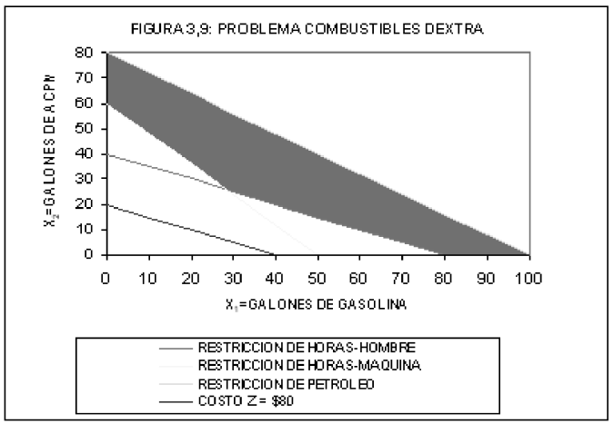
- *La línea de nivel de la función objetivo tiene la misma pendiente que la restricción de Horas-Hombre ($m = -0{,}5$).*

- **Análisis de Optimalidad Alternativa**:
  - Como $m_Z = m_{\text{Horas-Hombre}} = -0{,}5$, la F.O. toca simultáneamente toda la arista frontera comprendida entre los vértices:
    - **Vértice 1 (Horas-Hombre $\cap$ Horas-Máquina)**:
      $$\begin{cases} 4 X_1 + 8 X_2 = 320 & \times (6) \\ 6 X_1 + 5 X_2 = 300 & \times (-4) \end{cases} \implies 28 X_2 = 720 \implies X_2^* = \frac{180}{7} \approx 25{,}71, \quad X_1^* = \frac{200}{7} \approx 28{,}57$$
      $$Z^* = 2.000\left(\frac{200}{7}\right) + 4.000\left(\frac{180}{7}\right) = \frac{1.120.000}{7} = \$160.000$$
    - **Vértice 2 (Horas-Hombre $\cap$ Eje $X_1$)**:
      $$X_1^* = 80, \quad X_2^* = 0 \implies Z^* = 2.000(80) + 4.000(0) = \$160.000$$
  - **Conclusión**: Existen **infinitas soluciones óptimas** a lo largo del segmento de recta:
    $$(X_1, X_2) = \alpha \left(\frac{200}{7}, \frac{180}{7}\right) + (1 - \alpha)(80, 0), \quad \alpha \in [0, 1] \quad \text{con } Z^* = \$160.000$$

---

### Problema 6: Siderurgia Ltda. (Minimización – Solución No Acotada)
- **Contexto**: Aleación con sílice ($X_1$) y aluminio ($X_2$). Sílice cuesta \$3.000/kg. Aluminio cuesta \$5.000/kg pero recibe un **subsidio estatal de \$15.000/kg** $\implies$ Costo neto: $5.000 - 15.000 = -\$10.000$/kg.
- Consumo: mínimo 20 mg de material radiactivo (sílice 5, aluminio 4). Sílice consume 2 L de agua, pero aluminio produce 3 L de agua (consumo neto $-3$); disponibilidad de agua: 6 L. Límite técnico: máximo 8 kg de sílice.
- **Modelo**:
  $$\min Z = 3.000 X_1 - 10.000 X_2$$
  $$\text{s.a.} \quad 5 X_1 + 4 X_2 \ge 20 \quad \text{(Material radiactivo)}$$
  $$2 X_1 - 3 X_2 \le 6 \quad \text{(Balance de agua: } 2X_1 + (-3X_2) \le 6\text{)}$$
  $$X_1 \le 8 \quad \text{(Consumo máximo de sílice)}$$
  $$X_1, X_2 \ge 0$$

- **Puntos de Corte de Restricciones**:
  - Radiactivo: $(0, 5)$ y $(4, 0)$
  - Agua: $(0, -2)$ y $(3, 0)$
  - Sílice: $X_1 = 8$ (recta vertical)

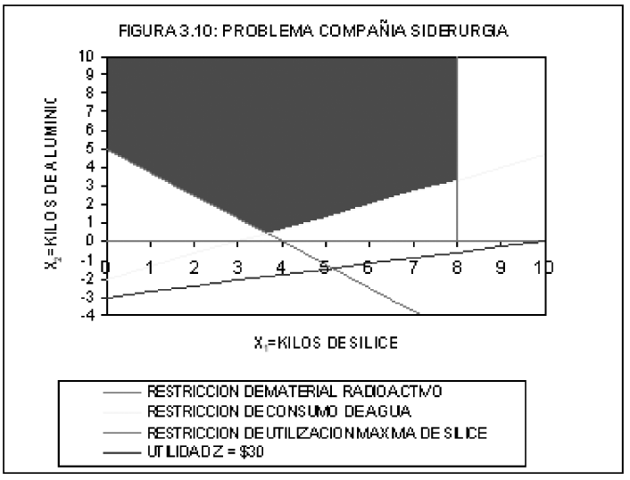
- *La región factible es abierta hacia arriba en la variable $X_2$. Como su coeficiente en Minimización es negativo, el costo decrece hacia $-\infty$.*

- **Diagnóstico**:
  - $X_1$ está acotado en $[0, 8]$.
  - Para cualquier valor admisible de $X_1$, $X_2$ puede aumentar hacia $+\infty$ cumpliendo $X_2 \ge \frac{2X_1 - 6}{3}$.
  - Con coeficiente negativo $-10.000$ en un objetivo de Minimización:
    $$\lim_{X_2 \to +\infty} Z = -\infty \implies \textbf{Solución No Acotada}$$

---

### Problema 7: Fábrica "El Pie Feliz" (Minimización – Infactible / Sin Solución)
- **Contexto**: Producción de calzado: zapatos ($X_1$, costo \$5.000/par) y tenis ($X_2$, costo \$4.000/par). Disponibilidad: 180 metros de cuero. Consumo: zapato 3 m, tenis 6 m. Políticas comerciales: máximo 30 pares de zapatos, mínimo 40 pares de tenis.
- **Modelo**:
  $$\min Z = 5.000 X_1 + 4.000 X_2$$
  $$\text{s.a.} \quad 3 X_1 + 6 X_2 \le 180 \quad \text{(Disponibilidad de cuero)}$$
  $$X_1 \le 30 \quad \text{(Venta máxima de zapatos)}$$
  $$X_2 \ge 40 \quad \text{(Venta mínima de tenis)}$$
  $$X_1, X_2 \ge 0$$

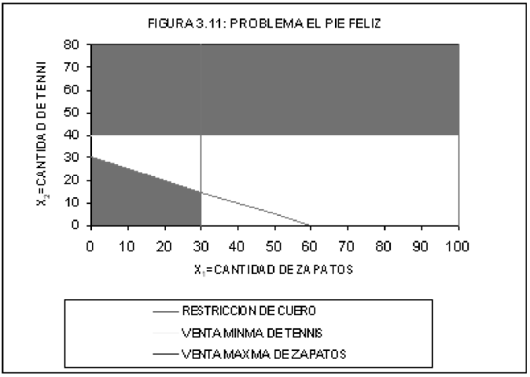
- *Infactibilidad gráfica: el área factible del cuero está acotada superiormente por $X_2 \le 30$, mientras que la restricción de tenis exige la zona sobre $X_2 = 40$.*

- **Diagnóstico**:
  - Con $180$ m de cuero, la producción máxima absoluta de tenis (haciendo $X_1 = 0$) es $X_2 = 180 / 6 = 30$ pares.
  - La meta de mercado exige $X_2 \ge 40$ pares.
  - Los semiplanos no comparten ningún punto en común:
    $$\mathcal{F} = \emptyset \implies \textbf{Problema No Factible (Incompatible)}$$

---

## ⚠️ 6. Puntos Críticos y Trampas Típicas en Exámenes

1. **Paralelismo y Múltiples Óptimos**:
   - Para identificar soluciones múltiples de forma inmediata en una pregunta de examen, calcula la pendiente de la función objetivo:
     $$m_Z = -\frac{c_1}{c_2}$$
   - Compara con las pendientes de las restricciones frontera: $m_i = -\frac{a_{i1}}{a_{i2}}$.
   - Si $m_Z = m_i$ y dicha restricción $i$ forma parte de la frontera óptima, **existen infinitas soluciones**.
2. **"Región No Acotada" $\ne$ "Solución No Acotada"**:
   - Una región factible no acotada **puede tener solución finita única**.
   - Ejemplo: en un problema de **Minimización con restricciones $\ge$** (como *Los Horses*), la región es abierta hacia arriba ($\infty$), pero el mínimo se alcanza en un vértice finito cercano al origen.
   - Para que la solución sea no acotada, la región debe ser abierta **en el sentido de mejora** del gradiente ($\max \to +\infty$ o $\min \to -\infty$).
3. **Punto de Prueba $(0,0)$**:
   - Solo es válido si la recta frontera **no pasa por el origen**.
   - Si la restricción es de la forma $a_1 X_1 - a_2 X_2 \le 0$, el punto $(0,0)$ pertenece a la recta; se debe seleccionar un punto auxiliar como $(1,0)$ o $(0,1)$.
4. **Restricciones con Coeficientes Negativos**:
   - Cuidado al despejar o graficar restricciones como $2X_1 - 3X_2 \le 6$:
     - Si $X_1 = 0 \implies -3X_2 \le 6 \implies X_2 \ge -2$ (el corte con el eje vertical es $(0, -2)$).
     - Al graficar en el primer cuadrante, la frontera corta el eje $X_1$ en $(3,0)$ y el semiplano factible queda delimitado hacia arriba del segmento.
5. **Identificación Rápida de Infactibilidad**:
   - Ocurre comúnmente cuando una restricción de disponibilidad máxima ($\le$) tiene un valor menor al requerido por una restricción de demanda mínima ($\ge$) para la misma variable o combinación.
