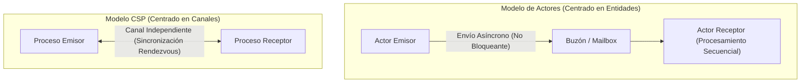
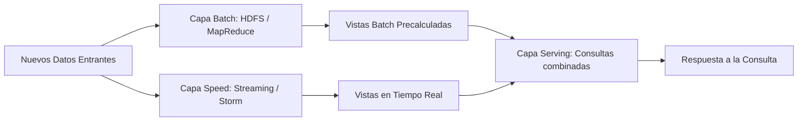

[← Volver a Curso.md](../Curso.md)

# 02. Siete Modelos de Concurrencia (Paul Butcher)

> **Materia**: Paralela y Distribuida | **Fuente**: [02.Siete_modelos_de_concurrencia.pdf](../Pdf/02.Siete_modelos_de_concurrencia.pdf)  
> **Terminos Core**: `concurrencia`, `paralelismo`, `hilos y cerrojos`, `actores`, `csp`, `paralelismo de datos`, `gpgpu`, `arquitectura lambda`, `kappa`, `inmutabilidad`

---

## Fundamentos: Concurrencia vs. Paralelismo

- **Concurrencia**: Múltiples hilos lógicos de control con ejecución intercalada o simultánea.
  - Objetivo: **Capacidad de respuesta** (*responsiveness*), tolerancia a la latencia y diseño desacoplado.
  - Enfoque: Estructura del software y coordinación entre tareas independientes.
- **Paralelismo**: Ejecución física y simultánea de múltiples cómputos en hardware dedicado.
  - Objetivo: **Rendimiento bruto y reducción de tiempo de ejecución**.
  - Enfoque: Rendimiento computacional y paralelización masiva de datos o instrucciones.
- **Regla clave**: Concurrencia $\neq$ Paralelismo (un programa concurrente puede correr en 1 solo núcleo intercalando ráfagas; un cálculo paralelo no siempre requiere hilos lógicos independientes).

### Niveles de Paralelismo en Hardware
- **Nivel de Bit**: Procesamiento de más bits por ciclo de reloj (ej. CPU de 32 bits vs 8 bits suma enteros en 1 ciclo vs 4 ciclos).
- **Nivel de Instrucción (ILP)**: Pipelining, ejecución fuera de orden y ejecución especulativa. *Riesgo*: Introduce no determinismo a bajo nivel.
- **Nivel de Datos (SIMD)**: *Single Instruction, Multiple Data* (vectores, shaders gráficos, GPU).
- **Nivel de Tareas**: Múltiples procesadores o núcleos ejecutando tareas distintas:
  - **Memoria Compartida**: Procesadores acceden a un bus común y memoria centralizada (requiere sincronización con locks/cerrojos).
  - **Memoria Distribuida**: Nodos independientes con memoria local enlazados por red (coordinación obligatoria mediante paso de mensajes).

---

## Metáforas y Resumen de los 7 Modelos de Concurrencia

| # | Modelo | Metáfora de Vehículo | Paradigma Central | Modelo de Memoria | Manejo de Estado |
|---|---|---|---|---|---|
| **1** | **Hilos y Cerrojos** (*Threads & Locks*) | **Ford Modelo T** (primitivo, peligroso y difícil de conducir, pero te traslada y sustenta todo) | Primitivas de sincronización directa sobre hardware (`synchronized`, mutex) | Memoria Compartida | Mutable y compartido |
| **2** | **Programación Funcional** | **Celdas de hidrógeno** (avanzado, limpio, seguro y futurista, aún no adoptado masivamente) | Funciones matemáticas puras sin efectos colaterales y evaluación de expresiones | Compartida / Distribuida | Inmutable (cero mutabilidad) |
| **3** | **La Manera Clojure** | **Vehículo Híbrido** (combina motor eléctrico y a combustión según el contexto) | Separación formal entre **identidad** y **estado** (Atoms, STM) | Solo Memoria Compartida | Inmutable con referencias mutables |
| **4** | **Actores** | **Vehículo Rentado** (fácil de obtener; si se avería no se repara, se cambia por otro: *Let it Crash*) | Aislamiento de procesos que intercambian mensajes asíncronos en buzones (*mailboxes*) | Compartida y Distribuida | Mutable pero **estrictamente aislado** |
| **5** | **CSP** (*Communicating Sequential Processes*) | **Red de Carreteras** (la eficiencia no depende del carro sino de la infraestructura de transporte) | Procesos independientes que intercambian datos a través de **canales de 1ª clase** | Compartida (Go / JVM) | Pasa a través del canal |
| **6** | **Paralelismo de Datos** | **Autopista Multicarril** (muchos vehículos a velocidad moderada transportan un volumen gigantesco) | Paralelismo numérico masivo ejecutado sobre GPU / GPGPU (SIMD, OpenCL) | Jerarquía de GPU | Masivo numérico homogéneo |
| **7** | **Arquitectura Lambda** | **Camión de 18 ruedas + Flota de camionetas** (camión para carga masiva intercontinental; camionetas para entrega inmediata) | Big Data dividido en Capa Batch histórica (MapReduce) + Capa Speed en tiempo real (Streaming) | Distribuida masiva | Dataset inmutable *append-only* |

---

## Desglose Técnico por Modelo

### 1. Hilos y Cerrojos (*Threads and Locks*)
- **Concepto**: Formalización directa de la arquitectura de la máquina física.
- **Herramientas de estudio**: Java clásico (`synchronized`, `ReentrantLock`, `volatile`, paquetes `java.util.concurrent`).
- **Fortalezas**: Máxima eficiencia computacional posible si se programa con rigor; disponible nativamente en casi cualquier lenguaje imperativo.
- **Debilidades**:
  - Difícil de probar, razonar y depurar.
  - Riesgo endémico de condiciones de carrera (*race conditions*), bloqueos mutuos (*deadlocks*) y no determinismo.
  - Restringido únicamente a arquitecturas de memoria compartida (no escala a clúster ni tolerancia a fallos por hardware).

### 2. Programación Funcional
- **Concepto**: Sustituye la mutación de estado global por la evaluación de expresiones puras ("*Si duele el estado mutable compartido, deje de compartirlo y de mutarlo*").
- **Implementación**: Clojure (Lisp dinámico sobre la JVM).
- **Fortalezas**: Elimina de raíz los fallos de concurrencia al no existir estado mutable compartido; soporte directo y natural para paralelismo (*parallel map*, *reducers*).
- **Debilidades**: Mayor presión sobre el recolector de basura (*Garbage Collector*) y costo de copia en estructuras no persistentes.

### 3. La Manera Clojure (*Separating Identity and State*)
- **Dicotomía fundamental**:
  - **Identidad**: Entidad conceptual abstracta que perdura en el tiempo.
  - **Estado**: Valor inmutable de la identidad en un instante puntual.
- **Primitivas**: *Atoms* (cambios atómicos síncronos), *Agents* (cambios asíncronos), *STM* (*Software Transactional Memory* vía `dosync`).
- **Fortalezas**: Resuelve la mutabilidad del mundo real preservando la inmutabilidad de los datos.
- **Regla del Curso**: **¡En este curso NO se estudia La Manera Clojure!**

### 4. Modelo de Actores (*Actor Model*)
- **Premisa**: *"Más orientado a objetos que los objetos mismos"*. Un actor encapsula su estado y la única forma de interacción es el envío de mensajes.
- **Principios operativos**:
  - Dentro de cada actor todo se ejecuta de manera **estrictamente secuencial**.
  - Los mensajes se envían de forma **asíncrona** y se almacenan en la cola del actor (**buzón / mailbox**).
  - Filosofía: *"Let it crash"* (dejar caer el actor ante fallo; los árboles de supervisión gestionan el reinicio).
- **Plataformas**: Erlang / Elixir sobre la máquina virtual BEAM; Akka en Scala/Java. Creado por Carl Hewitt (1973).
- **Fortalezas**: Traspasa con transparencia la barrera local/remota (memoria distribuida, tolerancia a fallos y resiliencia geográfica).
- **Debilidades**: Susceptible a bloqueos lógicos por acoplamiento indirecto; riesgo de saturación/desbordamiento de buzón (*mailbox overflow*); no apto para paralelismo de grano fino.

### 5. CSP (*Communicating Sequential Processes*)
- **Premisa**: Formulada por Tony Hoare (1978). En lugar de enviar mensajes dirigidos a identidades (actores), los procesos secuenciales escriben y leen en **canales de comunicación independientes**.
- **Canales de 1ª Clase**: Los canales se crean, se pasan como argumentos y se comparten entre procesos sin que estos se conozcan entre sí.
- **Sincronización por defecto**: Comunicación síncrona tipo *rendezvous* (el emisor se bloquea hasta que el receptor lee, y viceversa, salvo uso de canales con búfer).
- **Implementación**: Lenguaje Go (`goroutines` y `channels`), Clojure (`core.async`).
- **Debilidades**: Menor soporte histórico para sistemas distribuidos y tolerancia a fallos comparado con Actores.

---

## Comparación Directa: Actores vs. CSP

Ambos esquemas resuelven la concurrencia evitando la memoria compartida directa, pero estructuran el flujo de datos de forma antagónica:

| Dimensión | Modelo de Actores | Communicating Sequential Processes (CSP) |
|---|---|---|
| **Punto central** | La **entidad** (cada actor posee su propio buzón) | El **canal** (el canal es un recurso independiente y de primera clase) |
| **Buzón / Mailbox** | Acoplado al ciclo de vida del actor destinatario | Desacoplado; cualquier proceso con acceso al canal puede leer o escribir |
| **Sincronización** | **Asíncrona** (el emisor despacha el mensaje y continúa) | **Síncrona** por defecto (lectura/escritura actúan como barrera explícita) |
| **Destino del mensaje** | Dirigido a una dirección/ID de actor (*Mailbox*) | Emitido hacia un canal (*Channel*); emisor desconoce quién leerá |
| **Tolerancia a fallos** | Integrada nativamente (*Supervisores* y árboles de fallo) | Debe gestionarse en capas de aplicación / librerías |
| **Distribución** | Nativa en clúster y red geográfica (Erlang/Elixir BEAM) | Diseñado fundamentalmente para una sola máquina / memoria local |

---

## 6. Paralelismo de Datos (GPGPU)

- **Concepto**: Ejecución paralela masiva de una misma instrucción sobre una colección homogénea de datos (*Data-Parallel* / SIMD).
- **Arquitectura de soporte**: GPU (*Graphics Processing Unit*) usada para cómputo general (**GPGPU**).
- **Tecnologías**: OpenCL (*Open Computing Language*), CUDA, OpenGL Compute.
- **Fortalezas**: Rendimiento numérico extremo por ciclo y alta eficiencia de consumo energético frente a CPUs.
- **Debilidades**: No es apto para lógica irregular, bifurcaciones complejas (*branch divergence*) o flujos no numéricos.

---

## 7. Arquitectura Lambda & Evolución hacia Kappa y Unificada

### Arquitectura Lambda (Nathan Marz, 2011)
Diseñada para análisis y reportes sobre macrodatos (*Big Data*), combinando precisión histórica con baja latencia:

1. **Batch Layer**: Mantiene el dataset maestro inmutable (*append-only*). Precalcula vistas batch periódicamente (alta latencia, precisión absoluta).
2. **Speed Layer**: Procesa datos entrantes en tiempo real mediante *stream processing* (baja latencia, compensa el retardo del batch).
3. **Serving Layer**: Indexa las vistas batch y de tiempo real para responder consultas consolidadas.
- **Regla del Curso**: **¡En este curso NO se estudia La Arquitectura Lambda!**

### Evolución Histórica de Arquitecturas Big Data

| Arquitectura | Estructura del Flujo | Ventaja Principal | Debilidad Crítica |
|---|---|---|---|
| **Lambda (2011)** | Dos caminos separados: Batch + Streaming | Datos históricos exactos y respuesta en tiempo real | **Doble código y duplicación de lógica** de negocio |
| **Kappa (2014)** | Un solo camino: Flujo continuo de eventos (*Log/Stream*) con *replay* (Apache Kafka, Flink) | Una sola base de código para todo el sistema | Reprocesar grandes históricos por streaming exige alta capacidad |
| **Unificada Batch + Streaming (Actual)** | Mismo motor y misma API para datos acotados y no acotados (Apache Flink, Spark, Beam) | Cero duplicación de código; un único modelo de procesamiento | Requiere almacenamiento tipo Lakehouse (Delta Lake, Apache Iceberg) |

---

## Puntos Críticos para el Curso y Examen

### Contenidos Descartados del Programa
- **La Manera Clojure** (Atoms, STM).
- **La Arquitectura Lambda**.

### Contenidos que SÍ se Evalúan y Profundizan en el Curso
1. **Fork/Join Framework**: Descomposición recursiva de tareas en sub-tareas paralelas (`RecursiveAction`, `RecursiveTask`).
2. **Algoritmo de Work Stealing**: Balanceo dinámico de carga donde hilos desocupados toman tareas del final de la cola doble (*deque*) de hilos ocupados.
3. **Paralelismo con Flujo de Datos** (*Dataflow*): Ejecución dirigida por la disponibilidad de los datos.

### Preguntas Clave de Evaluación
- **Analogía vehicular**: Demuestra que no hay modelo universal; cada paradigma balancea control, costo de sincronización, tolerancia a fallos y escala operativa.
- **CSP (síncrono) vs. Actores (asíncrono)**: CSP coordina en canales compartidos tipo *rendezvous*; Actores operan de forma desacoplada depositando asíncronamente en buzones.
- **Concurrencia vs. Paralelismo**: Concurrencia estructura múltiples tareas lógicas en progreso intercalado/simultáneo (diseño/atención); Paralelismo ejecuta simultáneamente en hardware dedicado (rendimiento/cómputo).
- **Inmutabilidad y Condiciones de Carrera**: Las carreras exigen **estado mutable compartido**. Sin mutabilidad, múltiples hilos leen concurrentemente sin riesgo de corrupción ni necesidad de cerrojos.
