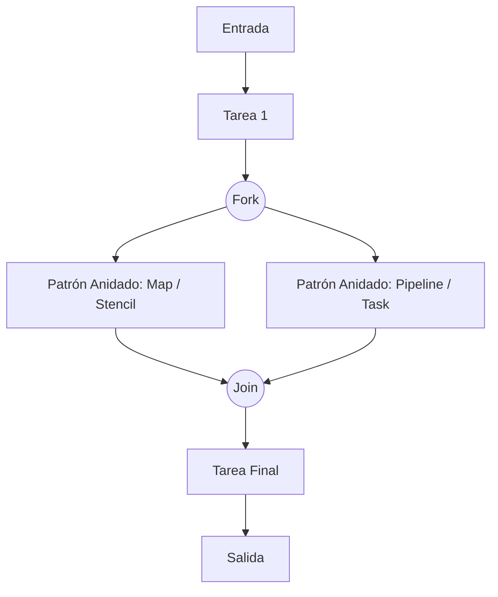
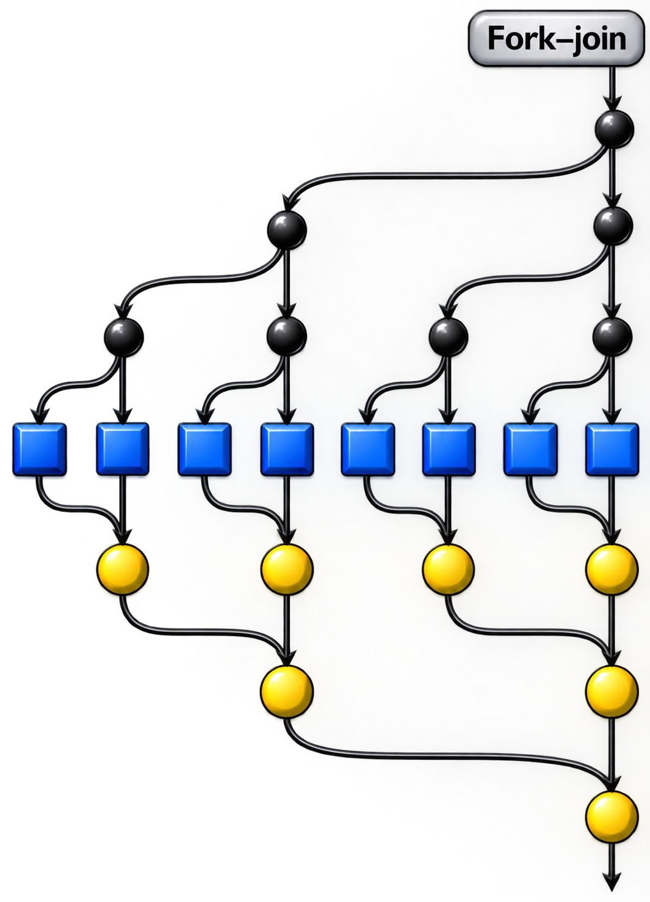
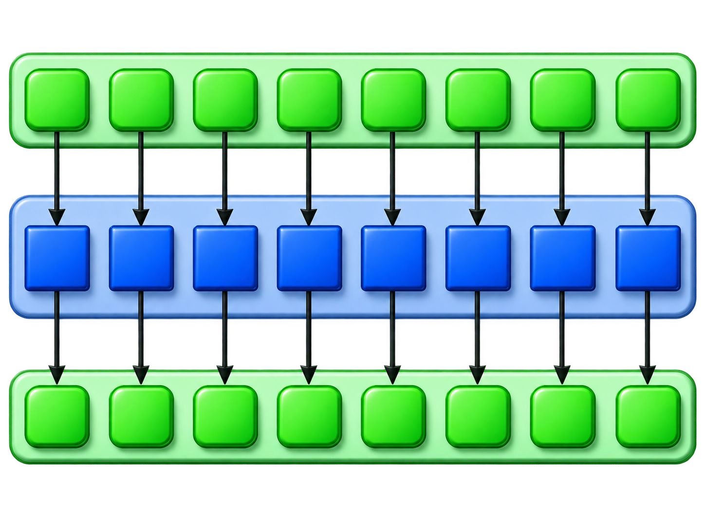
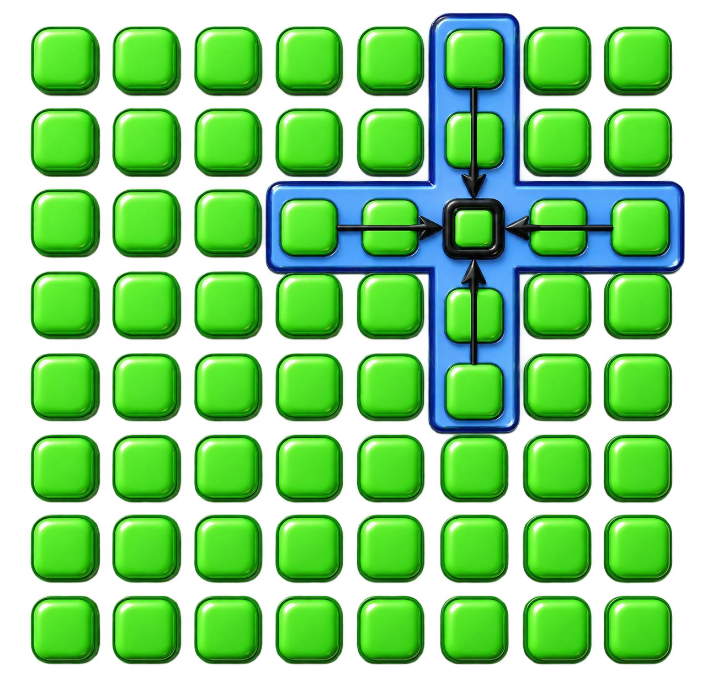
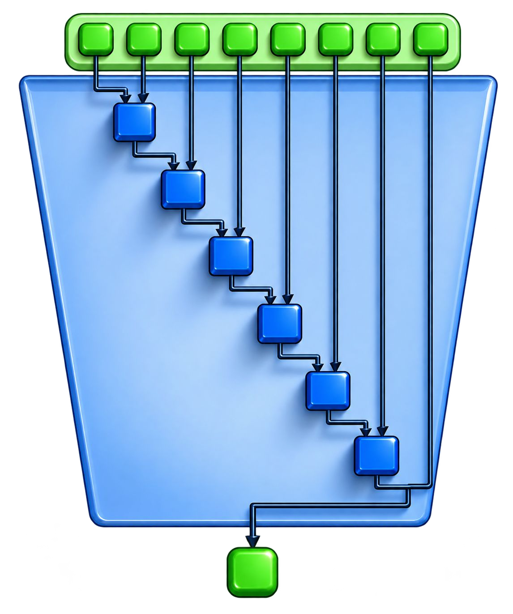
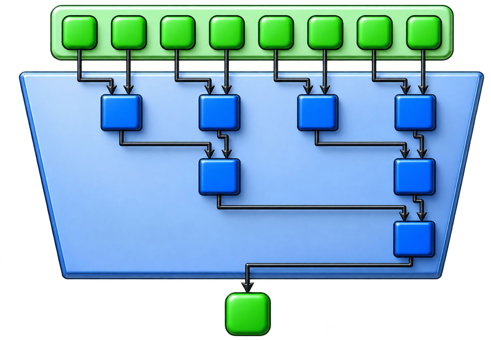
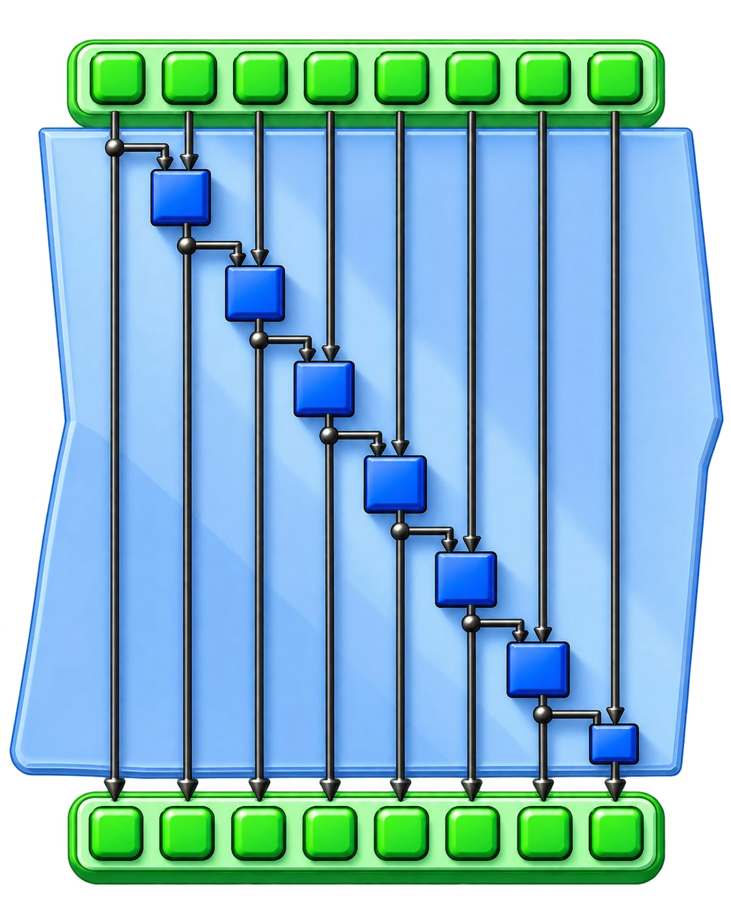
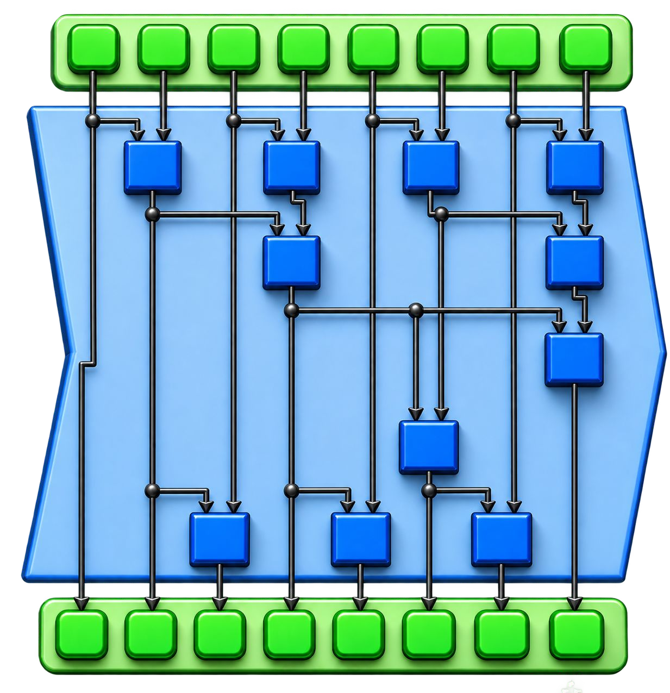
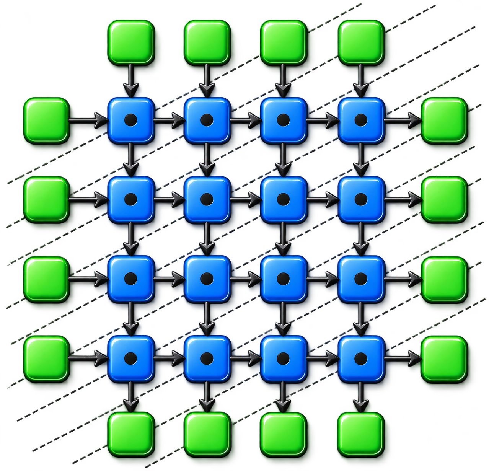

[← Volver a Curso.md](../Curso.md)

# 03. Patrones Paralelos (Structured Parallel Programming)

> **Materia**: Paralela y Distribuida | **Fuente**: [03.Parallel_Patterns_2026.pdf](../Pdf/03.Parallel_Patterns_2026.pdf)  
> **Terminos Core**: `fork-join`, `barrier`, `map`, `stencil`, `reduction`, `scan`, `recurrence`, `scatter`, `gather`, `pipeline`, `nesting pattern`

---

## Fundamentos de Patrones Paralelos

- **Definición**: Combinación recurrente de **distribución de tareas** y **acceso a datos** que resuelve un problema específico en el diseño de algoritmos paralelos.
- **Propósito**: Proporcionan un **vocabulario universal** de diseño independiente del lenguaje o plataforma de hardware subyacente.
- **Notación Gráfica Estándar**:
  - **Tarea (Task)**: Bloque de cómputo ejecutable.
  - **Datos (Data)**: Colecciones o elementos de memoria.
  - **Bifurcación (Fork)**: División de un flujo de control serial en flujos concurrentes.
  - **Unión (Join)**: Punto de sincronización donde convergen flujos concurrentes.
  - $\downarrow$ **Dependencia (Dependency)**: Dirección obligatoria de precedencia de datos o control.

### Patrón de Anidamiento (`Nesting Pattern`)
- Capacidad de **componer patrones jerárquicamente** (presente tanto en algoritmos seriales como paralelos).
- **Principio de Sustitución**: Cualquier bloque de tarea en un diagrama puede reemplazarse por un subpatrón completo, siempre que conserve las **mismas entradas/salidas y dependencias externas**.



---

## Patrones de Control Seriales vs. Paralelos

> Los patrones de control paralelos **extienden** los patrones seriales estructurados clásicos, **suavizando sus restricciones de orden y ejecución secuencial**:

| Patrón Serial | Supuesto Restrictivo en Serie | Extensión Paralela | Mecanismo Paralelo |
|---|---|---|---|
| **Sequence** | Ejecución estricta según orden textual de instrucciones ($T_1 \to T_2 \to T_3$). | **Superscalar Sequences / Fork-Join** | Se ejecutan en paralelo las tareas cuyas dependencias de datos ya estén satisfechas. |
| **Selection** (`if-else`) | La condición $c$ se evalúa primero; solo se ejecuta la rama $a$ o $b$ (nunca ambas ni antes de $c$). | **Speculative Selection** | Se evalúan en paralelo la condición $c$ y ambas ramas ($a$ y $b$); al resolver $c$, se descarta la rama no válida. |
| **Iteration** (`for`, `while`) | El paso $i+1$ espera la finalización del paso $i$. | **Map / Stencil / Workpile** | Si no hay dependencias cruzadas entre iteraciones, todas las iteraciones corren concurrentemente. |
| **Recursion** | Llamadas a sí misma apiladas en memoria LIFO secuencial. | **Fork-Join Recursivo** | Las llamadas recursivas se bifurcan (`spawn`) en subárboles paralelos y se sincronizan (`sync`). |

---

## Patrones de Control Paralelos (Los 6 Fundamentales)

### 1. Fork-Join
- **Concepto**: El flujo de control se bifurca (`fork`) en múltiples flujos paralelos independientes y luego se reúne (`join`) en un punto de sincronización.
- **Implementación (ej. Cilk Plus / Java ForkJoin)**:
  - `spawn` / `async`: Lanza una tarea hija asíncrona; la función invocadora **continúa ejecutándose de inmediato**.
  - `sync` / `join`: Pausa la ejecución hasta que todas las tareas hijas generadas hayan completado.
- **Pregunta Típica de Parcial — Diferencia crítica: `Join/Sync` vs. `Barrier`**:
  - **`Join` / `Sync`**: **Solo un hilo continúa** (el hilo padre o continuador; los hilos secundarios se terminan o reincorporan).
  - **`Barrier` (Barrera)**: **Todos los hilos participantes continúan** juntos una vez que el último de ellos alcanza el punto de encuentro.


- **Regla visual**: Árbol de llamadas en cascada: bifurcación (`fork`) hacia tareas independientes y convergencia en puntos de sincronización (`join`) donde continúa un único hilo.

---

### 2. Map
- **Concepto**: Aplica una misma **función elemental** (*Elemental Function*) sobre cada elemento de una colección de datos de forma aislada.
- **Características**:
  - Totalmente independiente (*embarrassingly parallel*): cero dependencias entre elementos.
  - El número de iteraciones/elementos se conoce de antemano.
  - Ejemplo: Multiplicar cada elemento de un vector por una constante, filtros de brillo en imágenes.


- **Regla visual**: Entradas fluyen 1 a 1 a instancias replicadas de la función elemental, produciendo salidas disjuntas sin comunicación entre tareas.

---

### 3. Stencil (Plantilla)
- **Concepto**: Generalización de `Map` donde la función elemental necesita acceder a un conjunto de elementos **vecinos** (*neighborhood*).
- **Aplicaciones**: Procesamiento de imágenes (filtros Sobel, Gaussian blur), ecuaciones diferenciales parciales, simulación física de calor/fluidos (método de diferencias finitas).
- **Punto Crítico**: **Condiciones de frontera** (*boundary conditions*). Los bordes de la matriz no tienen vecinos completos y requieren relleno (*padding*), reflejo o condiciones periódicas.


- **Regla visual**: La función elemental toma como entrada la celda objetivo y sus vecinos contiguos para calcular el nuevo valor central; requiere celdas fantasma (*halo*) en bordes.

---

### 4. Reduction (Reducción)
- **Concepto**: Combina todos los elementos de una colección en un único valor acumulado mediante una **función de combinación asociativa**.
- **Requisito Fundamental**: Asociatividad: $(a \oplus b) \oplus c = a \oplus (b \oplus c)$.
  - Permite transformar una cadena lineal secuencial de tiempo $O(n)$ en un **árbol de reducción balanceado** de tiempo crítico (**span**) $O(\log n)$.
- **Operaciones válidas**: Suma ($+$), producto ($\times$), $\min$, $\max$, operaciones booleanas (`AND`, `OR`, `XOR`).

| Reducción Serial ($O(n)$) | Reducción Paralela en Árbol ($O(\log n)$) |
|:---:|:---:|
|  |  |

- **Regla visual**: La versión serial acumula linealmente ($O(n)$); la paralela combina pares concurrentemente por niveles logarítmicos ($O(\log n)$).
- **Patrón Compuesto: Map-Reduce**:
  $$\text{Datos} \xrightarrow{\text{Map}} \text{Colección procesada} \xrightarrow{\text{Shuffle/Group}} \text{Agrupación por clave} \xrightarrow{\text{Reduce}} \text{Resultado consolidado}$$

---

### 5. Scan (Prefix Sum / Reducción por Prefijo)
- **Concepto**: Calcula **todas las reducciones acumuladas parciales** de una colección. Para la posición $i$, la salida es $\bigoplus_{k=0}^i x_k$.
- **Paralelización**: Requiere asociatividad. A primera vista parece estrictamente serial debido a dependencias acumulativas ($y_i = y_{i-1} \oplus x_i$), pero se paraleliza mediante algoritmos basados en árboles (Hillis-Steele, Blelloch con fases Up-Sweep y Down-Sweep).
- **Trade-off de Rendimiento**:
  - La versión paralela de `Scan` realiza **más operaciones aritméticas totales** (*work*) que la versión serial ($O(n \log n)$ vs $O(n)$), pero logra completarse en mucho menor tiempo de reloj (**span** $O(\log n)$) si hay suficientes núcleos disponibles.

| Scan Serial | Scan Paralelo |
|:---:|:---:|
|  |  |

- **Regla visual**: El scan paralelo calcula sumas parciales en árbol y las propaga lateralmente para computar todas las salidas simultáneamente en $O(\log n)$.

---

### 6. Recurrence (Recurrencia)
- **Concepto**: Variante compleja de `Map` donde las iteraciones de un ciclo **dependen directamente de salidas producidas por iteraciones previas adyacentes**.
- **Condición de computabilidad**: Debe existir un **ordenamiento serial topológico** válido que permita resolver los elementos apoyándose en resultados previos (ej. barrido diagonal en matrices o *wavefront computation*).


- **Regla visual**: Dependencias cruzadas resueltas en frente de onda (*wavefront*); tareas sobre la misma diagonal son independientes y corren en paralelo.

---

## Patrones de Gestión de Datos

### Patrones Seriales de Datos

| Patrón Serial | Mecanismo | Comportamiento en Paralelo / Riesgo |
|---|---|---|
| **Random Read / Write** | Acceso a memoria indexado por direcciones (punteros/arreglos). | **Aliasing**: La ambigüedad sobre si dos punteros referencian el mismo objeto impide que los compiladores determinen independencia de memoria y automaticen la paralelización. |
| **Stack Allocation** | Asignación LIFO dinámica en tiempo constante $O(1)$. Preserva excelente localidad de caché. | **Pila privada por hilo**: Cada hilo/trabajador paralelo recibe su propia pila independiente, preservando la localidad de datos a nivel de hilo. |
| **Heap Allocation** | Asignación en montículo para datos con ciclo de vida no LIFO. Más lento y propenso a fragmentación. | Requiere un **asignador de heap concurrente/paralelizado** (ej. *tcmalloc*, *jemalloc*) con pools o *arenas* privadas por hilo para evitar cuellos de botella por bloqueos globales de asignación. |
| **Objects** | Encapsulan estado y métodos de manipulación. | Base para modelos de datos concurrentes como Actores, Objetos Activos o estructuras concurrentes protegidas. |

---

### Patrones Paralelos de Datos

```
Pack:                  Gather:                      Scatter:
[A|B|C|D|E|F]          Input:   [A|B|C|D|E|F]       Input:   [A|B|C|𝗗|E|F]
[1|0|1|0|0|1]          Indices: [ 4 | 0 | 2 ]       Indices: [5|1|3|𝟬|2|4]
      ↓                           ↓                                ↓
[ A | C | F ]          Output:  [ E | A | C ]       Output:  [𝗗|B|E|C|F|A]
(Filtra y compacta)    (Lectura indexada)           (Escritura indexada - ¡Ojo con colisiones!)
```

1. **Pack / Unpack**:
   - **Pack**: Filtra una colección descartando elementos marcados con `false` y compactando los elementos `true` en una secuencia continua sin alterar su orden relativo. Se usa frecuentemente junto con `Map`.
   - **Unpack**: Operación inversa; restaura los elementos compactados a sus posiciones relativas originales en un arreglo disperso.
2. **Pipeline (Línea de Ensamblaje)**:
   - Conecta tareas en modo **productor-consumidor**.
   - Puede ser **lineal** (etapa 1 $\to$ etapa 2 $\to$ etapa 3) o formar un **Grafo Acíclico Dirigido (DAG)**.
   - Excelente multiplicador de paralelismo cuando se combina con paralelismo de datos (permite procesar el ítem $k$ en etapa 3 mientras el ítem $k+1$ se computa en etapa 2).
3. **Geometric Decomposition (Descomposición Geométrica)**:
   - Organiza colecciones de datos multidimensionales en subparticiones regulares (bloques, parches o tiras).
   - Tipos:
     - **No superpuestas** (*Non-overlapping*): Partición disjunta pura.
     - **Superpuestas** (*Overlapping*): Incluye zonas de solapamiento perimetral (**celdas halo/fantasma**) necesarias para stencils.
   - Brinda una **vista lógica estructurada** sin exigir necesariamente la reubicación física de memoria.
4. **Gather (Recolección)**:
   - Lee datos de una colección fuente usando un arreglo de índices: $\text{Salida}[i] = \text{Entrada}[\text{Índices}[i]]$.
   - Equivale a combinar `Map` con lecturas arbitrarias en memoria (*random read*).
   - La salida conserva el tipo de datos de la entrada, pero adopta el tamaño y forma del arreglo de índices.
5. **Scatter (Dispersión)**:
   - Operación dual e inversa de `Gather`: escribe los datos de entrada en las posiciones designadas por el arreglo de índices: $\text{Salida}[\text{Índices}[i]] = \text{Entrada}[i]$.
   - **Riesgo Crítico de Concurrencia**: Si dos o más elementos poseen el mismo índice de destino ($\text{Índices}[i] == \text{Índices}[j]$), ocurre una **condición de carrera por colisión de escritura**.
   - **Estrategias de resolución para Scatter**:
     - *Scatter Atómico*: Operaciones atómicas directas sobre hardware.
     - *Scatter por Permutación*: Garantiza matemáticamente que los índices son una permutación biyectiva (cero colisiones).
     - *Scatter por Fusión (Merge)*: Combina valores colisionantes mediante una función asociativa (ej. suma).
     - *Scatter por Prioridad*: Prevalece el valor emitido por el hilo de mayor prioridad o menor índice.

---

## Otros Patrones Paralelos Avanzados

| Patrón | Tipo | Descripción Operativa |
|---|---|---|
| **Superscalar Sequences** | Control | Secuencia de tareas independientes que se despachan fuera de orden según disponibilidad de dependencias de datos (equivalente a ejecución superescalar en CPU). |
| **Futures (Promesas)** | Control | Similar a Fork-Join, pero las tareas no necesitan anidarse jerárquicamente; devuelven un *handle* que se resuelve en el futuro. |
| **Speculative Selection** | Control | Generalización del `if`: evalúa en paralelo la condición booleana y las ramas `true`/`false`, descartando el trabajo de la rama incorrecta. |
| **Workpile (Bolsa de Trabajo)** | Control | Generalización de `Map` donde cualquier tarea elemental en ejecución puede generar dinámicamente nuevas subtareas y añadirlas a una cola compartida. |
| **Search (Búsqueda)** | Control/Datos | Explora concurrentemente una colección o espacio de estados hasta encontrar un criterio; emite señal de cancelación temprana al resto de tareas. |
| **Segmentation** | Datos | Aplica operaciones (como Scan o Reduce segmentado) sobre particiones subdivididas contiguas, disjuntas y de tamaño arbitrario/heterogéneo. |
| **Expand** | Datos | Fusión de `Pack` y `Map`: cada elemento de entrada puede expandirse en un número variable ($0, 1, 2, \dots$) de elementos de salida. |
| **Category Reduction** | Datos/Control | Agrupa elementos por clave o etiqueta de categoría y reduce independientemente cada subgrupo (base de `reduceByKey` en big data). |

---

## Soporte de Patrones en Modelos de Programación

> Basado en la clasificación comparativa de McCool et al. entre frameworks:
> - **F** (*Feature*): Soportado directamente con sintaxis o primitivas nativas de primera clase.
> - **I** (*Idiom*): Se puede implementar de manera sencilla y eficiente combinando otras características.
> - **Espacio en blanco**: No soportado directamente o muy complejo de implementar eficientemente.

| Patrón Paralelo | TBB (Intel) | Cilk Plus | OpenMP | ArBB | OpenCL (GPU) |
|---|:---:|:---:|:---:|:---:|:---:|
| **Anidamiento (Nesting)** | **F** | **F** | **F** | **F** | **F** |
| **Map** | **F** (`parallel_for`) | **F** (`cilk_for`) | **F** (`#pragma omp for`) | **F** | **F** (Kernels SIMD) |
| **Fork-Join** | **F** (`task_group`) | **F** (`spawn`/`sync`) | **I** (`task`/`taskwait`) | — | — |
| **Reduction** | **F** (`parallel_reduce`) | **F** (Hyperobjects) | **F** (`reduction(...)`) | **F** | **I** (Vía memoria local) |
| **Scan** | **F** (`parallel_scan`) | **I** / **P** | **I** (Directivas recientes) | **F** | **I** |
| **Pipeline** | **F** (`parallel_pipeline`) | **I** | **I** | — | — |
| **Workpile (Bolsa)** | **F** (`parallel_do`) | **I** | **I** (`omp taskloop`) | — | **I** |
| **Stencil** | **I** | **I** | **I** | **F** | **I** |
| **Recurrence** | — | **P** | — | — | — |
| **Gather / Scatter** | **F** / **I** | **F** / **I** | **F** / **I** | **F** | **F** |
| *Recursión* | **F** | **F** | **F** | — | **?** (Muy restringida) |
| *Asignación Heap Dinámica* | **F** | **F** | **F** | — | **?** (No recomendada/nula) |

---

## Bibliografía y Compilación para Paralelismo

### Textos Clave de Consulta
1. **McCool, Robison, & Reinders (2012)**: *Structured Parallel Programming* (Capítulo 3). Elsevier/Morgan Kaufmann.
2. **Reinders & Jeffers (2014, 2015)**: *High Performance Parallelism Pearls* (Vol. 1 y 2).
3. **Yong Wang (2024)**: *Theory of Structured Parallel Programming*. Morgan Kaufmann.

### Compiladores y Paralelismo
- **Autoparalelización**: Capacidad de optimizadores para detectar ciclos independientes y vectorizarlos automáticamente (con barreras de aliasing).
- **Proyectos destacados**:
  - `nvcc` (NVIDIA CUDA Compiler): Separa código de host (CPU) y código de device (GPU), gestionando el flujo PTX/SASS.
  - `parallel-rustc`: Paralelización interna de las fases de análisis y generación de código en Rust.
  - `ParallelGcc`: Esfuerzos para paralelizar pasos del optimizador en GCC.

---

## Puntos Críticos para Examen y Sustentación

- **`Join/Sync` vs. `Barrera`**: En `Join/Sync` solo continúa un único hilo (padre/continuador); en una `Barrera` todos los hilos participantes esperan y avanzan juntos simultáneamente.
- **Sobrecosto de `Scan` paralelo**: Duplica operaciones ($WORK = O(n \log n)$ vs. serial $O(n)$) para quebrar dependencias secuenciales y reducir el camino crítico ($SPAN = O(\log n)$).
- **Peligro en `Scatter` y prevención**: Colisión de escrituras si múltiples hilos escriben en el mismo índice. Prevención: operaciones atómicas de hardware, permutaciones biyectivas (cero colisión) o reducción/fusión (*merge*).
- **Aliasing de punteros**: Ambigüedad sobre memoria disjunta impide al optimizador del compilador garantizar independencia e invalida la vectorización o paralelización automática.
- **Celdas halo/fantasma**: Solapamiento perimetral en descomposición geométrica que permite cómputo de `Stencil` sin comunicación continua inter-proceso durante el ciclo local.
