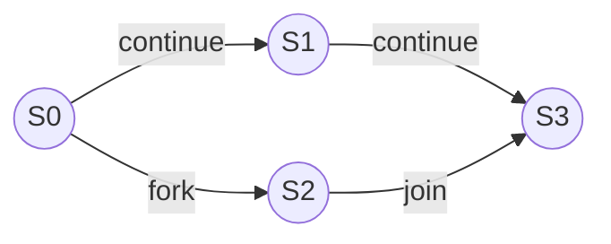
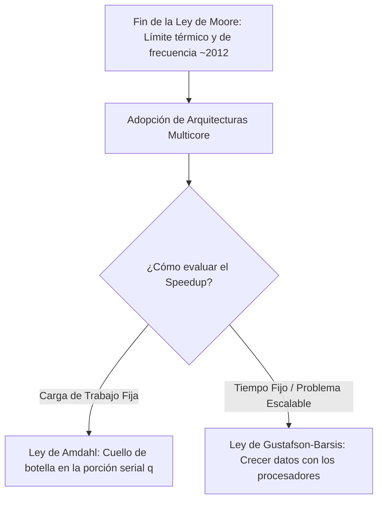

[← Volver a Curso.md](../Curso.md)

# 04. Paralelismo a Nivel de Tarea

> **Materia**: Paralela y Distribuida | **Fuente**: [04.Paralelismo_a_nivel_de_Tarea_2026.pdf](../Pdf/04.Paralelismo_a_nivel_de_Tarea_2026.pdf)  
> **Terminos Core**: `grafo computacional`, `work`, `span`, `speedup`, `costo`, `slackness`, `ley de amdahl`, `ley de gustafson-barsis`, `deadlock`, `condiciones de coffman`, `livelock`, `data race`

---

## Paralelismo de Tareas vs. Paralelismo de Datos

- **Paralelismo a Nivel de Tarea (Task-Level Parallelism)**: Habilidad para ejecutar concurrentemente **diferentes tareas/funciones independientes** dentro de un mismo problema global.
- **Paralelismo a Nivel de Datos (Data-Level Parallelism)**: Habilidad para ejecutar concurrentemente la **misma tarea u operación** sobre **diferentes particiones de datos**.

### Analogía de la Cosecha de Café
| Elemento | Representación en Hardware / Software |
|---|---|
| **Recolector** | Procesador / Núcleo de cómputo (*Core*) |
| **Arbusto de café** | Tarea o bloque de trabajo (*Task*) |
| **Granos de café** | Datos a procesar (*Data*) |

- **Esquemas de ejecución**:
  - **Secuencial**: $1$ recolector recoge todos los granos de un arbusto, luego pasa al siguiente.
  - **Paralelismo de datos**: Varios recolectores trabajan sobre el **mismo arbusto** recolectando granos en paralelo; al terminar, avanzan juntos al siguiente.
  - **Paralelismo de tareas**: Cada recolector se asigna a un **arbusto distinto** y avanza de forma independiente.
  - **Paralelismo en la vida real (Híbrido)**: Combinación de ambas técnicas; algunos núcleos procesan su propio flujo de tareas y otros se reparten datos masivos dentro de una tarea pesada.

### Pipelining vs. Bucket Brigade
- **Pipelining (Tubería / Canalización)**:
  - Estructurado como **línea de ensamblaje industrial**.
  - Cada etapa ejecuta una función fija sobre un flujo secuencial de datos.
- **Bucket Brigade (Brigada de Baldes)**:
  - Más **dinámico y adaptativo** que el pipeline estático.
  - Los trabajadores pueden desplazarse a zonas de mayor congestión para evitar cuellos de botella.

---

## Grafo Computacional (Computational Graph - CG)

- **Definición**: Grafo dirigido acíclico (DAG) que modela formalmente la ejecución de un programa paralelo.
  - **Vértices ($V$)**: Representan tareas o pasos atómicos de cómputo.
  - **Arcos ($E$)**: Representan relaciones de dependencia temporal o precedencia de datos.
- **Tipos de Arcos en el Grafo**:
  - **Arcos de continuación (`continue`)**: Pasos secuenciales consecutivos dentro de la **misma tarea**.
  - **Arcos de bifurcación (`fork` / `spawn`)**: Conectan la instrucción de bifurcación con el primer paso de la **tarea hija**.
  - **Arcos de encuentro (`join` / `sync`)**: Conectan el último paso de una **tarea hija** con las operaciones de sincronización de la **tarea padre**.
- **Fundamento Matemático**:
  - El grafo computacional define un **Conjunto Parcialmente Ordenado (POSET - Partially Ordered Set)** sobre las tareas. Las tareas sin relación de orden entre sí pueden ejecutarse legítimamente en paralelo.



---

## Métricas Fundamentales: Work, Span, Speedup y Límites

### 1. Definiciones Formales

- **$T_p$**: Tiempo total de ejecución de un cómputo en un sistema con $p$ procesadores.
- **Trabajo (Work - $T_1$ o $WORK(G)$)**:
  - Suma de los tiempos de ejecución de **todos los nodos** del grafo computacional.
  - Equivale al tiempo que tomaría ejecutar el programa en un único procesador ($p=1$), ignorando sobrecostos de comunicación.
  $$WORK(G) = T_1 = \sum_{v \in V} \text{time}(v)$$
- **Extensión / Tramo Crítico (Span / Critical Path Length - $T_\infty$ o $SPAN(G)$)**:
  - Longitud temporal del **camino más largo** en el grafo computacional, respetando las dependencias.
  - Equivale al tiempo de ejecución con **infinitos procesadores** ($p=\infty$). Determina el límite teórico mínimo de tiempo posible.
- **Costo (Cost)**:
  - Expresa el recurso total invertido (tiempo de procesamiento + tiempo ocioso/espera):
  $$\text{Cost} = p \cdot T_p$$

### 2. Leyes Básicas de Cómputo Paralelo
- **Ley del Trabajo (Work Law)**:
  $$p \cdot T_p \ge T_1 \implies T_p \ge \frac{T_1}{p}$$
  > Un sistema con $p$ núcleos no puede hacer más de $p$ operaciones simultáneas en una unidad de tiempo.
- **Ley de la Extensión (Span Law)**:
  $$T_p \ge T_\infty$$
  > Ningún número finito de procesadores puede superar a un computador con infinitos procesadores.
- **Rango Teórico de $T_p$**:
  $$T_\infty \le T_p \le T_1$$

### 3. Métricas de Rendimiento
| Métrica | Expresión Matemática | Significado / Propiedad |
|---|---|---|
| **Speedup ($S_p$)** | $S_p = \frac{T_1}{T_p}$ | Factor de aceleración frente al caso secuencial. Si $S_p = p$, es **speedup lineal perfecto**. |
| **Paralelismo Ideal** | $\frac{WORK(G)}{SPAN(G)} = \frac{T_1}{T_\infty}$ | **Límite superior absoluto** del Speedup. No depende del hardware físico, sino del algoritmo. |
| **Eficiencia ($E_p$)** | $E_p = \frac{S_p}{p} = \frac{T_1}{p \cdot T_p}$ | Fracción de uso productivo de los núcleos ($0 \le E_p \le 1$). |
| **Inconstancia / Holgura (*Slackness*)** | $\frac{T_1}{p \cdot T_\infty}$ | Si $\text{Slackness} < 1$, es **imposible** alcanzar speedup lineal perfecto sobre $p$ núcleos. |

> **Speedup Superlineal**: Ocurre en la práctica cuando $S_p > p$. Se debe a efectos de la **jerarquía de memoria** (el conjunto de datos de cada partición cabe completamente en la **memoria caché L1/L2/L3**, reduciendo dramáticamente fallos de caché respecto a la ejecución serial).

---

## Caso de Estudio: Planificación de la Cena

### Actividades y Tiempos
- $S_0$: Diseñar el menú ($5\text{ min}$)
- $S_1$: Compra de ingredientes aperitivo, vino, entrada y medallones ($25\text{ min}$)
- $S_2$: Compra de ingredientes puré, ensalada, postre ($20\text{ min}$)
- $S_3$: Arreglar ingredientes ($10\text{ min}$)
- $S_4$: Organizar cocina ($2\text{ min}$)
- $S_5$: Preparar medallones ($40\text{ min}$)
- $S_6$: Preparar ensalada ($5\text{ min}$)
- $S_7$: Preparar puré ($10\text{ min}$)
- $S_8$: Preparar crema de pollo ($15\text{ min}$)
- $S_9$: Organizar comedor ($10\text{ min}$)
- $S_{10}$: Servir la cena ($60\text{ min}$)

### Rutas en el Grafo
- **Path 1**: $S_0 \to S_1 \to S_3 \to S_4 \to S_5 \to S_9 \to S_{10} = 5 + 25 + 10 + 2 + 40 + 10 + 60 = \mathbf{152\text{ min}}$ (**Ruta Crítica / SPAN**)
- **Path 2**: $S_0 \to S_1 \to S_3 \to S_4 \to S_6 \to S_7 \to S_8 \to S_9 \to S_{10} = 5 + 25 + 10 + 2 + 5 + 10 + 15 + 10 + 60 = 142\text{ min}$
- **Path 3**: $S_0 \to S_2 \to S_3 \to S_4 \to S_5 \to S_9 \to S_{10} = 5 + 20 + 10 + 2 + 40 + 10 + 60 = 147\text{ min}$
- **Path 4**: $S_0 \to S_2 \to S_3 \to S_4 \to S_6 \to S_7 \to S_8 \to S_9 \to S_{10} = 5 + 20 + 10 + 2 + 5 + 10 + 15 + 10 + 60 = 137\text{ min}$

### Cálculos Globales
- **$WORK(G)$**: $5 + 25 + 20 + 10 + 2 + 40 + 5 + 10 + 15 + 10 + 60 = \mathbf{202\text{ min}}$
- **$SPAN(G)$**: $\mathbf{152\text{ min}}$
- **Paralelismo Ideal**: $\frac{WORK(G)}{SPAN(G)} = \frac{202}{152} \approx \mathbf{1.33}$

---

## Trade-off Fundamental: Trabajo vs. Span (Caso Ajedrez)

| Versión | Trabajo ($T_1$) | Span ($T_\infty$) | Tiempo en $32$ Cores ($T_{32} \approx \frac{T_1}{32} + T_\infty$) | Tiempo en $512$ Cores ($T_{512} \approx \frac{T_1}{512} + T_\infty$) |
|---|---|---|---|---|
| **Original** | $2048\text{ s}$ | $\mathbf{1\text{ s}}$ | $\frac{2048}{32} + 1 = \mathbf{65\text{ s}}$ | $\frac{2048}{512} + 1 = \mathbf{5\text{ s}}$ (Escalabilidad óptima) |
| **"Optimizada"** | $1024\text{ s}$ | $\mathbf{8\text{ s}}$ | $\frac{1024}{32} + 8 = \mathbf{40\text{ s}}$ (Mejor local) | $\frac{1024}{512} + 8 = \mathbf{10\text{ s}}$ (Pierde al doble) |

- **Regla Crítica**: Reducir trabajo aumentando el tramo crítico produce mejoras engañosas en pocas CPUs, pero **anula la escalabilidad masiva** ($p \to \infty$) donde el término $T_\infty$ se vuelve dominante.

---

## Primitivas de Concurrencia: `async` / `finish` y `fork` / `join`

- **`async { S }` / `fork { S }`**: Lanza la sentencia o bloque `S` como una tarea asíncrona concurrente. El flujo invocador continúa de inmediato.
- **`finish { ... }` / `join { ... }`**: Define un bloque de sincronización. No permite avanzar a la siguiente instrucción hasta que **todas** las tareas asíncronas generadas internamente hayan completado.

### Ejemplo: Suma Paralela de dos mitades de un arreglo
```text
finish {
    async {
        suma01 = suma(mitad_izquierda);
    }
    suma02 = suma(mitad_derecha);
}
suma_total = suma01 + suma02;
```

---

## Leyes de Escalabilidad: Moore, Amdahl y Gustafson-Barsis



### 1. Ley de Moore y el Fin del Escalamiento de Frecuencia
- **Premisa Histórica**: Duplicación periódica de densidad de transistores por chip.
- **Límite Físico (~2012)**: Fin del escalamiento de Dennard por barrera térmica y fugas de corriente; impuso la transición forzada de aumento de GHz hacia **computación multinúcleo (multicore)**.

### 2. Ley de Amdahl (Carga de Trabajo Fija)
Modela la ganancia al mejorar recursos manteniendo constante el tamaño del problema:
$$S_p = \frac{1}{(1-P) + \frac{P}{p}} = \frac{1}{q + \frac{1-q}{p}} \le \frac{1}{q}$$
- $q$: Fracción estrictamente secuencial ($q = 1-P$).
- $P$: Fracción paralelizable.
- $p$: Número de procesadores.
- **Límite Asintótico**:
  $$\lim_{p \to \infty} S_p = \frac{1}{q}$$
- **Ejemplos numéricos**:
  - Si $q = 0.5$ ($50\%$ serial) $\implies \text{Speedup} < 2$, sin importar si hay 1.000 núcleos.
  - Si $q = 0.1$ ($10\%$ serial) $\implies \text{Speedup} < 10$.
- **Vínculo con el Grafo Computacional**:
  $$q \approx \frac{SPAN(G)}{WORK(G)}$$

### 3. Ley de Gustafson-Barsis (Tiempo Fijo / Carga Escalable, 1988)
- **Principio**: En aplicaciones reales, al disponer de más procesadores **no resolvemos el mismo problema más rápido**, sino que resolvemos **un problema más grande y detallado** en el mismo tiempo.
- **Fórmula**:
  $$S_p = p - \alpha(p - 1)$$
  *(donde $\alpha$ es la fracción de tiempo secuencial del problema escalado).*
- **Limitaciones**:
  1. Problemas que carecen de conjuntos masivos de datos no pueden escalar.
  2. Algoritmos de complejidad temporal no lineal (ej. $O(N^3)$): duplicar procesadores solo permite aumentar el tamaño del problema en un $\approx 26\%$.

---

## Los 12 Retos y Dificultades en Computación Paralela

### #01 Condiciones de Carrera (*Race Conditions*) & *Data Race*
- **Condición de carrera**: Salida errónea cuando el resultado depende del orden impredecible de ejecución de eventos sobre un recurso compartido.
- **Data Race**: Ocurre en una posición de memoria $L$ si dos hilos acceden concurrentemente a $L$, al menos uno realiza una **escritura**, y **no existe un camino de arcos dirigidos** en el grafo computacional entre ellos.

### #02 Interbloqueo (*Deadlock*)
- Los hilos quedan bloqueados indefinidamente esperando recursos retenidos entre sí.
- **Las 4 Condiciones de Coffman (deben darse simultáneamente)**:
  1. **Exclusión Mutua**: El recurso no es compartible simultáneamente.
  2. **Retención y Espera (*Hold and Wait*)**: Un hilo retiene al menos un recurso mientras espera otro asignado a otro hilo.
  3. **Sin Derecho Preferente (*No Preemption*)**: Los recursos solo se liberan voluntariamente por el hilo poseedor.
  4. **Espera Circular (*Circular Wait*)**: Cadena de procesos $\{P_0, P_1, \dots, P_n\}$ donde $P_0$ espera a $P_1$, y $P_n$ espera a $P_0$.
- **Modelado mediante Grafo de Asignación de Recursos (RAG)**:
  - Nodos de Proceso ($P$) y Nodos de Recurso ($R$).
  - **Arco de solicitud**: $P_i \to R_j$ (proceso solicita recurso).
  - **Arco de asignación**: $R_j \to P_i$ (instancia asignada a proceso).
  - Un ciclo en el grafo es condición necesaria (y suficiente si hay una sola instancia por tipo de recurso) para que exista interbloqueo.

### #03 Ejecución Sin Progreso (*LiveLock*)
- Los procesos **continúan ejecutándose activamente y cambiando de estado**, pero ninguno logra progresar en la tarea útil (diferente a deadlock, donde están suspendidos).
- **Ejemplo**: Hilos invocando continuamente `pthread_mutex_trylock()`, detectando colisión, liberando su cerrojo y reintentando inmediatamente al unísono.
- **Solución**: Introducir **retardos aleatorios** (*random backoff*), análogo al algoritmo de colisión CSMA/CD en redes Ethernet Half Duplex.

### #04 Inanición (*Starvation*)
- A un hilo ejecutable se le deniega el acceso a los recursos por tiempo indefinido.
- Causado por esquemas de prioridad estrictos y **falta de justicia (*fairness*)** en la planificación ante procesos concurrentes "codiciosos" (*greedy*).
- Se detecta monitoreando métricas de tasa de progreso y tiempos de espera.

### #05 Atomicidad
- Propiedad de una operación de ejecutarse de forma **indivisible e ininterrumpible** ("todo o nada").
- La atomicidad **depende del contexto**: un bloque de instrucciones puede considerarse atómico para la lógica del negocio, pero no a nivel de registros de CPU o bus de memoria.

### #06 Sincronización y Problema de la Sección Crítica
- **Sección Crítica**: Segmento de código que manipula variables o estructuras de datos compartidas.
- **Requisitos formales de solución**:
  1. **Exclusión Mutua**: Si $P_i$ está en su sección crítica, ningún otro proceso puede entrar en la suya.
  2. **Progreso**: Si ningún proceso está en la sección crítica, la decisión sobre quién entra no puede demorarse indefinidamente.
  3. **Espera Acotada (*Bounded Waiting*)**: Debe existir un límite finito al número de veces que otros procesos entran antes de conceder la entrada al proceso solicitante.
- **Estructura canónica de un proceso**:
  $$\text{Entry Section} \to \mathbf{Critical\ Section} \to \text{Exit Section} \to \text{Remainder Section}$$

### #07 Cerrojos (*Locks*) y Mutex
- Primitivas de exclusión mutua mediante funciones `acquire()` y `release()` basadas en instrucciones atómicas de hardware (`Test-And-Set`, `Compare-And-Swap`).
- **Invariante Lógica**: Propiedad que debe preservarse intacta sobre los datos (ej. puntero `next` en una lista enlazada). El mutex encapsula las operaciones intermedias inconsistentes.
- **Grano Grueso (*Coarse-grained*) vs. Grano Fino (*Fine-grained*)**:
  - Grano grueso: Bloquea estructuras enteras; fácil implementación pero baja concurrencia.
  - Grano fino: Bloquea elementos puntuales; mayor concurrencia pero mayor sobrecarga de gestión.
  - En OpenMP: `#pragma omp critical` (sección crítica general) vs `#pragma omp atomic` (operación elemental indivisible de memoria).

### #08 Escalamiento Estrangulado (*Strangled Scaling*)
- La contención excesiva sobre cerrojos compartidos serializa la ejecución y recrea un **cuello de botella de Amdahl**, disparando además el tráfico de coherencia de caché entre núcleos.
- Se mitiga reemplazando cerrojos globales por cerrojos de grano fino o algoritmos *lock-free* con instrucciones atómicas.

### #09 Falta de Localidad
- **Localidad Temporal**: Probabilidad de volver a acceder a la misma dirección de memoria a corto plazo.
- **Localidad Espacial**: Probabilidad de acceder a direcciones contiguas.
- **Patrones clave**:
  - *Cache-oblivious algorithms*: Diseñados para aprovechar eficientemente la jerarquía de caché sin requerir parametrización explícita de su tamaño.
  - *Communication-avoiding algorithms*: Priorizan realizar cómputo redundante local si con ello evitan la costosa comunicación inter-nodo/core.

### #10 Desequilibrio de Carga (*Load Imbalance*)
- Asignación desigual de carga de trabajo entre núcleos, provocando núcleos ociosos esperando al más rezagado.
- Se resuelve descomponiendo el trabajo en un número de tareas mucho mayor que el número de procesadores ($M \gg p$) para permitir balanceo dinámico (*work stealing*).

### #11 Sobrecarga (*Overhead*)
- Costo temporal en crear, planificar y sincronizar tareas paralelas.
- Se reduce usando **árboles de bifurcación y reducción**, permitiendo que el arranque y sincronización de $p$ núcleos tome tiempo logarítmico $O(\log p)$.

### #12 El Factor Humano
- Dificultad intrínseca del desarrollo concurrente: equilibrar claridad, mantenibilidad y rendimiento óptimo; coordinar equipos de desarrollo en sistemas complejos.

---

## Computación Heterogénea

- **Motivación por Ley de Amdahl**:
  - Las tareas complejas combinan fases seriales y fases masivamente paralelas.
  - **CPU**: Pocos núcleos de gran tamaño optimizados para baja latencia en código secuencial y control complejo.
  - **GPU**: Miles de núcleos pequeños optimizados para alto rendimiento (*throughput*) en cómputo matricial/vectorial masivo.
  - Un sistema heterogéneo CPU + GPU supera en rendimiento y eficiencia energética a sistemas exclusivos de solo CPU o solo GPU.
- **Espectro**: Desde sensores inteligentes en el borde (**Edge-IoT**), pasando por dispositivos intermedios (*Gateways*), hasta nodos de cómputo y aceleradores en el **Data Center**.
- **Fronteras de Investigación**:
  - **PIM (*Processing-in-Memory*) / NDP (*Near-Data Processing*)**: Procesamiento embebido directamente en la memoria para eludir el cuello de botella de Von Neumann.
  - Cómputo a Escala Exaflopica (*Exascale*).
  - Chips neuromórficos (inspirados en redes neuronales biológicas).
  - Computación cuántica.

---

## Ejercicios Prácticos Resueltos (Típicos de Parcial)

### Ejercicio 2: Expansión del Grafo de la Cena
Al grafo original de la cena ($WORK = 202$, $SPAN = 152$), se adicionan dos tareas:
1. $S_5'$: Preparación salsa de champiñones ($10\text{ min}$) en paralelo a $S_5$.
2. $S_7'$: Preparación postre de tres leches ($25\text{ min}$) en paralelo a la rama $S_6 \to S_7 \to S_8$.

- **Nuevo Trabajo ($WORK$)**:
  $$WORK(G_{\text{ejercicio}}) = 202 + 10 + 25 = \mathbf{237\text{ min}}$$
- **Nuevo Tramo Crítico ($SPAN$)**:
  - Entre $S_4$ y $S_9$ compiten ahora cuatro ramas:
    - Rama 1 ($S_5$): $40\text{ min}$
    - Rama 2 ($S_6 \to S_7 \to S_8$): $5 + 10 + 15 = 30\text{ min}$
    - Rama 3 ($S_5'$): $10\text{ min}$
    - Rama 4 ($S_7'$): $25\text{ min}$
  - La rama más larga sigue siendo la de $S_5$ ($40\text{ min}$).
  - Por lo tanto, el camino crítico no se modifica:
  $$SPAN(G_{\text{ejercicio}}) = \mathbf{152\text{ min}}$$
- **Nuevo Paralelismo Ideal**:
  $$\frac{WORK(G_{\text{ejercicio}})}{SPAN(G_{\text{ejercicio}})} = \frac{237}{152} \approx \mathbf{1.56}$$

---

### Ejercicio 3: Pseudocódigo de la Cena Modificada (`async` / `finish`)
```text
S0
finish {
    async { S1 }
    S2
}
S3
S4
finish {
    async { S5 }
    async { S5_prima }
    async { S7_prima }
    S6
    S7
    S8
}
S9
S10
```

---

### Ejercicio 4: Suma de Matrices Triangulares Inferiores
Dado el algoritmo para matrices $n \times n$:
```c
finish {
    for (int i = 0; i < n; i++) {
        async {
            for (int j = 0; j < i; j++) {
                A[i][j] = B[i][j] + C[i][j];
            } // for-j
        } // async
    } // for-i
} // finish
```

1. **Cálculo de $WORK(n)$**:
   - Cada ejecución de la suma asigna una unidad de tiempo.
   - En la iteración $i$, el bucle interno ejecuta $i$ sumas.
   $$WORK(n) = \sum_{i=0}^{n-1} i = \frac{(n-1)n}{2} = \frac{n^2 - n}{2} = \mathbf{\Theta(n^2)}$$
2. **Cálculo de $SPAN(n)$**:
   - Cada iteración $i$ corre en paralelo bajo `async`.
   - La tarea paralela de mayor duración es la correspondiente a $i = n-1$, que ejecuta $n-1$ pasos secuenciales.
   $$SPAN(n) = n - 1 = \mathbf{\Theta(n)}$$
3. **Paralelismo Ideal**:
   $$\text{Paralelismo Ideal} = \frac{WORK(n)}{SPAN(n)} = \frac{\frac{n(n-1)}{2}}{n - 1} = \frac{n}{2} = \mathbf{\Theta(n)}$$
