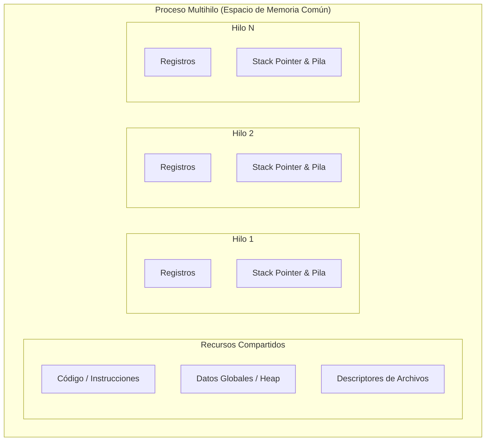
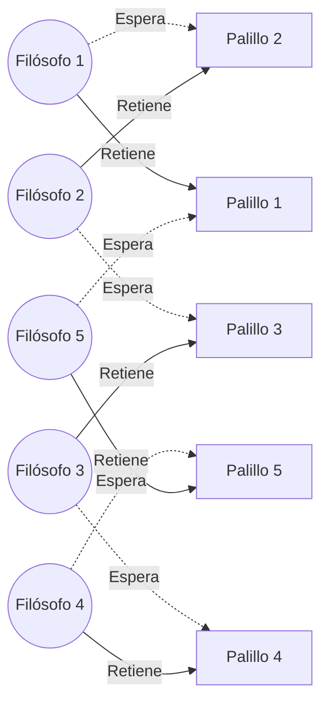

[← Volver a Curso.md](../Curso.md)

# 05. Hilos y Cerrojos — Día 1: Exclusión Mutua y Modelos de Memoria

> **Materia**: Paralela y Distribuida | **Fuente**: [05.SieteModelosConcurrenciaCapitulo2Dia1_2026.pdf](../Pdf/05.SieteModelosConcurrenciaCapitulo2Dia1_2026.pdf)  
> **Terminos Core**: `hilos vs procesos`, `exclusion mutua`, `synchronized`, `jmm`, `reordenamiento`, `visibilidad`, `cena de los filosofos`, `metodos alienigenas`

---

## Fundamentos de Hilos y Cerrojos

- **Metáfora del Ford Modelo T**: Primitivo y propenso a fallos, pero formaliza directamente el comportamiento del hardware físico subyacente; transfiere toda la responsabilidad de sincronización y corrección al desarrollador.
- **Ejes Críticos**: Exclusión mutua, condiciones de carrera (*race conditions*), visibilidad de memoria (JMM) e interbloqueos (*deadlocks*).

---

## Procesos vs. Hilos: Distribución de Memoria y Recursos

| Componente | Proceso (Aislado) | Hilo / *Thread* (Ligero) |
|---|---|---|
| **Definición** | Instancia de un programa en ejecución con espacio de memoria propio | Unidad básica de despacho y control dentro de un proceso |
| **Recursos Compartidos** | Ninguno por defecto (requiere IPC, sockets o memoria compartida explícita) | **Código/Instrucciones**, **Datos globales/Heap**, **Archivos abiertos**, **Identificador y estado del proceso** |
| **Recursos Privados** | Todo el espacio de direcciones, PCB, descriptores | **Registros de CPU**, **Contador de Programa (PC)**, **Puntero de Pila (SP)**, **Stack / Pila de llamadas** |
| **Costo de Context Switch** | Elevado (invalida TLB, cambio de tablas de páginas) | Bajo (solo preserva registros y puntero de stack) |
| **Mecanismo de Comunicación** | Paso de mensajes, tuberías o memoria compartida del SO | **Memoria compartida directa** (origen de carreras y fallos de concurrencia) |



---

## Creación de Hilos y No Determinismo Temporal

### Primitivas Fundamentales en Java
- `Thread`: Encapsula un único flujo de control secuencial.
- `myThread.start()`: Transición del hilo a estado *Runnable*; invoca asíncronamente su método `run()`.
- `myThread.join()`: Bloquea al hilo invocador hasta que `myThread` culmine su ejecución (`run()` retorne).
- `Thread.yield()`: Pista (*hint*) no vinculante al planificador del sistema operativo indicando que el hilo actual está dispuesto a ceder voluntariamente su quantum de CPU.

### Ejemplo: `HelloWorld.java`
```java
public class HelloWorld {
    public static void main(String[] args) throws InterruptedException {
        Thread myThread = new Thread() {
            public void run() {
                System.out.println("Hello from new thread");
            }
        };
        myThread.start();
        Thread.yield();
        System.out.println("Hello from main thread");
        myThread.join();
    }
}
```

- **Comportamiento no determinista**:
  - Salida A: `Hello from main thread` $\rightarrow$ `Hello from new thread`.
  - Salida B: `Hello from new thread` $\rightarrow$ `Hello from main thread`.
- **Principio de Concurrencia**: El orden depende de la latencia de arranque del hilo, la carga del sistema y decisiones del planificador del SO. *Si un entrelazamiento es técnicamente posible, tarde o temprano sucederá en producción*.

---

## Exclusión Mutua: El Primer Cerrojo (`Counting.java`)

### El Problema de la Condición de Carrera
Dos hilos incrementan concurrentemente una variable compartida 10,000 veces cada uno:
```java
// Versión incorrecta: sin sincronización
class Counter {
    private int count = 0;
    public void increment() { ++count; } // Operación no atómica
    public int getCount() { return count; }
}
```
- **Resultado esperado**: $20\,000$.
- **Resultado obtenido**: Valores inconsistentes y menores ($13\,850$, $11\,867$, $12\,616$).
- **Causa**: `++count` comprende 3 operaciones a bajo nivel no indivisibles:
  1. **Lectura** (*Read*) del valor actual de memoria a un registro.
  2. **Modificación** (*Modify*) incrementando el registro en $1$.
  3. **Escritura** (*Write*) del nuevo valor de vuelta a memoria.
  - Al intercalarse hilos, ocurren escrituras destructivas (*lost updates*).

### Solución con Bloqueo Intrínseco (`synchronized`)
```java
class Counter {
    private int count = 0;
    public synchronized void increment() { ++count; }
    public synchronized int getCount() { return count; } // Ambos métodos deben sincronizarse
}
```

- **Propiedades del bloqueo intrínseco en Java**:
  - Todo objeto Java posee un candado implícito (*intrinsic lock*, *monitor* o *mutex*).
  - Al ingresar a `synchronized`, el hilo adquiere el cerrojo del objeto receptor (`this`); al retornar o lanzar excepción, lo libera automáticamente.
  - Es **reentrante**: un hilo puede readquirir un cerrojo que ya posee sin auto-bloquearse.
  - **Limitaciones de `synchronized`**:
    - **Egoísta**: No admite cancelación ni interrupción mientras espera adquirir el cerrojo (*uninterruptible*).
    - **Ciego al tiempo**: No soporta expiración ni tiempo límite (*no timeouts*).
    - **Estructura estricta**: Adquisición y liberación limitadas al alcance del bloque léxico de código.

---

## Modelo de Memoria de Java (JMM) y Visibilidad (`Puzzle.java`)

### El Enigma del Valor `0`
```java
public class Puzzle {
    static boolean answerReady = false;
    static int answer = 0;

    static Thread t1 = new Thread() {
        public void run() {
            answer = 42;
            answerReady = true;
        }
    };

    static Thread t2 = new Thread() {
        public void run() {
            if (answerReady)
                System.out.println("The meaning of life is: " + answer);
            else
                System.out.println("I don't know the answer");
        }
    };

    public static void main(String[] args) throws InterruptedException {
        t1.start(); t2.start();
        t1.join(); t2.join();
    }
}
```

- **Resultados observables**:
  1. `The meaning of life is: 42` (Ejecución ordenada: $t_1 \rightarrow t_2$).
  2. `I don't know the answer` ($t_2$ evalúa antes de la asignación de $t_1$).
  3. **`The meaning of life is: 0`**: ¿Cómo es posible que `answerReady == true` pero `answer == 0`?

### Causas Físicas y de Compilación
1. **Reordenamiento de Instrucciones (*Instruction Reordering*)**:
   - **Compilador**: Reordena instrucciones estáticamente para optimizar uso de registros.
   - **JIT / JVM**: Reordena código dinámicamente durante la compilación en tiempo de ejecución.
   - **Hardware / CPU**: Procesadores modernos ejecutan instrucciones fuera de orden (*out-of-order execution*) y emplean buffers de escritura en caché (*store buffers*).
2. **Falta de Visibilidad en Caché (*Memory Visibility*)**:
   - Los núcleos de CPU retienen variables en cachés locales L1/L2/L3 o registros.
   - Si no hay barreras de memoria (*memory barriers/fences*), la escritura de `answer = 42` puede permanecer en caché local sin descargarse a RAM, mientras que `answerReady = true` sí se propaga.
   - En bucles como `while (!answerReady)`, el hilo puede quedar en bucle infinito si la JVM almacena en caché el valor `false` en un registro y jamás vuelve a consultar la memoria principal.

### Reglas Clave del JMM (JSR-133 - Bill Pugh)
- **Garantía cero sin sincronización**: En ausencia de sincronización, la JVM no garantiza ningún orden temporal ni visibilidad entre hilos.
- **Relación *Happens-Before***:
  - La liberación de un lock por el hilo $A$ *happens-before* la adquisición del mismo lock por el hilo $B$.
  - La finalización de `t.start()` *happens-before* cualquier acción en el nuevo hilo `t`.
  - La terminación de un hilo *happens-before* el retorno exitoso de `join()`.
- **Regla de Oro de Visibilidad**: **Tanto el hilo que escribe como el que lee deben usar sincronización sobre el mismo cerrojo**. Sincronizar únicamente la escritura deja vulnerable la lectura a valores obsoletos (*stale values*).

---

## Múltiples Cerrojos e Interbloqueo: Cena de los Filósofos

### Planteamiento del Problema
- $5$ filósofos sentados en mesa circular con $5$ palillos (recursos compartidos).
- Cada filósofo requiere **ambos palillos adyacentes** (izquierdo y derecho) para comer.
- Si cada filósofo toma simultáneamente el palillo izquierdo con `synchronized(left)`, todos intentarán tomar el derecho `synchronized(right)`:
  - Ningún palillo derecho estará disponible.
  - Todos los hilos quedan suspendidos permanentemente: **Punto Muerto / Interbloqueo (*Deadlock*)**.



### Solución: Adquisición en Orden Global Fijo
- El interbloqueo se elimina rompiendo la condición de **espera circular**.
- **Regla**: Adquirir siempre los bloqueos en un orden estrictamente creciente de identificación global única (`id` del objeto).

```java
class Philosopher extends Thread {
    private Chopstick first, second;

    public Philosopher(Chopstick left, Chopstick right) {
        // Rompe la simetría ordenando los bloqueos por ID
        if (left.getId() < right.getId()) {
            first = left;
            second = right;
        } else {
            first = right;
            second = left;
        }
    }

    public void run() {
        try {
            while (true) {
                Thread.sleep(random.nextInt(1000)); // Pensar
                synchronized(first) {               // Tomar recurso menor
                    synchronized(second) {          // Tomar recurso mayor
                        Thread.sleep(random.nextInt(1000)); // Comer
                    }
                }
            }
        } catch (InterruptedException e) {}
    }
}
```

> [!WARNING]
> Usar `System.identityHashCode(obj)` como criterio de ordenación global para objetos sin ID propio es propenso a errores porque los hash codes no garantizan unicidad absoluta (pueden ocurrir colisiones).

---

## Los Peligros de los Métodos "Alienígenas" (*Alien Methods*)

### Definición y Trampa
- Un método **alienígena** es aquel cuyo comportamiento interno es desconocido para la clase invocadora (ej. callbacks, listeners, observers, métodos sobrescribibles).
- **Ejemplo vulnerable (`Downloader.java`)**:
  ```java
  // Código defectuoso
  private synchronized void updateProgress(int n) {
      for (ProgressListener listener : listeners) {
          listener.onProgress(n); // Llamada alienígena reteniendo cerrojo de Downloader
      }
  }
  ```
- **Riesgos críticos**:
  1. **Deadlock encubierto**: Si `onProgress()` internamente adquiere otro cerrojo o interactúa con otro hilo que intenta acceder al `Downloader`, se genera un bloqueo mutuo con solo tener 1 cerrojo explícito en la clase.
  2. **Violación de concurrencia y excepciones**: Si un listener ejecuta `removeListener()` dentro de `onProgress()`, se corrompe la iteración sobre la lista (`ConcurrentModificationException`).
  3. **Degradación de rendimiento**: Se retiene el cerrojo durante operaciones externas lentas (E/S, renderizado), serializando innecesariamente a todos los hilos.

### Solución: Copia Defensiva (*Defensive Copy*)
```java
// Solución correcta: minimizar ámbito del cerrojo
private void updateProgress(int n) {
    ArrayList<ProgressListener> listenersCopy;
    synchronized(this) {
        listenersCopy = (ArrayList<ProgressListener>) listeners.clone();
    } // Cerrojazo liberado antes de interactuar con el exterior
    
    for (ProgressListener listener : listenersCopy) {
        listener.onProgress(n); // Seguro: invocación alienígena sin cerrojo retenido
    }
}
```

---

## Las 5 Reglas de Oro del Día 1

1. **Sincronizar todo acceso a variables mutables compartidas**: Si una variable es compartida y al menos un hilo escribe en ella, todo acceso debe sincronizarse.
2. **Sincronizar tanto lectura como escritura**: No basta con asegurar la escritura; la lectura sin lock puede leer basura o datos desactualizados en caché.
3. **Adquirir múltiples cerrojos en un orden global fijo**: Previene de raíz la espera circular y los deadlocks.
4. **Nunca invocar métodos alienígenas mientras se retiene un cerrojo**: Realizar copias defensivas de listeners/callbacks y liberar el lock antes de invocarlos.
5. **Minimizar el tiempo de retención del cerrojo**: Mantener locks solo para la sección estrictamente crítica; reduce contención y maximiza el paralelismo.

---

## Preguntas de Parcial y Autoestudio

| Pregunta / Reto | Respuesta / Principio Técnico |
|---|---|
| **¿Por qué `++x` no es seguro en concurrencia?** | Consta de 3 instrucciones independientes (lectura, suma, escritura); genera condiciones de carrera (*lost update*). |
| **¿Qué garantiza el JMM sobre variables sin sincronizar?** | Ninguna garantía: permite reordenamiento de instrucciones y lecturas de variables desactualizadas en registros/caché. |
| **¿Por qué falla el antipatrón *Double-Checked Locking* en versiones antiguas?** | La inicialización del objeto puede ser reordenada después de publicar la referencia no nula; otro hilo ve un objeto parcialmente inicializado si la referencia no es `volatile`. |
| **¿Cómo se previene el deadlock en la Cena de los Filósofos?** | Eliminando la espera circular mediante la adquisición de recursos en orden ascendente según su identificador único. |
| **¿Qué es un método alienígena y cómo neutralizar su peligro?** | Código externo/callback desconocido invocado dentro de una sección crítica; se neutraliza clonando la estructura (*copia defensiva*) y liberando el cerrojo antes de la llamada. |
