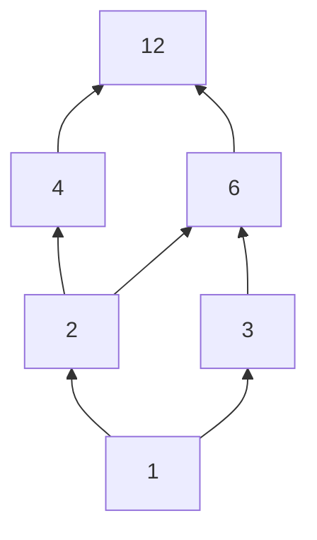
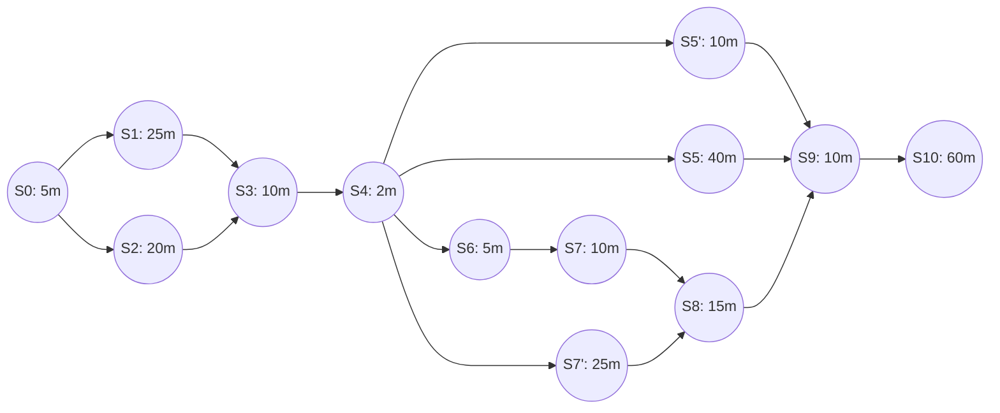

# Solución Tarea No. 03: Paralelismo a Nivel de Tarea

**Materia:** Computación Paralela y Distribuida  
**Facultad:** Facultad de Ingeniería, Departamento de Ingeniería de Sistemas e Industrial  
**Universidad:** Universidad Nacional de Colombia  
**Fuente principal de referencia:** [04_Paralelismo_a_Nivel_de_Tarea.md](../Apuntes/04_Paralelismo_a_Nivel_de_Tarea.md) y Diapositivas oficiales del curso ([04.Paralelismo_a_nivel_de_Tarea_2026.pdf](../Pdf/04.Paralelismo_a_nivel_de_Tarea_2026.pdf)).

---

## Pregunta 1

> **¿Qué es un conjunto parcialmente ordenado (POSET)? Muestre cuáles serían las propiedades de un POSET con el conjunto de los divisores de un número entero.**

### 1.1. Definición Formal de un POSET

Un **Conjunto Parcialmente Ordenado** (o **POSET**, por sus siglas en inglés: *Partially Ordered Set*) es una estructura matemática formal definida por un par:

$$(S, \le)$$

donde $S$ es un conjunto no vacío y $\le$ es una **relación binaria homogénea de orden parcial** sobre los elementos de $S$.

A diferencia de un **conjunto totalmente ordenado** (donde para cualquier par $a, b \in S$ siempre se cumple $a \le b$ o $b \le a$), en un POSET pueden existir pares de elementos $a, b$ que son **incomparables** (denotado $a \parallel b$), es decir, donde no se cumple ni $a \le b$ ni $b \le a$.

#### Relevancia en Computación Paralela
En el modelo de **Paralelismo a Nivel de Tarea**, la ejecución de un programa se modela mediante un **Grafo Computacional Dirigido y Acíclico (DAG)** $G = (V, E)$, el cual induce un POSET $(V, \prec)$ sobre las tareas:
- Si existe un camino dirigido de la tarea $u$ a la tarea $v$ ($u \prec v$), significa que $u$ debe completarse antes de que $v$ comience (dependencia temporal o de datos).
- Si dos tareas $u$ y $w$ son **incomparables** ($u \not\prec w$ y $w \not\prec u$), no existe dependencia entre ellas y pueden **ejecutarse legítimamente de forma paralela y simultánea**.

---

### 1.2. Propiedades Axiomáticas de un POSET

Para que una relación binaria $\le$ sobre un conjunto $S$ constituya un orden parcial reflexivo (o débil), debe satisfacer **tres propiedades fundamentales** para todos los elementos $a, b, c \in S$:

1. **Reflexividad:** Todo elemento está relacionado consigo mismo.
   $$\forall a \in S, \quad a \le a$$

2. **Antisimetría:** Si dos elementos se relacionan mutuamente en ambas direcciones, son idénticos.
   $$\forall a, b \in S, \quad (a \le b \land b \le a) \implies a = b$$

3. **Transitividad:** Si un elemento precede a un segundo, y este precede a un tercero, el primero precede al tercero.
   $$\forall a, b, c \in S, \quad (a \le b \land b \le c) \implies a \le c$$

---

### 1.3. Demostración con el Conjunto de los Divisores de un Entero

Sea $n \in \mathbb{Z}^+$ un número entero positivo fijo, y sea $D(n)$ el conjunto de todos sus divisores positivos:

$$D(n) = \{ d \in \mathbb{Z}^+ : d \mid n \}$$

La relación binaria a evaluar es la **relación de divisibilidad** ($\mid$), donde por definición:
$$a \mid b \iff \exists k \in \mathbb{Z}^+ \text{ tal que } b = k \cdot a$$

Demostremos que $(D(n), \mid)$ cumple las tres propiedades de un POSET:

#### 1. Reflexividad
Sea $a \in D(n)$.  
Podemos escribir $a = 1 \cdot a$, donde $1 \in \mathbb{Z}^+$.  
Por tanto, existe el entero $k = 1$ tal que $a = k \cdot a$, lo que implica que:
$$a \mid a \quad \forall a \in D(n)$$
*Todo divisor de $n$ se divide exactamente a sí mismo.*

#### 2. Antisimetría
Sean $a, b \in D(n)$ tales que $a \mid b$ y $b \mid a$.
- Por definición de divisibilidad:
  - $a \mid b \implies b = k_1 \cdot a$, con $k_1 \in \mathbb{Z}^+$ ($k_1 \ge 1$).
  - $b \mid a \implies a = k_2 \cdot b$, con $k_2 \in \mathbb{Z}^+$ ($k_2 \ge 1$).
- Sustituyendo la primera igualdad en la segunda:
  $$a = k_2 \cdot (k_1 \cdot a) = (k_1 \cdot k_2) \cdot a$$
- Dado que $a > 0$, dividimos ambos lados entre $a$:
  $$k_1 \cdot k_2 = 1$$
- En los enteros positivos $\mathbb{Z}^+$, la única solución para $k_1 \cdot k_2 = 1$ es $k_1 = k_2 = 1$.
- Sustituyendo $k_1 = 1$ en $b = k_1 \cdot a$:
  $$b = 1 \cdot a = a \implies a = b$$
*Se cumple la antisimetría.*

#### 3. Transitividad
Sean $a, b, c \in D(n)$ tales que $a \mid b$ y $b \mid c$.
- Por definición:
  - $b = k_1 \cdot a$, con $k_1 \in \mathbb{Z}^+$.
  - $c = k_2 \cdot b$, con $k_2 \in \mathbb{Z}^+$.
- Sustituyendo $b$ en la expresión de $c$:
  $$c = k_2 \cdot (k_1 \cdot a) = (k_1 \cdot k_2) \cdot a$$
- Como el producto de dos enteros positivos es un entero positivo ($k_3 = k_1 \cdot k_2 \in \mathbb{Z}^+$), se cumple que:
  $$a \mid c$$
*Se cumple la transitividad.*

---

### 1.4. Ejemplo Ilustrativo Concreto: $D(12)$

Tomemos $n = 12$. El conjunto de divisores es:
$$D(12) = \{1, 2, 3, 4, 6, 12\}$$

- **Relaciones de orden existentes:** $1 \mid 2$, $1 \mid 3$, $2 \mid 4$, $2 \mid 6$, $3 \mid 6$, $4 \mid 12$, $6 \mid 12$.
- **Elementos Incomparables:** Observemos los elementos $4$ y $6$:
  $$4 \nmid 6 \quad \text{y} \quad 6 \nmid 4$$
  Ni $4$ divide a $6$, ni $6$ divide a $4$. Son **incomparables** ($4 \parallel 6$).
- **Analogía directa con la computación paralela:** Así como $4$ y $6$ son independientes en el POSET $(D(12), \mid)$, dos tareas en un grafo computacional sin camino dirigido entre sí no dependen una de la otra y pueden ejecutarse simultáneamente en dos núcleos diferentes.



---

## Pregunta 2

> **Para el grafo computacional $G^{\text{ejercicio}}$ adicionarle las dos actividades indicadas en la ubicación que señalan las flechas azules en el diagrama. Después, calcule el $WORK(G^{\text{ejercicio}})$, el $SPAN(G^{\text{ejercicio}})$ y el paralelismo ideal correspondiente.**

### 2.1. Actividades y Tiempos del Grafo Base ($G$)

El problema modela la preparación y servicio de una cena (según los apuntes de la clase):

| Tarea | Descripción | Duración |
|:---:|---|:---:|
| $S_0$ | Diseñar el menú | $5\text{ min}$ |
| $S_1$ | Compra ingredientes aperitivo, vino, entrada y medallones | $25\text{ min}$ |
| $S_2$ | Compra ingredientes puré, ensalada, postre | $20\text{ min}$ |
| $S_3$ | Arreglar ingredientes | $10\text{ min}$ |
| $S_4$ | Organizar cocina | $2\text{ min}$ |
| $S_5$ | Preparar medallones | $40\text{ min}$ |
| $S_6$ | Preparar ensalada | $5\text{ min}$ |
| $S_7$ | Preparar puré | $10\text{ min}$ |
| $S_8$ | Preparar crema de pollo | $15\text{ min}$ |
| $S_9$ | Organizar el comedor | $10\text{ min}$ |
| $S_{10}$ | Servir la cena | $60\text{ min}$ |

### 2.2. Actividades Adicionadas ($G^{\text{ejercicio}}$)

Se incorporan al grafo las dos actividades señaladas por las flechas azules:
1. **$S_5'$**: Preparación salsa de champiñones ($10\text{ min}$). Se ejecuta en paralelo a la preparación del plato principal tras organizar la cocina ($S_4$) y finaliza antes de organizar el comedor ($S_9$).
2. **$S_7'$**: Preparación postre de tres leches ($25\text{ min}$). Comienza tras $S_4$ y conecta mediante la flecha azul hacia el bloque de finalización de cocina ($S_8$ o $S_9$).



---

### 2.3. Cálculo del Trabajo: $WORK(G^{\text{ejercicio}})$

El trabajo $WORK(G)$ o $T_1$ es el tiempo total acumulado que tomaría ejecutar todas las tareas en un único procesador ($p=1$), ignorando sobrecostos de comunicación. Corresponde a la **suma de los tiempos de todos los vértices del grafo**:

$$WORK(G^{\text{ejercicio}}) = \sum_{v \in V} \text{time}(v)$$

Calculando término a término:
$$\begin{aligned}
WORK(G^{\text{ejercicio}}) &= \text{time}(S_0) + \text{time}(S_1) + \text{time}(S_2) + \text{time}(S_3) + \text{time}(S_4) \\
&\quad + \text{time}(S_5) + \text{time}(S_5') + \text{time}(S_6) + \text{time}(S_7) + \text{time}(S_7') + \text{time}(S_8) \\
&\quad + \text{time}(S_9) + \text{time}(S_{10}) \\
&= 5 + 25 + 20 + 10 + 2 + 40 + 10 + 5 + 10 + 25 + 15 + 10 + 60
\end{aligned}$$

$$WORK(G^{\text{ejercicio}}) = 202 + 10 + 25 = \mathbf{237\text{ minutos}}$$

---

### 2.4. Cálculo del Tramo Crítico: $SPAN(G^{\text{ejercicio}})$

El tramo crítico $SPAN(G)$ o $T_\infty$ es la **longitud temporal del camino más largo** en el grafo computacional desde el nodo inicial hasta el nodo final. Determina el tiempo mínimo de ejecución con infinitos procesadores ($p = \infty$).

Analicemos las etapas del grafo:
1. **Etapa 1 (Compras):** Entre $S_0$ y $S_3$:
   - Rama $S_1$: $25\text{ min}$
   - Rama $S_2$: $20\text{ min}$
   - $\max(25, 20) = \mathbf{25\text{ min}}$ (Ruta por $S_1$).

2. **Etapa Intermedia:** $S_3 (10\text{ min}) + S_4 (2\text{ min}) = \mathbf{12\text{ min}}$.

3. **Etapa 2 (Cocina):** Entre $S_4$ y $S_9$:
   - **Rama de medallones ($S_5$):** $40\text{ min}$.
   - **Rama de salsa de champiñones ($S_5'$):** $10\text{ min}$.
   - **Rama de ensalada, puré y crema ($S_6 \to S_7 \to S_8$):** $5 + 10 + 15 = 30\text{ min}$.
   - **Rama de postre ($S_7'$):**
     - Si la flecha azul sincroniza en $S_8$: la duración hasta $S_9$ es $\text{time}(S_7') + \text{time}(S_8) = 25 + 15 = 40\text{ min}$.
     - Si sincroniza directamente en $S_9$: la duración es $\text{time}(S_7') = 25\text{ min}$.
   - En cualquiera de los casos, la duración máxima de la etapa de cocina es:
     $$\max(40, 10, 30, 40) = \mathbf{40\text{ min}}$$

4. **Etapa 3 (Servicio):** $S_9 (10\text{ min}) + S_{10} (60\text{ min}) = \mathbf{70\text{ min}}$.

Sumando a lo largo del camino crítico:
$$\begin{aligned}
SPAN(G^{\text{ejercicio}}) &= \text{time}(S_0) + \text{time}(S_1) + \text{time}(S_3) + \text{time}(S_4) + \text{time}(S_5) + \text{time}(S_9) + \text{time}(S_{10}) \\
&= 5 + 25 + 10 + 2 + 40 + 10 + 60
\end{aligned}$$

$$SPAN(G^{\text{ejercicio}}) = \mathbf{152\text{ minutos}}$$

> **Observación:** El tramo crítico no se incrementa respecto al grafo original porque las nuevas tareas $S_5'$ ($10\text{ min}$) y $S_7'$ ($25\text{ min}$) se ejecutan de manera concurrente dentro de la holgura temporal y ninguna excede la duración de la tarea más larga ($S_5 = 40\text{ min}$).

---

### 2.5. Cálculo del Paralelismo Ideal

El paralelismo ideal representa la **máxima aceleración teórica (*speedup*)** que puede alcanzarse en el algoritmo sin importar la cantidad física de procesadores:

$$\text{Paralelismo Ideal} = \frac{WORK(G^{\text{ejercicio}})}{SPAN(G^{\text{ejercicio}})} = \frac{T_1}{T_\infty}$$

Sustituyendo los valores calculados:
$$\text{Paralelismo Ideal} = \frac{237}{152} \approx \mathbf{1.5592 \approx 1.56}$$

---

## Pregunta 3

> **Para el grafo computacional $G^{\text{ejercicio}}$ escribir el seudocódigo de inicio y terminación de tareas utilizando las 'palabras' `async` y `finish`.**

### 3.1. Semántica de las Primitivas
- **`async { S }`**: Lanza el bloque o sentencia $S$ como una tarea hija asíncrona que se ejecuta en paralelo con el flujo que la invocó.
- **`finish { S }`**: Bloque estructurado de sincronización (*join colectivo*). Espera a que el bloque $S$ y **todas** las tareas asíncronas generadas transitivamente dentro de él concluyan antes de permitir continuar con la instrucción siguiente.

### 3.2. Seudocódigo de la Solución Principal

```c
S0; // Diseñar el menú (secuencial)

// Bloque 1: Compras paralelas en el supermercado
finish {
    async {
        S1; // Compra aperitivo, vino, entrada y medallones (hilo hijo)
    }
    S2;     // Compra puré, ensalada, postre (hilo principal)
}

S3; // Arreglar ingredientes (secuencial)
S4; // Organizar cocina (secuencial)

// Bloque 2: Preparación paralela de la cena
finish {
    async {
        S5; // Preparar medallones (40 min)
    }
    async {
        S5_prima; // Preparar salsa de champiñones (10 min)
    }
    async {
        S7_prima; // Preparar postre de tres leches (25 min)
    }
    // Secuencia de ensalada, puré y crema de pollo en el hilo principal:
    S6; // Preparar ensalada (5 min)
    S7; // Preparar puré (10 min)
    S8; // Preparar crema de pollo (15 min)
}

S9;  // Organizar comedor (secuencial)
S10; // Servir la cena (secuencial)
```

### 3.3. Variante con Dependencia Explícita en $S_8$

Si se modela de manera estricta la flecha azul inferior donde la preparación del postre $S_7'$ debe confluir antes de preparar la crema $S_8$, se utiliza un bloque `finish` anidado para sincronizar las preparaciones previas a $S_8$:

```c
S0;

finish {
    async { S1; }
    S2;
}

S3;
S4;

finish {
    async { S5; }
    async { S5_prima; }
    
    // Sub-bloque sincronizado antes de S8:
    finish {
        async { S7_prima; } // Postre (25 min) en paralelo con S6 y S7
        S6;                 // Ensalada (5 min)
        S7;                 // Puré (10 min)
    }
    S8; // Crema de pollo (15 min), inicia cuando S7 y S7' terminan
}

S9;
S10;
```

---

## Pregunta 4

> **El siguiente seudo-código, suma dos matrices triangulares inferiores (matrices cuadradas $n \times n$ en las cuales los elementos por encima de la diagonal, incluyendo la diagonal de $(0,0)$ a $(n,n)$, son cero). En el código, cada ejecución de la sentencia `A[i][j] = B[i][j] + C[i][j];` representa una unidad de tiempo en el grafo computacional correspondiente.**
>
> ```c
> finish {
>     for (int i = 0; i < n; i++) { 
>         async {
>             for (int j = 0; j < i; j++) { 
>                 A[i][j] = B[i][j] + C[i][j];
>             } // for-j
>         } // async
>     } // for-i
> } // finish
> ```
>
> **En términos de $n$ ¿Cuál es el WORK del código mostrado? Explique cómo obtuvo su respuesta.**

---

### 4.1. Análisis Estructural del Algoritmo

1. **Bucle externo (`for-i`):**  
   La variable de control $i$ toma los valores discretos:
   $$i \in \{0, 1, 2, \dots, n-1\}$$
   En cada iteración $i$, se genera una tarea asíncrona concurrente mediante la directiva `async`.

2. **Bucle interno (`for-j`):**  
   Para una iteración dada $i$, el bucle interno corre con la condición $j < i$ arrancando en $j = 0$:
   $$j \in \{0, 1, \dots, i-1\}$$
   El número total de veces que se ejecuta la sentencia elemental `A[i][j] = B[i][j] + C[i][j];` en dicha iteración es exactamente **$i$ veces**.

---

### 4.2. Conteo Paso a Paso de las Operaciones

Listando el número de operaciones realizadas por cada iteración $i$:

- Para $i = 0$: el bucle `for (int j = 0; j < 0; j++)` realiza **$0$ ejecuciones**.
- Para $i = 1$: el bucle `for (int j = 0; j < 1; j++)` realiza **$1$ ejecución** ($j = 0$).
- Para $i = 2$: el bucle realiza **$2$ ejecuciones** ($j = 0, 1$).
- Para $i = 3$: el bucle realiza **$3$ ejecuciones** ($j = 0, 1, 2$).
- $\dots$
- Para $i = n-1$: el bucle realiza **$n-1$ ejecuciones** ($j = 0, 1, \dots, n-2$).

---

### 4.3. Deducción Matemática del $WORK(n)$

El trabajo total $WORK(n)$ es la suma de las operaciones elementales de todas las tareas (ya que cada una representa $1$ unidad de tiempo):

$$WORK(n) = \sum_{i=0}^{n-1} i = 0 + 1 + 2 + 3 + \dots + (n-1)$$

Esta es la serie aritmética clásica de Gauss para los primeros $n-1$ enteros positivos:

$$WORK(n) = \frac{(n-1) \cdot ((n-1) + 1)}{2} = \frac{n(n-1)}{2} = \frac{n^2 - n}{2}$$

En notación asintótica:
$$WORK(n) = \mathbf{\Theta(n^2)}$$

---

### 4.4. Justificación Geométrica / Matricial

Una matriz cuadrada de tamaño $n \times n$ tiene un total de $n^2$ posiciones.  
- La diagonal principal está conformada por $n$ elementos: $(0,0), (1,1), \dots, (n-1, n-1)$.
- Excluyendo la diagonal principal, quedan:
  $$n^2 - n$$
  posiciones en la matriz.
- Por simetría, la mitad de estas posiciones se ubican estrictamente por encima de la diagonal (triángulo superior estricto) y la otra mitad estrictamente por debajo (triángulo inferior estricto):
  $$\frac{n^2 - n}{2} = \frac{n(n-1)}{2}$$

Dado que el enunciado especifica que las matrices son triangulares inferiores con ceros en la diagonal y por encima de ella, los únicos elementos no necesariamente nulos son aquellos con $i > j$. El código recorre e indexa precisamente todos y cada uno de estos elementos, realizando exactamente $\frac{n(n-1)}{2}$ sumas.

---

### 4.5. Métricas Complementarias (Span y Paralelismo Ideal)

Para brindar una caracterización completa según los apuntes de la materia:

- **Tramo Crítico ($SPAN(n)$):**  
  Como cada iteración $i$ del bucle exterior corre de forma concurrente bajo `async`, el tiempo total bajo infinitos procesadores estará determinado por la tarea paralela más pesada. La iteración más larga corresponde a $i = n-1$, la cual ejecuta $n-1$ iteraciones secuenciales:
  $$SPAN(n) = n - 1 = \mathbf{\Theta(n)}$$

- **Paralelismo Ideal:**
  $$\text{Paralelismo Ideal} = \frac{WORK(n)}{SPAN(n)} = \frac{\frac{n(n-1)}{2}}{n-1} = \frac{n}{2} = \mathbf{\Theta(n)}$$

> **Conclusión:** El algoritmo exhibe un paralelismo ideal que escala linealmente con el orden de la matriz ($\Theta(n)$), permitiendo aceleraciones sustanciales a medida que el tamaño de la matriz crece, sujeto únicamente a la política de balanceo de carga ante tareas asimétricas ($0$ a $n-1$ pasos).
