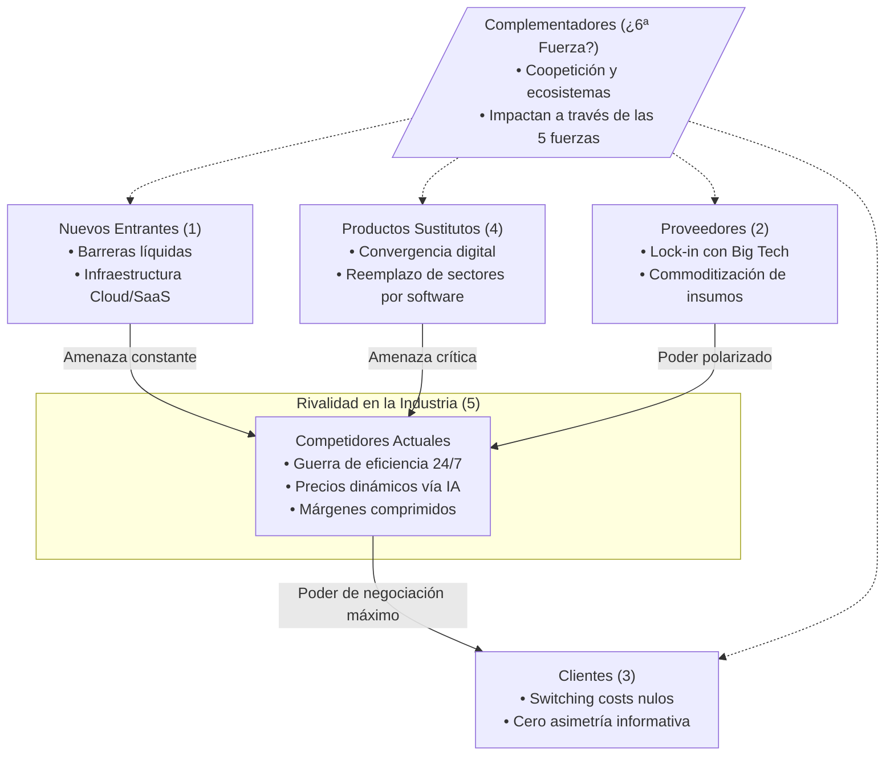
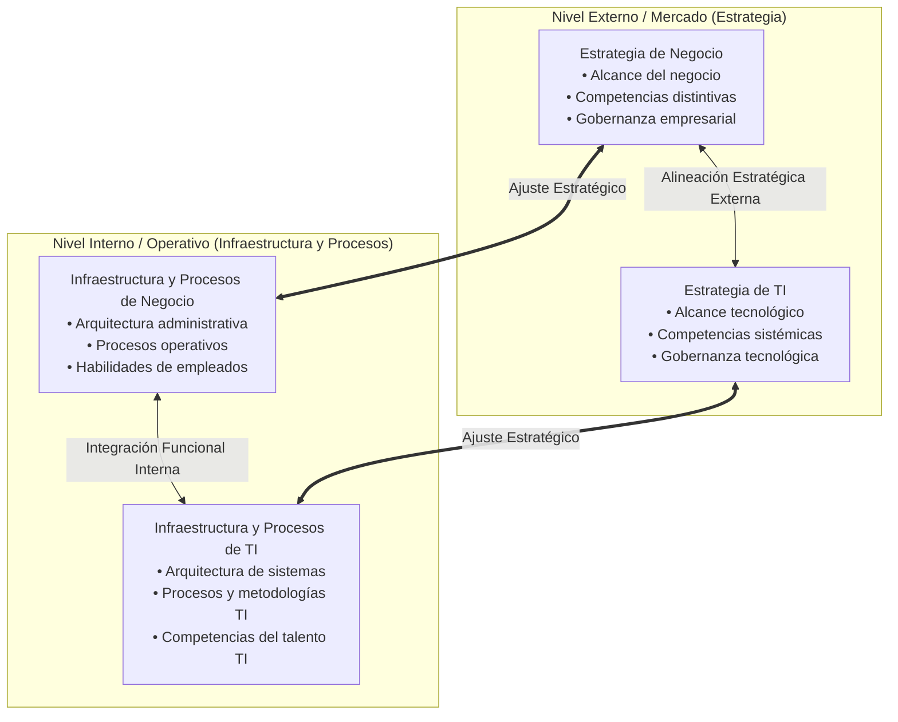

[← Volver a Curso.md](../Curso.md)

# 02. Estrategia TI y Ventaja Competitiva

> **Materia**: Sistemas de Información | **Fuente**: [Sesión 2. Estrategia TI y ventaja competitiva (1).pdf](../Documentos/Sesión%202.%20Estrategia%20TI%20y%20ventaja%20competitiva%20(1).pdf)  
> **Docente**: PhD Jhon Alexander Garcia Camargo  
> **Términos Core**: `5 Fuerzas de Porter`, `Barreras Líquidas`, `Switching Costs`, `Asimetría de Información`, `Convergencia Digital`, `Complementadores`, `Coopetición`, `Cadena de Valor`, `Actividades Primarias`, `Actividades de Apoyo`, `Margen`, `Modelo de Alineación Estratégica (SAM)`, `Paradoja de la Productividad`, `Estrategia Digital de Negocio`, `Rol del CIO`

---

## 1. Fundamentos: TI, Procesos y Estrategia

- **Proceso de Negocio**: Secuencia coordinada de tareas que transforma entradas (`inputs`) mediante recursos organizacionales en salidas (`outputs`) de valor para el cliente.
- **Transformación de Procesos vía TI**: La tecnología no es un mero acelerador de tareas existentes; reconfigura radicalmente la arquitectura de los procesos eliminando pasos intermedios, fricciones y costos transaccionales.
- **Paradoja de la Productividad de TI (Erik Brynjolfsson)**:
  - *Premisa*: El incremento de inversión en TI históricamente no exhibe correlación lineal directa e inmediata con mejoras medibles en productividad agregada ("vemos computadores en todas partes menos en las estadísticas de productividad" — Robert Solow).
  - *Causas estructurales*:
    1. **Errores de medición**: Métrica clásica de PIB ignora ganancias cualitativas (variedad, conveniencia, personalización, ahorro de tiempo).
    2. **Retardos temporales (`lags`)**: Las curvas de aprendizaje y el rediseño organizacional toman años antes de rentabilizar la infraestructura.
    3. **Redistribución de mercado**: La TI traslada cuotas de mercado entre rivales sin elevar la productividad total de la industria.
    4. **Mala gestión operativa**: Implementar tecnología sobre procesos ineficientes sin reingeniería estructural.
- **Estrategia Digital de Negocio (Bharadwaj et al., 2013)**:
  - Supera la visión tradicional de TI subordinada al negocio; unifica estrategia comercial y estrategia digital.
  - *Dimensiones operativas*:
    - **Alcance (`Scope`)**: Conectividad ubicua que trasciende fronteras corporativas clásicas.
    - **Escala (`Scale`)**: Aprovechamiento de efectos de red y costos marginales cercanos a cero en software/nube.
    - **Velocidad (`Speed`)**: Ciclos de toma de decisiones y respuesta comercial en tiempo real.
    - **Fuentes de Valor**: Monetización de ecosistemas, analítica de datos y captura dinámica de valor.

---

## 2. Mutación de las 5 Fuerzas de Porter en la Era Digital

Marco microeconómico formulado por Michael Porter (1979) para cuantificar el atractivo intrínseco y la rentabilidad estructural de una industria.

| Fuerza Competitiva | Dinámica Analógica Tradicional | Mutación en la Era Digital | Impacto / Peso Actual |
| :--- | :--- | :--- | :--- |
| **1. Amenaza de Nuevos Entrantes** | Protegida por economías de escala de capital intensivo, fábricas e infraestructura física. | **Barreras Líquidas**: Cloud computing (`SaaS`, `IaaS`) y marketing algorítmico reducen el Capex a Opex; una startup compite globalmente con inversión mínima. Nuevas barreras son intangibles: datos acumulados, efectos de red y marca. | **Aumentado**: Entrada constante, ágil y disruptiva. |
| **2. Poder de Negociación de Proveedores** | Concentrado en proveedores exclusivos de materias primas o componentes físicos críticos. | **Del Dominio Físico a la Plataforma**: Proveedores mutan a gigantes de infraestructura (AWS, Google, Microsoft) o creadores descentralizados. Si existe dependencia de algoritmos/ecosistemas, el poder es absoluto (lock-in); para insumos genéricos, la transparencia digital lo pulveriza. | **Polarizado**: Máximo ante plataformas dominantes monopólicas; mínimo ante proveedores de insumos estándar. |
| **3. Poder de Negociación de Clientes** | Asimetría de información a favor de la empresa; altos costos de búsqueda geográfica. | **El Soberano Digital**: Eliminación radical de la asimetría informativa vía comparadores de precios, marketplaces y reseñas en tiempo real. Costo de cambio (`switching cost`) reducido casi a cero a un clic de distancia. | **Máximo**: Desplazamiento casi absoluto del control hacia el consumidor. |
| **4. Amenaza de Productos Sustitutos** | Productos alternativos de diseño físico similar que resuelven una misma función dentro del sector. | **Convergencia Digital**: Industrias completas canibalizadas o reemplazadas por aplicaciones de software y plataformas intersectoriales (ej. videollamadas vs. viajes de negocios, streaming vs. soportes físicos). | **Crítico**: Amenaza continua procedente de sectores tecnológicos adyacentes no tradicionales. |
| **5. Rivalidad entre Competidores Existentes** | Competencia local o regional acotada por horarios comerciales y fronteras geográficas. | **Guerra de la Eficiencia 24/7**: El e-commerce suprime barreras geográficas (tienda local compite contra conglomerados mundiales). Competencia basada en IA para fijación dinámica de precios, micro-segmentación y optimización logística en tiempo real. | **Intenso**: Erosión sistemática de márgenes por guerras de precios y saturación de catálogo. |

### El Debate de la "Sexta Fuerza": Complementadores y Coopetición
- **Definición**: Un *complementador* es un actor de mercado cuyo producto o servicio incrementa significativamente el valor percibido del producto propio (ej. desarrolladores de aplicaciones móviles respecto a los fabricantes de smartphones).
- **Mecanismo de Coopetición**: Cooperación simultánea con competidores para expandir la demanda global del mercado ("agrandar el pastel") antes de disputar su participación individual.
- **Posición Canónica de Michael Porter (HBR, 2008)**:
  - **Rechaza** formalmente a los complementadores como una sexta fuerza estructural autónoma.
  - *Fundamento*: Los complementos no ejercen un vector de fuerza unívocamente favorable o adverso sobre la rentabilidad; su impacto financiero se transmite exclusivamente modulando la intensidad de las 5 fuerzas ya existentes (p. ej., elevando las barreras de entrada o reduciendo los sustitutos disponibles).

---

## 3. Cadena de Valor de Porter y Maximización del Margen

Marco analítico para descomponer el funcionamiento interno de una organización en bloques de actividades estratégicas e identificar fuentes concretas de ventaja competitiva (liderazgo en costos o diferenciación).

### Ecuación Estructural del Margen
$$\text{Margen} = \text{Valor Total Aportado al Cliente} - \text{Costo Total Acumulado de las Actividades}$$

- **Condición de Ventaja Competitiva**: Generar un diferencial de valor percibido que exceda el costo agregado de ejecutar todas las actividades primarias y de apoyo.
- **El Caso Starbucks ("El negocio no es el café")**: El grano de café es un *commodity* agrícola con margen despreciable; el sobreprecio y la rentabilidad sostenida derivan de la sincronización de actividades: atmósfera del local (tercer espacio), selección y cultura del personal (baristas), cadena logística trazable y fidelización digital mediante app móvil con billetera de prepago y analítica predictiva.

### Desglose de Actividades Primarias vs. Actividades de Apoyo

| Categoría | Actividad | Definición Operativa | Palanca Tecnológica de TI |
| :--- | :--- | :--- | :--- |
| **Primaria** | **Logística Interna (`Inbound Logistics`)** | Recepción, almacenamiento, gestión de inventarios y distribución interna de materias primas e insumos. | Sistemas ERP/WMS, tracking satelital, sensores IoT y etiquetado RFID. |
| **Primaria** | **Operaciones (`Operations`)** | Procesamiento mecánico, físico o lógico de insumos para fabricar el producto o estructurar el servicio. | Automatización robótica, mantenimiento predictivo, sistemas CAD/CAM. |
| **Primaria** | **Logística Externa (`Outbound Logistics`)** | Almacenamiento, consolidación, ruteo y despacho físico o digital del producto terminado hacia clientes. | Algoritmos de ruteo dinámico, tracking de entregas en tiempo real, fulfillment automatizado. |
| **Primaria** | **Marketing y Ventas (`Marketing & Sales`)** | Atracción comercial, fijación de precios, canales publicitarios y facilitación del acto de compra. | Plataformas CRM, funnels de conversión, e-commerce, segmentación algorítmica y pauta digital. |
| **Primaria** | **Servicio Postventa (`Service`)** | Mantenimiento, soporte técnico, garantías y atención continua para sostener el valor del producto vendido. | Asistentes virtuales con IA, portales de autoservicio (`Helpdesk`), telemetría remota. |
| **Apoyo** | **Infraestructura Corporativa (`Firm Infrastructure`)** | Alta gerencia, planificación estratégica, gobernanza legal, cumplimiento normativo y finanzas. | Dashboards ejecutivos (`ESS`), sistemas ERP contables, gestión documental digital. |
| **Apoyo** | **Gestión de Recursos Humanos (`HRM`)** | Reclutamiento, selección, contratación, capacitación, planes de carrera y compensaciones del personal. | Plataformas de reclutamiento con screening por IA, sistemas de nómina, portales de e-learning. |
| **Apoyo** | **Desarrollo Tecnológico (`Tech Development`)** | Investigación y desarrollo (I+D), diseño de productos, mejora de procesos internos y software corporativo. | Repositorios de código, entornos cloud CI/CD, laboratorios de prototipado rápido. |
| **Apoyo** | **Adquisiciones / Compras (`Procurement`)** | Función de aprovisionamiento transversal: contractualización, compras y negociación de insumos y servicios. | Plataformas B2B de e-procurement, subastas electrónicas, auditoría automática de contratos. |

```mermaid
flowchart LR
    subgraph Apoyo["Actividades de Apoyo (Transversales a toda la organización)"]
        Infra["Infraestructura de la Empresa (Finanzas, Legal, Planificación)"]
        HR["Gestión de Recursos Humanos (Contratación, Formación, Compensación)"]
        Tech["Desarrollo Tecnológico (I+D, Software, Redes, Diseño de Procesos)"]
        Proc["Adquisiciones / Compras (E-procurement, Proveedores globales)"]
    end

    subgraph Primarias["Actividades Primarias (Secuencia de flujo de valor físico/digital)"]
        direction LR
        Inbound["Logística Interna"] --> Ops["Operaciones"] --> Outbound["Logística Externa"] --> Mkt["Marketing y Ventas"] --> Svc["Servicio Postventa"]
    end

    Apoyo -. Respaldan y optimizan .-> Primarias
    Primarias ==> Margen{{"MARGEN<br/>(Valor aportado - Costo total)"}}
    Apoyo ==> Margen
```

---

## 4. Modelo de Alineación Estratégica (SAM) y Rol del CIO

Formulado por Henderson & Venkatraman (1993); postula que la TI es un catalizador estratégico que requiere coherencia simétrica en cuatro dimensiones organizacionales.

- **Dimensiones Fundamentales de Ajuste**:
  - **Alineación Estratégica (Ajuste Externo)**: Congruencia entre los imperativos del negocio en el mercado y la capacidad de la tecnología para respaldar o liderar nuevos modelos comerciales.
  - **Integración Funcional (Ajuste Interno)**: Acoplamiento bidireccional entre las capacidades tecnológicas de TI y los flujos operativos diarios del personal.
- **Evolución Histórica del CIO (`Chief Information Officer`)**:
  - *Etapa Tradicional (Centro de Costos)*: Gerente técnico orientado a mantenimiento reactivo, SLA de soporte básico, disponibilidad de servidores ("mantener las luces encendidas") y recorte de gastos de infraestructura.
  - *Etapa Estratégica (Generador de Ingresos)*: Co-diseñador del modelo de negocio, miembro clave de la junta directiva y habilitador de transformación digital enfocado en captura de valor, nuevos canales e innovación de producto.

---

## 5. Puntos Críticos de Examen y Trampas Conceptuales

- **Trampa 1: Confundir `Procurement` (Adquisiciones) con `Inbound Logistics` (Logística Interna)**:
  - *Inbound Logistics*: Actividad primaria que manipula físicamente los insumos (recibir camiones, clasificar materiales, despachar a bodega).
  - *Procurement*: Actividad de apoyo transversal que ejecuta la gestión contractual y comercial de compra de bienes/servicios para cualquier área de la compañía (desde comprar servidores para TI hasta contratar consultoría legal).
- **Trampa 2: Suponer que la TI confiere ventaja competitiva per se**:
  - El hardware y el software comercial estándar (`commodity`) son replicables por los competidores en el corto plazo.
  - La ventaja competitiva surge exclusivamente cuando la TI se integra de forma propietaria con procesos internos, datos históricos irreplicables, cultura y alineación estratégica (SAM).
- **Trampa 3: Postura de Porter frente a la 6ª Fuerza**:
  - Si un examen pregunta si Porter reconoce a los complementadores como la sexta fuerza, **la respuesta canónica es NO**. Porter argumenta que los complementadores influyen indirectamente acelerando o frenando las cinco fuerzas estructurales ya definidas.
- **Trampa 4: Reducción simplista del Margen**:
  - Aumentar el margen no equivale únicamente a recortar costos. Reducir costos en logística o servicio puede destruir el valor percibido por el cliente de forma desproporcionada, reduciendo el margen neto final.

