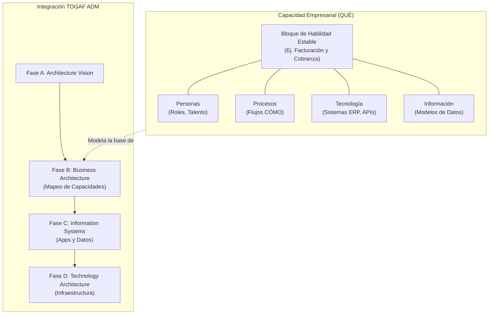
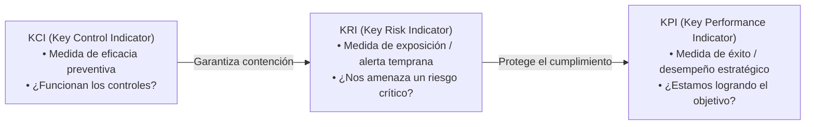
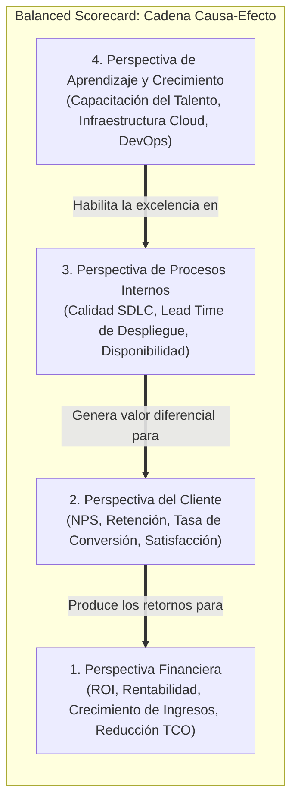
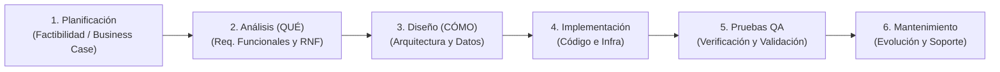
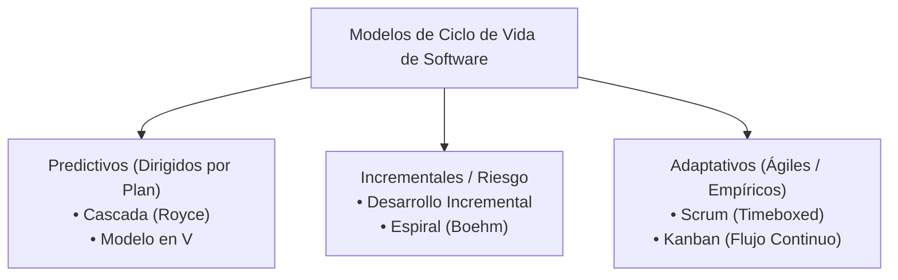
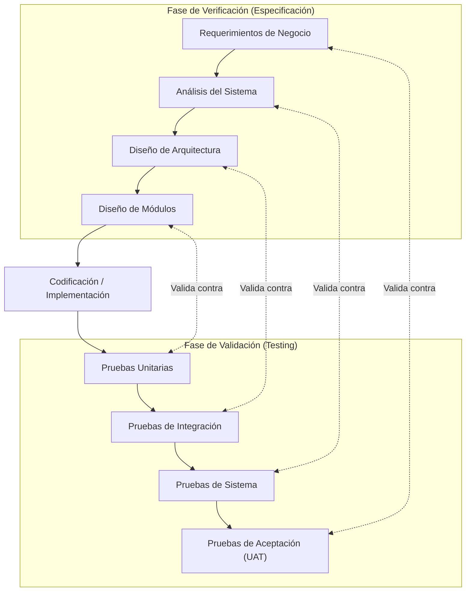
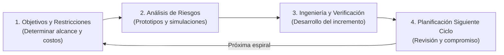
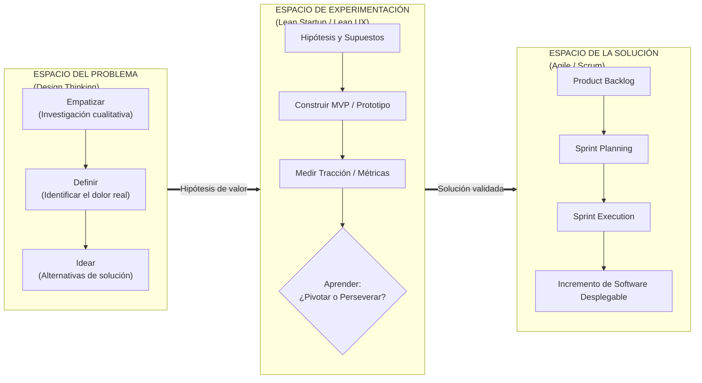

[← Volver a Curso.md](../Curso.md)

# 03. Alineación Estratégica y Ciclos de Desarrollo de Software (SDLC)

> **Materia**: Sistemas de Información | **Fuente**: [Sesión 3. Alineación estratégica y ciclos de desarrollo de software.pdf](../Documentos/Sesión%203.%20Alineación%20estratégica%20y%20ciclos%20de%20desarrollo%20de%20software.pdf)  
> **Docente**: PhD Jhon Alexander Garcia Camargo  
> **Términos Core**: `Business Capability Map`, `TOGAF ADM`, `Capacidad vs Proceso`, `KPI`, `KRI`, `KCI`, `Balanced Scorecard (BSC)`, `4 Perspectivas de Kaplan & Norton`, `SDLC`, `Royce (1970)`, `TCO Mantenimiento (60-80%)`, `SWEBOK`, `Modelo Cascada`, `Modelo en V`, `Modelo Espiral (Boehm)`, `Desarrollo Incremental`, `Scrum`, `Kanban`, `WIP Limit`, `Ley de Little`, `Design Thinking`, `Lean Startup`, `Pivot or Persevere`

---

## 1. Mapeo de Capacidades de Negocio (Business Capability Mapping)

Marco de arquitectura empresarial para descomponer y articular lo que una organización hace para generar valor, independientemente de su estructura orgánica o tecnológica coyuntural.

- **Definición Canónica (TOGAF / The Open Group)**: Una *capacidad* es la habilidad particular o facultad que una empresa posee o intercambia para ejecutar una función esencial y alcanzar un objetivo de negocio.
- **Definición Formal (Ulrich Homann - Microsoft Enterprise Architecture)**: "Habilidad particular que una empresa puede poseer o intercambiar para lograr un propósito empresarial concreto. Describe **lo que hace** la empresa (resultados y niveles de servicio) para mejorar la creación de valor; abstrae e integra a **personas, procesos/procedimientos, tecnología e información** en los bloques esenciales necesarios para facilitar la optimización de rendimiento y el análisis de rediseño."
- **Axioma Diferencial (Denise Cook)**:
  $$\text{Capacidad de Negocio} = \text{QUÉ hace la empresa (Estable)} \quad \longleftrightarrow \quad \text{Proceso de Negocio} = \text{CÓMO lo hace (Dinámico / Evolutivo)}$$

### Cuadro Comparativo: Capacidad vs. Proceso

| Dimensión | Capacidad de Negocio (`Business Capability`) | Proceso de Negocio (`Business Process`) |
| :--- | :--- | :--- |
| **Interrogante Clave** | **¿QUÉ hace la empresa?** | **¿CÓMO, QUIÉN y CUÁNDO se ejecuta?** |
| **Estabilidad Temporal** | **Alta**: Invariable salvo cambio radical de modelo corporativo (ej. "Gestión de Pagos"). | **Baja**: Altamente volátil ante automatización, normativas o software nuevo. |
| **Componentes Integrados** | Personas + Procesos + Tecnología + Información. | Secuencia ordenada de tareas, roles, entradas (`inputs`) y salidas (`outputs`). |
| **Representación Visual** | Mapa matricial jerárquico (*Level 1*, *Level 2*, *Level 3*) tipo heatmap. | Diagramas de flujo secuenciales o notación BPMN con carriles (*pools/lanes*). |
| **Aplicación Estratégica** | Asignación de presupuesto Capex/Opex y racionalización de TI. | Optimización operativa, eliminación de cuellos de botella y reingeniería. |

### Escenarios Operativos de Aplicación de los Mapas de Capacidad
1. **Consolidación de TI en Fusiones y Adquisiciones (`M&A`)**: Superponer mapas de ambas entidades para detectar capacidades redundantes y racionalizar el portafolio de aplicaciones (*application portfolio rationalization*), suprimiendo sistemas duplicados.
2. **Planificación Estratégica e Inversión TI**: Identificar brechas de madurez (*gap analysis*) mediante mapas térmicos (*heatmaps*); asignar capital a capacidades de alto impacto competitivo con bajo nivel tecnológico actual.
3. **Roadmap de Producto y Desarrollo**: Estructurar épicas y requerimientos de software alineados a capacidades específicas en lugar de requerimientos departamentales aislados.

---

## 2. Indicadores de Alineación Estratégica: Tríada KPI, KRI y KCI

Marco métrico para articular el desempeño corporativo, la exposición al riesgo operacional y la eficacia de los controles preventivos y de mitigación en sistemas de información.

### Definiciones y Relación Causal

- **KPI (`Key Performance Indicator`)**: Métrica de desempeño orientada a resultados (*lagging/leading*). Cuantifica el progreso hacia metas estratégicas de negocio.
- **KRI (`Key Risk Indicator`)**: Métrica predictiva (*leading indicator*) de alerta temprana. Señala incrementos en la probabilidad o impacto de eventos adversos que amenazan el cumplimiento de los KPI.
- **KCI (`Key Control Indicator`)**: Métrica de cumplimiento y robustez operativa. Evalúa si los mecanismos de control diseñados están activos, vigentes y mitigando los riesgos señalados por los KRI.

### Matriz Operativa de la Tríada en TI

| Indicador | Propósito | Horizonte Temporal | Pregunta Clave | Ejemplo en Pasarela de Pagos E-Commerce |
| :--- | :--- | :--- | :--- | :--- |
| **KPI** | Medir creación de valor y éxito de metas. | Histórico / En curso | ¿Alcanzamos la meta? | **Disponibilidad del servicio $\ge 99.99\%$** ($< 4.3$ min caída/mes); $10.000$ tx/seg. |
| **KRI** | Alertar sobre probabilidad e impacto de amenazas. | Preventivo / Predictivo | ¿Qué riesgo se aproxima? | **Uso de CPU/RAM en clúster $> 85\%$** durante 5 min; tasa de error HTTP 5xx $> 0.5\%$. |
| **KCI** | Medir cobertura y efectividad del blindaje. | Operativo continuo | ¿El control funciona? | **$\%$ de nodos con auto-escalado probado**; cobertura de pruebas de carga $= 100\%$. |

---

## 3. Cuadro de Mando Integral (Balanced Scorecard - BSC)

Marco de gestión estratégica formulado por **Robert Kaplan y David Norton (1992, 1996, 2006)** para balancear métricas financieras tradicionales con inductores no financieros de creación de valor futuro.

### Las 4 Perspectivas Interconectadas

1. **Financiera (`Financial`)**: "¿Cómo debemos aparecer ante los accionistas para tener éxito financiero?". Metas: Retorno de inversión (ROI), crecimiento de ingresos, reducción del costo marginal, rentabilidad por cliente.
2. **Cliente (`Customer`)**: "¿Cómo debemos aparecer ante los clientes para alcanzar nuestra visión?". Metas: Retención de usuarios, satisfacción (CSAT/NPS), reducción de costos de cambio (*switching costs*), tiempo de respuesta.
3. **Procesos Internos (`Internal Business Processes`)**: "¿En qué procesos internos debemos sobresalir para satisfacer a accionistas y clientes?". Metas: Calidad del software, ciclo de despliegue (lead time), costo de transacción, gobernanza y cumplimiento.
4. **Aprendizaje y Crecimiento (`Learning & Growth`)**: "¿Cómo mantendremos la capacidad de cambiar, innovar y mejorar continuamente?". Metas: Competencias técnicas del talento TI, adopción de cultura ágil/DevOps, infraestructura en la nube y activos de datos.

- **Principio de Causalidad Ascendente**: Los activos intangibles y el capital humano (**Aprendizaje y Crecimiento**) optimizan los flujos de trabajo (**Procesos Internos**), lo cual eleva la propuesta de valor (**Clientes**), desencadenando el éxito monetario (**Finanzas**).

---

## 4. Fundamentos del Ciclo de Vida de Software (SDLC)

### Naturaleza Ontológica del Software (SWEBOK v3.0, IEEE Computer Society)
- **Intangible y Moldeable (`Malleable`)**: El software no obedece restricciones físicas de rozamiento, fatiga mecánica o gravedad. Puede reconfigurarse indefinidamente, lo que habilita múltiples modelos de ciclo de vida (desde lineales hasta continuos).
- **Inexistencia de Desgaste Físico**: El software no se deteriora con el tiempo; sufre obsolescencia funcional, deuda técnica acumulada e incompatibilidad con cambios en el entorno operativo.
- **Economía del Software**: Costo marginal de replicación virtualmente nulo (\$0) frente a costos de diseño, verificación y evolución sumamente elevados.

### Principio de Royce (1970 - "Managing the Development of Large Software Systems")
- **Orden lógico, no cronológico**: Las fases del SDLC representan una descomposición analítica de responsabilidades, no una camisa de fuerza temporal sin retorno. Forzar una ejecución estrictamente cronológica y secuencial sin bucles de retroalimentación es la causa raíz de fracasos en sistemas complejos.

### Fases del SDLC y Distribución del Costo Total (TCO)
1. **Planificación**: Justificación económica y factibilidad técnica (¿Podemos y debemos construirlo?).
2. **Análisis (El "QUÉ")**: Levantamiento y especificación formal de requerimientos funcionales (`RF`) y no funcionales (`RNF`).
3. **Diseño (El "CÓMO")**: Definición de arquitectura de software, patrones arquitectónicos, diagramas de interacción y modelo de bases de datos.
4. **Implementación**: Codificación, pruebas unitarias automatizadas y configuración de infraestructura como código (`IaC`).
5. **Pruebas (QA)**:
   - **Verificación**: ¿Construimos el sistema correctamente? (Apego a la especificación de diseño).
   - **Validación**: ¿Construimos el sistema correcto? (Satisface la necesidad real del usuario).
6. **Mantenimiento**: Corrección de defectos, adaptación a nuevas plataformas y evolución funcional.

$$\text{Costo de Fase de Mantenimiento} = 60\% \text{ a } 80\% \text{ del TCO Total del Software}$$

> [!WARNING]
> La fase de desarrollo inicial solo representa del **20% al 40%** del costo de vida de un sistema. Escatimar en análisis, pruebas y arquitectura limpia durante la creación inicial incrementa de manera exponencial el gasto de mantenimiento a largo plazo.

---

## 5. Modelos de Gestión de Software: Predictivos, Incrementales y Adaptativos

### 1. Modelos Predictivos (Cascada y Modelo en V)
- **Premisa Operativa**: Requerimientos completamente conocidos, estables e inmutables desde el inicio. Dominio técnico dominado con bajo grado de incertidumbre.
- **Variante Modelo en V**: Asocia de forma simétrica y bidireccional cada fase de especificación con su nivel de prueba correspondiente.

- **Criterio de Uso**: Proyectos de **alta criticidad** donde un defecto causa pérdidas de vidas humanas o catástrofes financieras (dispositivos médicos, control de reactores, software aeroespacial, represas hidroeléctricas) o software con regulaciones normativas fijas e innegociables (ej. sistema de nómina tributaria en Colombia).

---

### 2. Modelos Incrementales y Orientados a Riesgo

#### Desarrollo Incremental
- Entrega escalonada: Se construye y despliega un núcleo operativo básico (**Core**) en la versión 1, añadiendo "incrementos" de funcionalidad en versiones sucesivas.
- Reduce el tiempo de puesta en producción inicial y permite obtener retroalimentación temprana sobre el núcleo del sistema.

#### Modelo Espiral (Barry Boehm, 1988)
- **Motor Central**: **Análisis continuo y mitigación explícita de riesgos** en cada ciclo iterativo.
- **Geometría del Modelo**:
  - **Dimensión Radial**: Costo acumulado invertido.
  - **Dimensión Angular**: Progreso a través de las fases de desarrollo.
- **4 Cuadrantes de cada Iteración**:
  1. *Determinar objetivos, alternativas y restricciones*.
  2. *Evaluar alternativas; identificar y resolver riesgos* (mediante prototipado rápido, simulaciones y benchmarks).
  3. *Desarrollar y verificar el producto del nivel actual*.
  4. *Planificar la siguiente fase y revisar compromisos con los interesados*.

---

### 3. Modelos Adaptativos (Ágiles / Empíricos)

- **Premisa Operativa**: "Abrazar el cambio en lugar de intentar predecirlo". Respuesta ante la incertidumbre mediante iteraciones cortas, retroalimentación frecuente y software funcional sobre documentación exhaustiva.

#### Scrum (Schwaber & Sutherland, 2020)
- Marco basado en empirismo: **Transparencia, Inspección y Adaptación**.
- **Timeboxing**: Iteraciones de duración fija (**Sprints**) de 1 a 4 semanas.
- **Roles**: Product Owner (maximiza el valor del producto), Scrum Master (gestiona el marco y elimina impedimentos), Developers (construyen el incremento).
- **Artefactos y Compromisos**:
  - *Product Backlog* $\rightarrow$ Compromiso: *Product Goal*.
  - *Sprint Backlog* $\rightarrow$ Compromiso: *Sprint Goal*.
  - *Increment* $\rightarrow$ Compromiso: *Definition of Done (DoD)*.
- **Eventos**: Sprint Planning, Daily Scrum, Sprint Review, Sprint Retrospective.

#### Kanban (David J. Anderson)
- Gestión visual del flujo continuo de trabajo (*Pull System*).
- No impone iteraciones fijas (*sprints*) ni roles predeterminados.
- **Límite de Trabajo en Curso (WIP Limit - Work In Progress)**: Restricción cuantitativa al número de tareas permitidas en cada columna de estado simultáneamente.
  - *Efecto*: Evita la sobrecarga de trabajo, expone cuellos de botella inmediatamente y reduce los tiempos de entrega.
  - **Ley de Little**:
    $$\text{Cycle Time (Tiempo de Ciclo)} = \frac{\text{WIP (Trabajo en Proceso)}}{\text{Throughput (Tasa de Salida)}}$$

---

### Tabla Comparativa de Modelos de Gestión de Software

| Criterio | Predictivos (Cascada / V) | Incrementales / Espiral | Adaptativos (Scrum / Kanban) |
| :--- | :--- | :--- | :--- |
| **Requerimientos** | Fijos, estables y congelados al inicio. | Inicialmente generales; detallados por ciclo. | Emergentes, cambiantes y priorizados por valor. |
| **Gestión del Cambio** | Costosa; requiere comités de control de cambios. | Aceptable entre incrementos planificados. | Intrínseca; el cambio es bienvenido en cada iteración. |
| **Entrega de Valor** | Única al final del ciclo de vida. | Escalonada en incrementos operativos. | Continua en incrementos potencialmente desplegables. |
| **Gestor Primario** | Seguimiento estricto del plan inicial. | Mitigación cuantitativa del riesgo (Boehm). | Valor entregado al usuario y retroalimentación empírica. |
| **Costo del Cambio** | Exponencial ($\approx 100\times$ si se detecta tarde). | Moderado si se detecta en la espiral correcta. | Lineal y controlado dentro del timebox. |

---

## 6. Marcos Mixtos de Gestión: La Tríada de Innovación

Articulación sinérgica entre **Design Thinking**, **Lean Startup / Lean UX** y **Agile / Scrum** para sincronizar el descubrimiento del problema con la entrega continua de valor.

### Articulación de los 3 Marcos

1. **Design Thinking (Espacio del Problema - *Customer Problem*)**:
   - *Foco*: Deseabilidad humana. Explora la divergencia y convergencia para entender a profundidad al usuario.
   - *Fases*: **Empatizar** (comprender dolores y contexto), **Definir** (declarar el problema nuclear) e **Idear** (explorar múltiples conceptos).
   - *Pregunta clave*: "¿Estamos resolviendo el problema correcto?".

2. **Lean Startup / Lean UX (Espacio de Experimentación - *Problem/Solution Fit*)**:
   - *Foco*: Viabilidad del modelo de negocio.
   - *Bucle*: **Construir $\rightarrow$ Medir $\rightarrow$ Aprender (`Build - Measure - Learn`)**.
   - *Mecanismo*: Transforma ideas en experimentos rápidos (*Minimum Viable Product* - MVP) para comprobar hipótesis con usuarios reales.
   - *Decisión Estratégica*:
     - **Perseverar (`Persevere`)**: Si los datos confirman la hipótesis, transferir el alcance a desarrollo escalable.
     - **Pivotar (`Pivot`)**: Si las métricas refutan la hipótesis, modificar la propuesta de solución, canal o segmento sin cambiar la visión de negocio.

3. **Agile / Scrum (Espacio de la Solución - *Customer Solution Delivery*)**:
   - *Foco*: Factibilidad técnica y excelencia operativa.
   - *Mecanismo*: Toma las hipótesis validadas por Lean Startup, las traduce en historias de usuario en el *Product Backlog* y ejecuta entregas incrementales con calidad de producción.
   - *Pregunta clave*: "¿Estamos construyendo la solución correctamente y a ritmo sostenible?".

---

## 7. Puntos Críticos de Examen y Trampas Conceptuales

- **Trampa 1: Confundir Capacidad de Negocio con Proceso de Negocio**:
  - *Capacidad*: Es el **QUÉ** (estable en el tiempo, ej. "Gestión de Créditos"). Se representa en mapas matriciales y no describe secuencia temporal.
  - *Proceso*: Es el **CÓMO** (secuencia temporal de tareas, actividades, roles y herramientas que ejecutan dicha capacidad). Cambia constantemente ante la digitalización.
- **Trampa 2: Dirección Causal en el Balanced Scorecard (BSC)**:
  - Error típico: Afirmar que el BSC se construye desde los objetivos financieros hacia abajo.
  - Corrección: Aunque la estrategia se desglosa desde la visión, la **cadena de causa-efecto operativa** fluye ascendentemente: la inversión en *Aprendizaje y Crecimiento* genera capacidades internas en *Procesos*, que producen valor en *Clientes*, resultando finalmente en impacto *Financiero*.
- **Trampa 3: Interpretación Errónea del Paper de Royce (1970)**:
  - Error típico: Afirmar que Winston Royce fue el promotor y defensor de la metodología Cascada pura.
  - Corrección: Royce describió el modelo puramente secuencial paso a paso como un modelo **defectuoso y con alto riesgo de fracaso ("risky and invites failure")**, proponiendo inmediatamente la necesidad de añadir iteraciones, prototipos y bucles continuos de retroalimentación entre fases.
- **Trampa 4: Distinción Leading vs. Lagging en KPI, KRI y KCI**:
  - Los **KRI** son métricas predictivas (*leading*); actúan como velocímetro o sensor térmico antes de que ocurra el incidente.
  - Los **KPI** son predominantemente métricas de resultado (*lagging*); informan si la meta se logró o no tras el periodo de ejecución.
  - Los **KCI** miden la integridad de la barrera de defensa: un KCI en 100% no garantiza riesgo cero, pero demuestra que el control opera según lo diseñado.
- **Trampa 5: Scrum vs. Kanban**:
  - Scrum exige roles rígidos, eventos fijos y *sprints* con alcance congelado temporalmente (*timebox*).
  - Kanban no tiene sprints ni roles obligatorios; opera bajo un modelo de flujo continuo (*pull*) gobernado estrictamente por **límites de trabajo en curso (WIP Limits)**.
- **Trampa 6: El Mantenimiento en el TCO del Software**:
  - Si un reactivo de examen sugiere que la mayor parte del presupuesto de un sistema de información se consume durante la programación o pruebas de aceptación, la afirmación es **FALSA**. El mantenimiento y evolución operativa consumen históricamente entre el **60% y el 80%** del costo del ciclo de vida.

