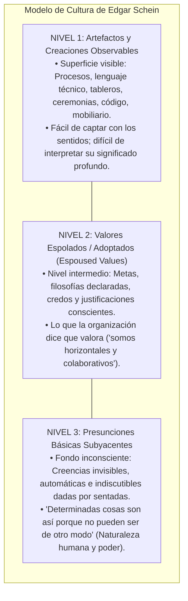
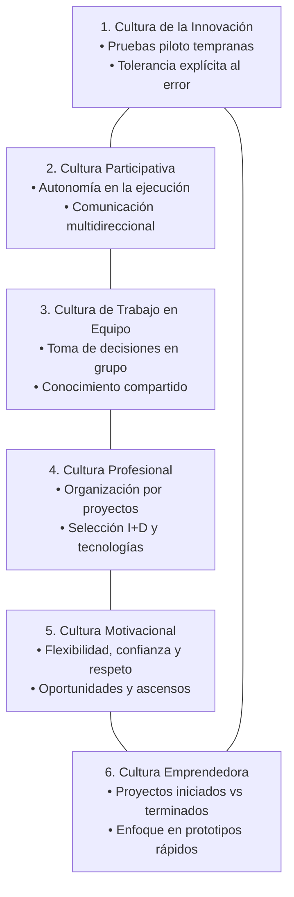
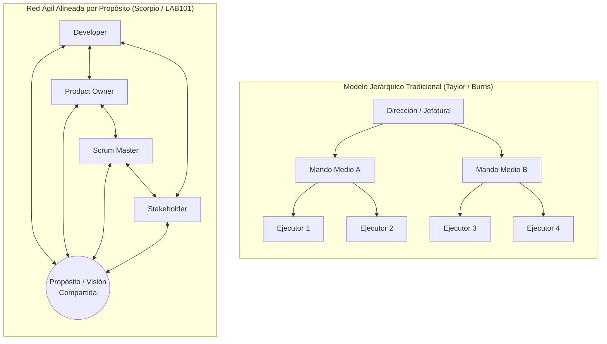
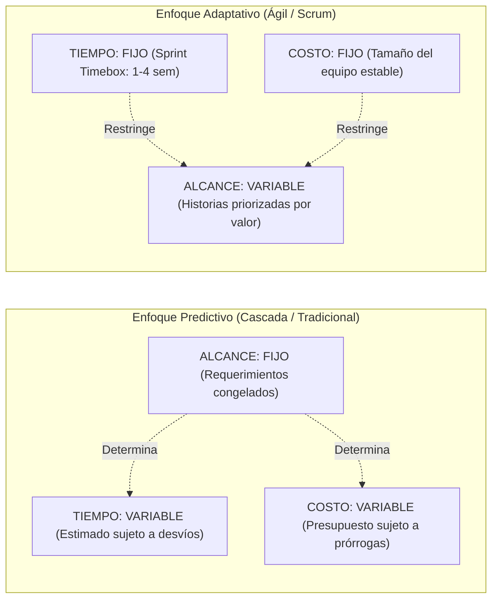
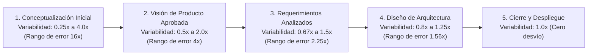
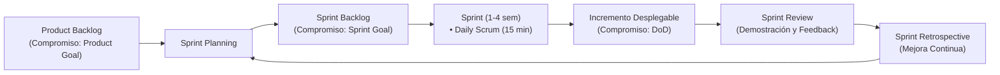
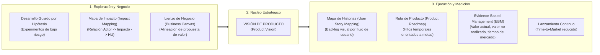
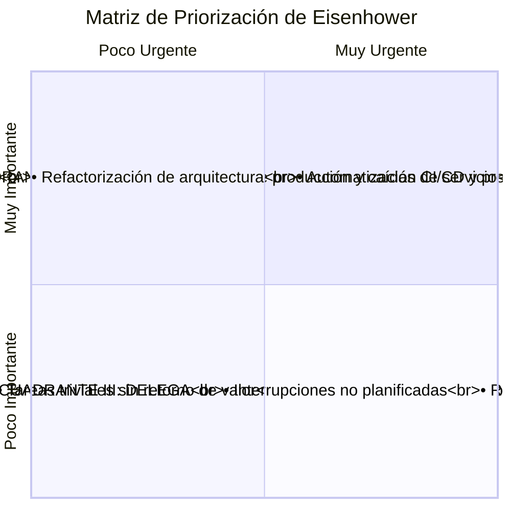
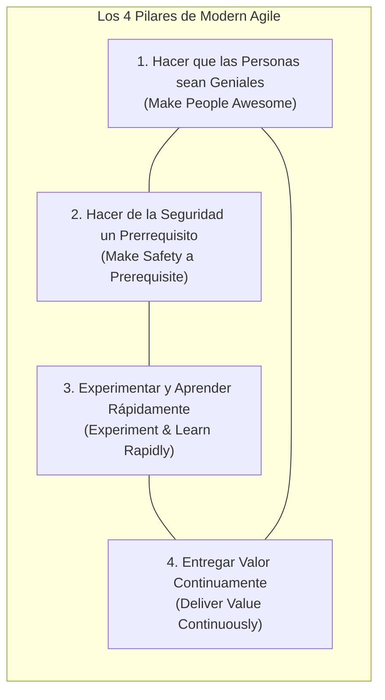

[← Volver a Curso.md](../Curso.md)

# 04. Agilismo y Gestión de Equipos de Alto Rendimiento

> **Materia**: Sistemas de Información | **Docente**: PhD Jhon Alexander Garcia Camargo  
> **Fecha de Sesión**: 17 de septiembre de 2026  
> **Fuentes**: [Sesión 4. Agilismo y gestión de equipos.pdf](../Documentos/Sesión%204.%20Agilismo%20y%20gestión%20de%20equipos.pdf) | LAB101 UNAL | [Cultura Organizacional (Cuevas Sarmiento)](http://ww.revistaespacios.com/a18v39n42/18394236.html) | [Manifiesto Ágil (2001)](https://agilemanifesto.org/) | [Modern Agile (Joshua Kerievsky 2016)](https://modernagile.org/) | [Product Owner Toolkit (Scrum.org)](https://www.scrum.org/resources/blog/product-owner-toolkit)  
> **Términos Core**: `Cultura Organizacional`, `Niveles de Schein (Artefactos, Valores, Presunciones)`, `Cultura Participativa`, `Jerarquías vs Red Horizontal`, `Manifiesto Ágil (4 Valores)`, `Triángulo de Hierro de Proyectos`, `Cono de la Incertidumbre (Boehm/McConnell)`, `Being Agile vs Doing Agile`, `Scrum (3 Roles, 4 Eventos, 3 Artefactos)`, `Daily Standup`, `Sprint Retrospective`, `Product Owner Toolkit`, `Evidence-Based Management (EBM)`, `Modern Agile (Kerievsky)`, `Seguridad Psicológica`, `Blameless Retrospectives`, `Matriz de Eisenhower`, `Kudos (Management 3.0)`, `Anti-patrones Ágiles (Zombie Agile, SM Policial, PO Ausente)`.

---

## 1. Cultura Organizacional y Gestión de Equipos

La transición exitosa hacia sistemas de información ágiles no es un problema puramente tecnológico o procedimental; depende de la transformación de las normas de conducta y la seguridad de las personas.

- **Axioma Fundacional (Peter Drucker)**:
  $$\text{"Culture eats strategy for breakfast"}$$
  Cualquier estrategia o marco metodológico fracasa si colisiona frontalmente con las creencias, hábitos y estructuras de incentivos del personal.
- **Definición Formal de Cultura Organizacional (Marisela Cuevas Sarmiento)**:
  > "La conducta convencional de una sociedad que comparte una serie de valores y creencias particulares y éstos a su vez influyen en todas sus acciones."

### Los 3 Niveles de la Cultura Organizacional (Edgar Schein, MIT Sloan)

El modelo de Schein conceptualiza la cultura como un iceberg estratificado por grado de visibilidad y resistencia al cambio:

| Nivel | Naturaleza | Manifestación Operativa en TI | Modificabilidad |
| :--- | :--- | :--- | :--- |
| **Nivel 1: Artefactos** | Totalmente visible y sensorial. | Tableros Trello/Jira, *post-its*, salas abiertas, daily standups de 15 min, repositorios Git. | **Inmediata**: Se compran herramientas o se decretan reuniones por orden administrativa. |
| **Nivel 2: Valores** | Consciente y discursivo. | Políticas de innovación escritas, discursos de agilidad, código de ética, manuales de procesos. | **Media**: Requiere alineación entre directivas y equipos de desarrollo. |
| **Nivel 3: Presunciones** | Inconsciente y preconsciente. | Miedo al castigo por fallar, necesidad de aprobación jerárquica para cada cambio, desconfianza interdepartamental. | **Extremadamente lenta**: Raíz del rechazo cultural; su ignorancia causa el fracaso de transformaciones ágiles. |

---

## 2. Dimensiones de la Cultura Organizacional Participativa

Según los modelos de gestión del conocimiento (Revista Espacios / LAB101 UNAL), un entorno de ingeniería creativo requiere equilibrar 6 subculturas interconectadas:

### Atributos Operativos de las 6 Subculturas

1. **Cultura de la Innovación**: Fomenta pruebas piloto, proyectos experimentales y **tolerancia activa al error técnico** como mecanismo de aprendizaje.
2. **Cultura Participativa**: Promueve la iniciativa del colaborador, autonomía para proponer soluciones y canales abiertos para sugerir ideas de mejora.
3. **Cultura de Trabajo en Equipo**: Sustituye la propiedad individual del código por la responsabilidad colectiva; fomenta la toma de decisiones consensuada y la experiencia compartida.
4. **Cultura Profesional**: Orientación al cliente externo/interno, estructuración por proyectos dinámicos y adopción continua de nuevas tecnologías de vanguardia.
5. **Cultura Motivacional**: Basada en confianza intrínseca, horarios flexibles, reconocimiento explícito y planes claros de formación y carrera técnica.
6. **Cultura Emprendedora**: Foco en la finalización de iniciativas iniciadas, superando la parálisis por análisis mediante entregas tangibles.

### Jerarquía Tradicional vs. Red Horizontal Orientada a Objetivos

- **Modelo Jerárquico Tradicional**: Comunicación vertical estricta; cuellos de botella en mandos medios; microgestión de tareas; desvinculación entre el ejecutor y el cliente final.
- **Red Horizontal Ágil**: Comunicación directa y cruzada; el equipo orbita alrededor de un **objetivo de producto común** (*Product Goal*); autonomía descentralizada y alta alineación.

---

## 3. Fundamentos del Agilismo: Valores, Incertidumbre y Triángulo de Hierro

### Origen y los 4 Valores del Manifiesto Ágil (Snowbird, 2001)

Formulado por 17 líderes de desarrollo de software para contrarrestar la burocracia de los modelos predictivos pesados:

| Elemento Prioritario (**Izquierda**) | | Elemento Secundario (**Derecha**) |
| :--- | :---: | :--- |
| **Individuos e interacciones** | *MÁS QUE* | Procesos y herramientas rígidas |
| **Software funcionando** | *MÁS QUE* | Documentación extensiva |
| **Colaboración continua con el cliente** | *MÁS QUE* | Negociación contractual rígida |
| **Respuesta rápida ante el cambio** | *MÁS QUE* | Seguimiento estricto de un plan |

> [!IMPORTANT]
> **Axioma de Cierre del Manifiesto**: Aunque reconocemos el valor de los elementos de la derecha, **valoramos más los de la izquierda**. El agilismo no prohíbe documentar ni planificar; prohíbe anteponer el documento o el contrato al valor entregado.

---

### El Triángulo de Hierro de Proyectos: Predictivo vs. Adaptativo

El dilema clásico del Project Management balancea 4 variables fundamentales: **Alcance (`Scope`)**, **Costo (`Cost`)**, **Tiempo (`Time`)** y **Calidad (`Quality`)**.

#### Paradoja de Intersecciones (¿Cómo quieres tu proyecto?)

- $\text{Rápido} + \text{Barato} \longrightarrow$ **Mal hecho** (deuda técnica severa).
- $\text{Rápido} + \text{Calidad} \longrightarrow$ **Bien pagado** (alto costo de talento e infraestructura).
- $\text{Calidad} + \text{Barato} \longrightarrow$ **Lento / Utopía** (inviable a alta velocidad).
- $\text{Gratis} + \text{Rápido} \longrightarrow$ **Estafa / Ilusión**.
- $\text{Rápido} + \text{Barato} + \text{Calidad} \longrightarrow$ **Utopía matemática**.

---

### El Cono de la Incertidumbre (Barry Boehm & Steve McConnell)

Modela cómo la variabilidad e imprecisión en las estimaciones de tiempo y costo evolucionan a lo largo del ciclo de vida del software:

$$\text{Rango de Incertidumbre Inicial} = \frac{4.0\text{x}}{0.25\text{x}} = 16\text{x}$$

- **Gestión Ágil del Cono**: Los modelos tradicionales pretenden eliminar la incertidumbre en el papel (escribiendo especificaciones de cientos de páginas antes de programar). El agilismo colapsa el cono ejecutando **iteraciones cortas con software funcionando**, obteniendo datos empíricos de rendimiento y costos reales desde el primer sprint.

---

### "Being Agile" (Ser Ágil) vs. "Doing Agile" (Hacer Ágil)

- **Doing Agile (Teatro Ágil)**: Adopción mecánica y superficial de la terminología y las ceremonias (llenar paredes de *post-its*, usar Jira, hacer dailies de pie), manteniendo jerarquías punitivas, falta de colaboración y silos organizacionales.
- **Being Agile (Mentalidad Ágil)**: Interiorización cultural del empirismo:
  $$\text{Agilidad} = \text{Transparencia} + \text{Inspección} + \text{Adaptación}$$
  Foco en resolver problemas de forma flexible ante cualquier imprevisto técnico o de mercado.

---

## 4. El Marco de Trabajo Scrum: Roles, Eventos y Artefactos

Scrum es un marco liviano que ayuda a personas, equipos y organizaciones a generar valor mediante soluciones adaptativas a problemas complejos.

### Regla Canónica de Scrum: 3 Roles, 4-5 Eventos, 3 Artefactos

#### 1. Los 3 Roles (Scrum Team)

- **Product Owner (PO)**:
  - Responsable de maximizar el valor del producto y del trabajo del equipo.
  - Administra de forma exclusiva el **Product Backlog** (creación, ordenamiento, refinamiento y visibilidad).
  - Representa a los usuarios de negocio y stakeholders; define **QUÉ** se construye.
- **Scrum Master (SM)**:
  - Líder servicial enfocado en la efectividad del equipo según la Guía Scrum.
  - Facilita ceremonias, remueve bloqueos e impedimentos organizacionales y protege al equipo de interferencias externas.
  - Enseña el empirismo y asegura que el marco sea comprendido y aplicado; no asigna tareas ni evalúa personal.
- **Developers (Equipo de Desarrollo)**:
  - Profesionales técnicos multidisciplinarios comprometidos a crear cualquier aspecto de un incremento utilizable en cada sprint.
  - Poseen autonomía técnica total sobre el **CÓMO** se diseña, codifica y prueba la solución.

#### 2. Los 5 Eventos (Timeboxed)

| Evento | Propósito Operativo | Duración Típica (Sprint de 2 semanas) | Participantes Requeridos |
| :--- | :--- | :--- | :--- |
| **Sprint** | Contenedor de todos los demás eventos; corazón operativo del marco. | 1 a 4 semanas (fijo e inalterable). | Scrum Team completo. |
| **Sprint Planning** | Define qué se puede entregar en el sprint y cómo se realizará dicho trabajo. | 2 a 4 horas. | PO, SM y Developers. |
| **Daily Scrum** | Sincronización diaria rápida para inspeccionar el progreso hacia el *Sprint Goal*. | Máximo **15 minutos**. | Developers (SM y PO opcionales). |
| **Sprint Review** | Inspección del incremento terminado con stakeholders; ajuste del Product Backlog. | 1 a 2 horas. | Scrum Team + Stakeholders clave. |
| **Sprint Retrospective** | Inspección interna del equipo sobre personas, relaciones, procesos y herramientas. | 1 a 1.5 horas. | PO, SM y Developers (sin jefes externos). |

> [!CAUTION]
> **Anti-patrón Crítico de la Daily Scrum**: La Daily **NO** es una reunión para resolver problemas técnicos profundos ni para dar un reporte de estatus al Scrum Master o jefe. Si surgen impedimentos complejos, se marcan como bloqueo y los desarrolladores implicados se coordinan en una sesión técnica posterior por fuera de los 15 minutos.

#### 3. Los 3 Artefactos y sus Compromisos

1. **Product Backlog** $\longrightarrow$ **Compromiso**: *Product Goal* (Meta de largo plazo del producto).
2. **Sprint Backlog** $\longrightarrow$ **Compromiso**: *Sprint Goal* (Objetivo único e innegociable de la iteración).
3. **Incremento (Increment)** $\longrightarrow$ **Compromiso**: *Definition of Done (DoD)* (Criterio formal y consensuado de calidad técnica para que un ítem se considere terminado y desplegable).

---

## 5. Kit de Herramientas del Product Owner (PO Toolkit)

Marco de gestión de producto (Scrum.org / Joel Francia) para conectar la estrategia corporativa con la ejecución técnica diaria:

### Técnicas y Dinámicas para Entornos Creativos (LAB101 UNAL)

- **User Story Mapping**: Descomposición del backlog en dos dimensiones: el eje horizontal representa el recorrido secuencial del usuario (*user journey*); el eje vertical representa la prioridad de entrega para definir el MVP y sucesivos incrementos.
- **Impact Mapping**: Técnica gráfica que vincula los objetivos estratégicos de la organización con los actores clave, los impactos esperados en su comportamiento y las historias de software específicas.
- **Dinámica Retrospectiva Clásica**: Estructura de 3 cuadrantes de reflexión:
  1. *¿Qué hicimos bien?* (Refuerzo positivo y consolidación de buenas prácticas).
  2. *¿Qué podemos mejorar?* (Detección de fricciones técnicas o deuda de procesos).
  3. *¿Qué debemos dejar de hacer?* (Eliminación activa de desperdicio: ej. reuniones innecesarias o pruebas manuales redundantes).
- **Desafíos Creativos**: Uso de dinámicas como *LEGO Serious Play* (desafío de comunicación multidireccional), *Card Sorting* (organización taxonómica de información) y *Fichas Persona* (arquetipos de usuario para validar empatía).

---

## 6. Priorización Operativa y Motivación Intrínseca

### Matriz de Eisenhower (Urgencia vs. Importancia)

Herramienta analítica de priorización para blindar la productividad técnica frente al caos operativo:

| Cuadrante | Condición | Acción Operativa | Enfoque en Ingeniería de Software |
| :--- | :--- | :--- | :--- |
| **Q1** | Urgente + Importante | **¡Hazlo Ya!** | Caída de la base de datos principal, vulnerabilidad zero-day en producción. |
| **Q2** | Poco Urgente + Importante | **Planifica** | **Zona de efectividad**: Cobertura de tests unitarios, diseño de arquitectura limpia, refactorización, capacitación técnica del equipo. |
| **Q3** | Urgente + Poco Importante | **Delega** | Solicitudes administrativas menores, responder correos rutinarios, tareas auxiliares. |
| **Q4** | Poco Urgente + Poco Importante | **Desecha** | Discusiones bizantinas de diseño sin métricas, documentación huérfana que nadie lee. |

> [!TIP]
> **Regla de Gestión TI**: Entre más tiempo invierta el equipo de desarrollo en el **Cuadrante II (Planificar / Prevenir)**, menos incidentes críticos detonarán en el **Cuadrante I (Crisis)**.

---

### Kudos y Seguridad Emocional (Management 3.0 / Jurgen Appelo)

- **Concepto**: Mecanismo de reconocimiento horizontal (*peer-to-peer*) y explícito para celebrar comportamientos positivos, compañerismo y soporte mutuo, eliminando la dependencia de la felicitación vertical del jefe.
- **Herramientas de Implementación**:
  - *Kudo Cards*: Tarjetas físicas o virtuales prediseñadas con mensajes específicos (*"Thank you!"*, *"Great job!"*, *"Totally awesome!"*, *"Well done!"*).
  - *Kudo Box / Kudo Wall*: Espacio físico o canal digital visible donde el equipo deposita notas de agradecimiento.
  - *Encuentro Virtual de Kudos*: Sesión breve al final de la retrospectiva para entregar y leer agradecimientos públicos.

---

## 7. Modern Agile (Joshua Kerievsky, Agile 2016)

Modern Agile trasciende las metodologías prescriptivas de los años 90 (Scrum, XP) para enfocarse en **4 principios fundamentales libres de rituales innecesarios**:

### Desglose de los 4 Pilares

1. **Hacer que las Personas sean Geniales (`Make People Awesome`)**:
   - Enfoque holístico: Abarca usuarios, clientes, desarrolladores, testers y directivos.
   - La tecnología y los procesos existen para amplificar la capacidad humana, no para alienar a los trabajadores en rituales burocráticos.
2. **Hacer de la Seguridad un Prerrequisito (`Make Safety a Prerequisite`)**:
   - **Seguridad Psicológica (Amy Edmondson)**: Nadie debe temer represalias, burlas o castigos por admitir un error, hacer preguntas difíciles o proponer ideas radicales.
   - **Retrospectivas sin Culpas (`Blameless Retrospectives`)**: Analizar las causas sistémicas y de diseño que propiciaron el fallo, en lugar de señalar culpables individuales.
   - **Seguridad Técnica**: Pruebas automatizadas continuas, *canary deployments* y *feature flags* para desplegar a producción sin estrés operativo.
3. **Experimentar y Aprender Rápidamente (`Experiment & Learn Rapidly`)**:
   - Fomentar la curiosidad científica; el fracaso temprano y de bajo costo es la única vía para descubrir valor real de negocio.
4. **Entregar Valor Continuamente (`Deliver Value Continuously`)**:
   - Pasar de entregas en grandes lotes (*big bang releases*) a un flujo continuo de micro-entregas en producción con pipelines de CI/CD automatizados.

- **La Metáfora de la Bicicleta**:
  $$\text{Equilibrio Cultural} \quad \succ \quad \text{Velocidad Mecánica}$$
  No sirve pedalear más rápido (*hacer sprints a ciegas*) si el equipo no ha aprendido a mantener el balance (*valores, seguridad psicológica y calidad técnica*). Forzar la velocidad sin equilibrio provoca caídas graves.

---

## 8. Anti-patrones Ágiles y Errores de Implementación ("The Wrong Way to do Agile")

Sátira y análisis de fallos frecuentes en la adopción ágil en empresas de tecnología:

| Anti-patrón | Comportamiento Tóxico Observado | Causa Raíz | Solución Correctiva |
| :--- | :--- | :--- | :--- |
| **El Scrum Master "Policía" / Capataz** | Toma asistencia en la Daily, exige cuentas individuales, asigna tareas a dedo y reporta al jefe. | Conservación de la mentalidad de mando y control jerárquico tradicional. | Formar al SM como líder servicial; el equipo autoorganizado selecciona y asigna sus propias tareas. |
| **El Product Owner "Ausente" o "Tirano"** | No asiste a los refinamientos, rechaza clarificar requerimientos o impone cambios de alcance en medio del sprint. | Desconexión con el equipo de desarrollo; falta de gobernanza del backlog. | PO con dedicación exclusiva, presente en revisiones y respetuoso del *Sprint Goal* pactado. |
| **Daily Standup como Sesión de Depuración** | El equipo supera los 15 minutos debatiendo detalles de implementación de código o discutiendo arquitectura. | Confusión entre sincronización rápida de avance e ingeniería detallada. | Limitarse a exponer el avance y los impedimentos; agendar sesiones técnicas independientes entre los interesados. |
| **Teatro Ágil / Zombie Agile** | Se ejecutan todas las ceremonias rígidamente pero no se entrega software en producción ni hay mejora continua. | Adopción de artefactos superficiales (Nivel 1 de Schein) sin asimilar los valores (Nivel 2 y 3). | Enfocar métricas en valor real entregado al usuario final y en tiempo de despliegue, no en número de ceremonias. |
| **El Síndrome del "Experto en Coaching"** | Gurús externos vendiendo recetas milagrosas y discursos motivacionales vacíos sin entender el software real. | Venta de humo corporativo y desprecio por el rigor de la ingeniería. | Valorar el dominio técnico profundo, el diseño de sistemas y la resolución empírica de problemas. |
| **The Expert: 7 Red Lines** | Directivos o clientes exigiendo requerimientos mutuamente excluyentes o físicamente imposibles ("7 líneas rojas perpendiculares"). | Falta de criterio técnico en la toma de decisiones y ausencia de negociación honesta. | Empoderar al Product Owner y al arquitecto para delimitar la factibilidad técnica y priorizar por valor real. |

---

## 9. Puntos Críticos de Examen y Trampas Conceptuales

- **Trampa 1: El Agilismo como "Panacea Universal"**:
  - Afirmación falsa de examen: *"Todo proyecto de software moderno debe implementarse obligatoriamente bajo Scrum"*.
  - Realidad: El agilismo es óptimo bajo alta incertidumbre y requerimientos evolutivos. En proyectos de criticidad extrema (aviónica, marcapasos, centrales nucleares) o con requerimientos legales cerrados y fijos, los marcos predictivos o rigurosos (Modelo en V, Cleanroom) siguen siendo pertinentes y obligatorios.
- **Trampa 2: Las Preguntas Canónicas de la Daily Scrum**:
  - Error típico: Creer que la Daily es para rendir cuentas al Scrum Master.
  - Corrección: La Daily es un evento exclusivo para que los **Developers** se sincronicen entre sí respecto al **Sprint Goal**. El Scrum Master únicamente enseña a mantener la reunión dentro del timebox de 15 minutos.
- **Trampa 3: Interpretación de los Niveles de Schein**:
  - Si una empresa compra licencias de Jira y pinta tableros en las paredes, ¿ya transformó su cultura organizacional?
  - **NO**. Solo ha modificado el **Nivel 1 (Artefactos observables)**. Si las presunciones básicas (Nivel 3: miedo al error, desconfianza, castigo jerárquico) siguen intactas, la organización sigue operando bajo cultura tradicional disfuncional.
- **Trampa 4: Magnitud Inicial del Cono de la Incertidumbre**:
  - En la fase de conceptualización inicial, el rango de variación en las estimaciones abarca desde **$0.25\times$ hasta $4.0\times$**, lo que representa un factor de dispersión de **$16\times$** entre la estimación más optimista y la más pesimista.
- **Trampa 5: Cuadrante Clave en la Matriz de Eisenhower**:
  - El cuadrante que genera la mayor ventaja competitiva y previene las crisis técnicas no es el Cuadrante I (Urgente), sino el **Cuadrante II (Importante pero No Urgente)**: arquitectura, pruebas automatizadas, refactorización y formación continua.
- **Trampa 6: Compromisos de los Artefactos en Scrum**:
  - Cada artefacto contiene un compromiso formal específico:
    - *Product Backlog* $\longrightarrow$ **Product Goal**.
    - *Sprint Backlog* $\longrightarrow$ **Sprint Goal**.
    - *Incremento* $\longrightarrow$ **Definition of Done (DoD)**.

