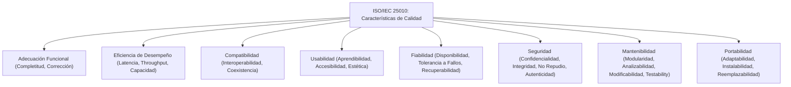
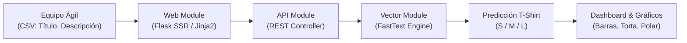
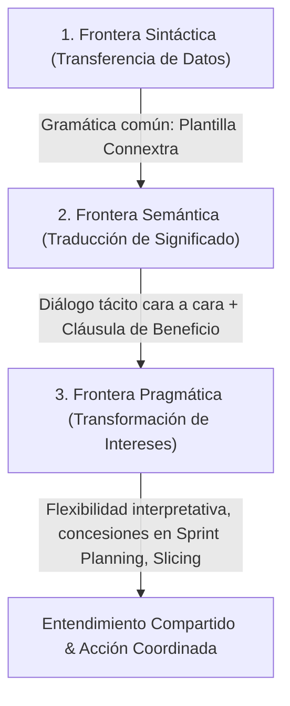
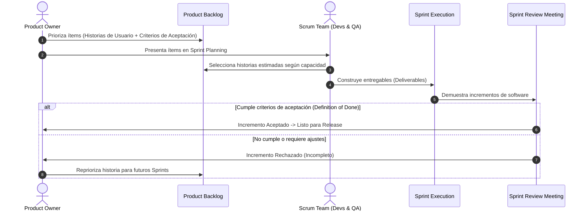
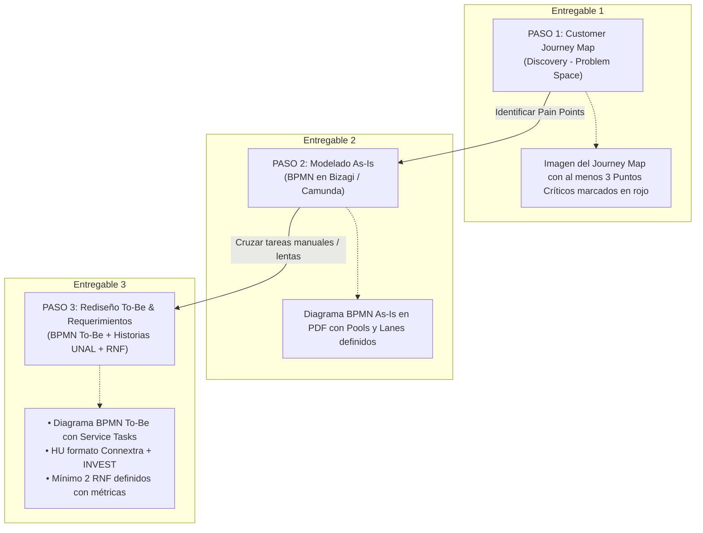

[← Volver a Curso.md](../Curso.md)

# 05. Ingeniería de Requerimientos y Descubrimiento de Producto

> **Materia**: Sistemas de Información | **Docente**: PhD Jhon Alexander Garcia Camargo  
> **Fecha de Sesión**: 22 de septiembre de 2026  
> **Fuentes**: [Sesión 5. Ingeniería de Requerimientos.pdf](../Documentos/Sesión%205.%20Ingeniería%20de%20Requerimientos.pdf) | [TheHeroCamp YouTube](https://www.youtube.com/live/jysamSOY9Zg) | [Product Discovery - SVPG](../Documentos/Sesion%205.%20Product%20Discovery%20-%20Silicon%20Valley%20Product%20Group%20_%20Silicon%20Valley%20Product%20Group.pdf) | [Formato HU UNAL](../Documentos/2.%20FORMATO%20HISTORIAS%20DE%20USUARIO.pdf) | [SLM User Stories (Amna & Poels 2022)](../Documentos/Sesion%205.%20Systematic_Literature_Mapping_of_User_Story_Research.pdf) | [User Stories as Boundary Objects (Sporsem et al. 2026)](../Documentos/Sesion%205.%201-s2.0-S0164121225003620-main.pdf) | [NFR SDLC Review (Dongmo 2024)](../Documentos/Sesion5.%20computers-13-00308-v4.pdf) | [Herramienta SPP (González-Palacio et al. 2024)](../Documentos/Sesion5.%20View%20of%20Tool%20for%20estimating%20user%20stories%20associated%20with%20non-functional%20requirements.pdf)  
> **Términos Core**: `Product Discovery`, `Product Delivery`, `Dual-Track Agile`, `Problem Space`, `Solution Space`, `4 Riesgos de Producto (SVPG)`, `Expensive Prototype Trap`, `Product Trio / Quartet`, `Opportunity Solution Tree (OST)`, `Requisitos Funcionales (FR)`, `Requisitos No Funcionales (NFR)`, `ISO/IEC 25010`, `GORE (KAOS, i*, Tropos)`, `Softgoal Interdependency Graph (SIG)`, `FastText`, `Story Points Predictor (SPP)`, `Boundary Objects`, `Connextra Template`, `INVEST`, `Gherkin (Dado-Cuando-Entonces)`, `Priority Poker`, `Customer Journey Map`, `BPMN As-Is / To-Be`

---

## 1. Descubrimiento de Producto (Product Discovery) y Dual-Track Agile

### 1.1 Paradigma: Product Discovery vs. Product Delivery

| Dimensión | **Product Discovery** (*Build to Learn*) | **Product Delivery** (*Build to Earn*) |
| :--- | :--- | :--- |
| **Objetivo Primario** | Determinar **qué construir**; separar rápidamente ideas viables de inviables [07:44]. | Construir y desplegar software **robusto, escalable, probado y mantenible**. |
| **Pregunta Clave** | ¿Resuelve un problema real y genera valor de negocio viable? | ¿El software cumple los estándares de producción, seguridad y calidad? |
| **Foco Operativo** | Reducción de incertidumbre mediante experimentos rápidos y aprendizaje. | Previsibilidad, velocidad de despliegue, *throughput* y calidad de código. |
| **Artefacto Típico** | Prototipos descartables, *mockups*, entrevistas, pruebas de concepto (*tech spikes*). | Incremento de software listo para producción (código testeado y desplegado). |
| **Tolerancia al Fallo** | **Máxima**: Descartar el 70%–80% de las hipótesis iniciales en días es un éxito económico. | **Mínima**: Errores en producción causan deuda técnica, caídas y pérdidas financieras. |
| **Métrica de Éxito** | **Outcomes** (impacto en KPIs de negocio y comportamiento real de usuario). | **Outputs** (velocidad, *story points* completados, fechas de entrega). |

```mermaid
flowchart LR
    subgraph Discovery_Track["DISCOVERY TRACK (Exploración Continua - Build to Learn)"]
        direction TB
        OKR["Objetivo Estratégico / OKR"] --> ProbSpace["Problem Space<br/>(Customer Discovery & Pain Points)"]
        ProbSpace --> OST["Opportunity Solution Tree<br/>(Priorización de oportunidades)"]
        OST --> SolSpace["Solution Space<br/>(Validación 4 Riesgos)"]
        SolSpace --> FastProto["Prototipado Rápido & Spikes<br/>(Descartar hipótesis inválidas)"]
    end

    subgraph Delivery_Track["DELIVERY TRACK (Ejecución Continua - Build to Earn)"]
        direction TB
        Backlog["Backlog Validado<br/>(Ready Stories)"] --> Sprint["Sprint / Kanban<br/>(Desarrollo, QA & Testing)"]
        Sprint --> Release["Producción / Release"]
        Release --> Telemetry["Telemetría & Analítica Real"]
    end

    FastProto -- "Hipótesis Validadas" --> Backlog
    Telemetry -- "Nuevos cuellos de botella & Feedback" --> ProbSpace
```



### 1.2 La Trampa del Prototipo Costoso (*Expensive Prototype Trap* - Marty Cagan / SVPG)
- **Falsa Analogía de Construcción Civil**: La dirección tradicional asume que el software es predecible como construir una casa, forzando cronogramas lineales (*waterfall*) sobre procesos intrínsecamente inciertos.
- **Pánico al Ingeniero Ocioso (*Foosball Syndrome*)**: Por mantener ocupados a los desarrolladores mientras se definen requisitos, se asigna a todo el equipo a codificar especificaciones sin validar.
- **Consecuencia**: El equipo invierte 3 a 6 meses construyendo un **prototipo extremadamente costoso** directamente en producción, convirtiendo a los clientes reales en sujetos de prueba no informados.
- **Regla Operativa**: No enviar ninguna iniciativa a *Delivery* sin antes mitigar sistemáticamente los 4 grandes riesgos con artefactos livianos.

### 1.3 Los 4 Grandes Riesgos de Producto (Marty Cagan - SVPG)

| Riesgo | Definición Técnica | Pregunta Clave | Responsable Principal | Métodos de Validación Rápida |
| :--- | :--- | :--- | :--- | :--- |
| **1. Value Risk** *(Valor)* | Si el usuario adoptará/comprará el producto y si resuelve un dolor con suficiente intensidad. | ¿El cliente obtendrá valor tangible y estará dispuesto a pagar/adoptarlo? [27:21] | **Product Manager** (apoyo de UX / Data) | *Fake doors*, pruebas de humo (*smoke tests*), cartas de intención (LOI), entrevistas de disposición a pagar (*willingness to pay*). |
| **2. Usability Risk** *(Usabilidad)* | Si el usuario puede operar, comprender y navegar la solución sin fricciones cognitivas severas. | ¿El usuario descubre cómo usar la interfaz y completa su objetivo con éxito? | **Product Designer** / UX | Pruebas de usabilidad con prototipos interactivos en Figma, pruebas de árbol (*tree testing*), test de 5 segundos. |
| **3. Feasibility Risk** *(Factibilidad)* | Si se cuenta con tecnología, arquitectura, tiempo, datos y capacidades técnicas para construirlo. | ¿Sabemos cómo construirlo con las dependencias y límites técnicos actuales? [13:10] | **Tech Lead** / Ingenieros | **Development Spikes** (pruebas de concepto de 1–2 días), evaluación de APIs, pruebas de carga y latencia. |
| **4. Business Viability Risk** *(Viabilidad)* | Si la solución es compatible con las restricciones legales, regulatorias, financieras y comerciales. | ¿La solución encaja con ventas, canales, finanzas, legal, auditoría y cumplimiento? [29:33] | **Product Manager** (con Stakeholders) | Revisión de *compliance*, análisis de *unit economics*, sesiones de alineación con legal y operaciones. |

### 1.4 Dinámica Operativa: Continuous Discovery & Product Quartet
- **Dual-Track Agile (Jeff Patton)**: Un único equipo multifuncional corre *Discovery* y *Delivery* en paralelo sobre un mismo *roadmap* integrado [15:26]. Mientras ingeniería implementa el ítem validado $N$, el equipo investiga y mitiga riesgos del ítem $N+1$.
- **Del Product Trio al Product Quartet**:
  - *Product Trio clásico*: Product Manager + Product Designer + Tech Lead [10:35].
  - *Product Quartet moderno*: Se integra el **Product Data Analyst** para aportar telemetría, segmentación y pruebas cuantitativas continuas en tiempo real [12:27].
- **Problem Space vs. Solution Space**:
  - *Principio de Einstein* [09:48]: Dedicar el 90% del esfuerzo a comprender a fondo el dolor del usuario (Problem Space) y solo el 10% a validar la solución (Solution Space).
- **Opportunity Solution Tree (OST - Teresa Torres)**: Estructura jerárquica que conecta un objetivo de negocio (`OKR`) $\rightarrow$ con múltiples oportunidades identificadas en los usuarios $\rightarrow$ con soluciones alternativas rivales $\rightarrow$ con experimentos concretos de validación [25:47].

---

## 2. Requerimientos Funcionales vs. No Funcionales (RNF) a lo largo del SDLC

### 2.1 Definición Formal y Taxonomía Normativa (ISO/IEC 25010)
* **Requisitos Funcionales (FR)**: Especifican los **servicios directos, funciones y comportamientos** que el sistema debe ejecutar en respuesta a entradas de los usuarios o eventos externos.
* **Requisitos No Funcionales (NFR / Calidad de Servicio - QoS)**: Definen las **propiedades de calidad, atributos emergentes y restricciones operacionales, ambientales y de diseño** (SLA, normativas, rendimiento, seguridad) bajo las cuales el sistema debe funcionar.



---

### 2.2 Brecha Estructural en el Ciclo de Vida del Software (Dongmo, 2024)
Análisis del estudio de mapeo sistemático sobre el tratamiento de NFR a lo largo del SDLC (34 estudios primarios indexados):

| Fase SDLC | Cobertura en Literatura | Actividades Específicas Reportadas | Diagnóstico Crítico |
| :--- | :---: | :--- | :--- |
| **Requirements Engineering (RE)** | **94.1%** | • Elicitación y evaluación (17.6%)<br>• Extracción, clasificación y categorización (41.2%)<br>• Especificación y modelado formal (47.1%)<br>• Detección de conflictos y trade-offs (32.4%) | **Hiperconcentración teórica**. Foco predominante en clasificar sentencias textuales y modelar metas. |
| **Software Design (SD)** | **<11.8%** | • Mapeo a decisiones arquitectónicas<br>• Modelos de trazabilidad NFR $\leftrightarrow$ Arquitectura<br>• Reconfiguración dinámica en tiempo de ejecución | **Crítica desconexión**. Escasa formalización de cómo los NFR condicionan los componentes de diseño. |
| **Implementation / Coding** | **0.0%** | • Propagación de NFR a directivas de código o compiladores | **Vacío total (Research Gap)**. Cero metodologías para propagación directa al código. |
| **Testing & Verification** | **0.0%** | • Verificación empírica automatizada de NFR en código | **Ausencia crítica**. Falta de frameworks integrados de testing sistemático no funcional. |

---

### 2.3 Enfoques de Análisis y Modelado de NFR (Diapositivas & Literatura)

| Enfoque | Características Principales | Ventajas | Limitaciones |
| :--- | :--- | :--- | :--- |
| **GORE (Goal-Oriented Requirements Engineering)** | Frameworks **KAOS**, **$i^*$**, **Tropos** y **NFR Framework**. Utiliza el **Softgoal Interdependency Graph (SIG)** con descomposición AND/OR y enlaces de contribución (*make, help, break, hurt*). | Modela dependencias y conflictos cualitativos. Aplica concepto de *satisficing* (satisfacción suficiente en lugar de absoluta). | Alta complejidad formal; difícil adopción en equipos ágiles sin expertos en modelado. |
| **UML y Perfiles UML** | Extensiones mediante estereotipos y valores etiquetados (*tagged values*). Estándares derivados: **SysML** y **MARTE** (sistemas embebidos y tiempo real). | Reutiliza la infraestructura y herramientas existentes de modelado (diagramas de clases y casos de uso). | UML no fue concebido nativamente para restricciones no funcionales; semántica restringida. |
| **Machine Learning / NLP** | Clasificación automática de NFR desde texto plano usando **BERT-CNN**, **SVM**, **RNN/LSTM**. Datasets de referencia: *PROMISE* (684 sentencias) y *Concordia RE Corpus*. | Alta escalabilidad; reduce el esfuerzo manual de clasificación documental en backlogs masivos. | Fuerte dependencia de la representatividad del dataset de entrenamiento; riesgo de falsos positivos/negativos. |
| **Métodos Matemáticos y Lógicos** | Modelado mediante **Lógica Difusa (Fuzzy Logic)**, ontologías de dominio (*sureCM*), grafos conceptuales y procesos POMDP para decisiones en runtime. | Rigor y precisión formal matemática; permite razonamiento deductivo sobre conflictos. | Elevada barrera matemática; prácticamente inaplicable en ciclos de desarrollo cortos. |
| **XML y Prototipado** | Especificación y trazabilidad de restricciones de calidad embebidas en esquemas XML y prototipos funcionales de validación rápida. | Documentación estructurada y estandarizada; integración con pipelines de herramientas. | Dificultad para modelar aspectos dinámicos, cross-cutting y restricciones complejas. |

### 2.4 Trade-Offs Arquitectónicos Fundamentales
Los NFR son transversales (*cross-cutting*) y colisionan intrínsecamente entre sí:
* $\text{Seguridad (Cifrado multicapa, inspección profunda)} \longleftrightarrow \text{Desempeño (Latencia, Throughput)}$.
* $\text{Fiabilidad / Tolerancia a Fallos (Replicación geográfica)} \longleftrightarrow \text{Consistencia de Datos / Costo Cloud}$.
* $\text{Usabilidad (Flujo sin fricción, Checkout en 1 clic)} \longleftrightarrow \text{Seguridad (Autenticación multifactor - MFA)}$.

---

## 3. Estimación de Historias de Usuario con NFR: Story Points Predictor (SPP)

### 3.1 Problemática de Subestimación en Entornos Ágiles
* **Sesgo Funcional del Story Point**: En Scrum y XP, los equipos estiman esfuerzo basados casi exclusivamente en funcionalidad perceptible en interfaz. Las restricciones de calidad (seguridad, concurrencia, disponibilidad) se asumen gratuitas o quedan relegadas.
* **Consecuencias**: Explosión de deuda técnica oculta, saturación en fases de integración (*hardening sprints*) y retrasos sistemáticos de entrega.
* **Deficiencia de Herramientas Existentes**: Métodos clásicos (COCOMO, Function Points) son pesados y burocráticos; herramientas ágiles (Planning Poker) son 100% intuitivas y carecen de inteligencia analítica sobre atributos de calidad.

### 3.2 Arquitectura y Algoritmo de SPP (González-Palacio et al., 2024)
Herramienta de software desarrollada bajo Scrum en la Universidad de Medellín / EAFIT para predecir objetivamente el esfuerzo de historias de usuario asociadas a requisitos de calidad:



* **Motor de ML (FastText - Meta AI)**:
  * Emplea vectorización de **n-gramas de caracteres** a partir del texto del título y la descripción de la HU.
  * *Ventaja técnica*: Reconoce raíces léxicas y morfología técnica de atributos de calidad aun en presencia de errores tipográficos o vocabulario fuera de diccionario (*out-of-vocabulary words*).
* **Escala de Clasificación (T-Shirt Sizing)**:
  * **S (Small)**: Requisito de calidad de baja complejidad operacional o cambio puntual.
  * **M (Medium)**: Requisito que exige ajustes moderados en servicios o configuración de middleware.
  * **L (Large)**: Requisito con impacto arquitectónico estructural severo (ej. refactorización de seguridad o réplicas distribuidas).
* **Dataset y Entrenamiento**:
  * Entrenado sobre **16 proyectos de código abierto de Jira** (*Apache, Spring, Mulesoft, Atlassian, Moodle, Talendforge*).
  * Partición: **70% Entrenamiento**, **30% Validación**.
* **Resultado Experimental**:
  * **Precisión Global (Overall Accuracy)**: **72%**, con concentración óptima sobre la diagonal principal de la matriz de confusión.
* **Stack Tecnológico**: Python 3.7 + **Flask 1.1.1** (Server Side Rendering - SSR), desplegado en Linux Ubuntu, curva de aprendizaje $< 30$ minutos.

---

## 4. Historias de Usuario: Perspectiva Académica y Teoría de Boundary Objects

### 4.1 Mapeo Sistemático de la Literatura (Amna & Poels, IEEE Access 2022)
* **Volumen y Temporalidad**: 186 estudios revisados por pares; el **78% publicado entre 2015 y 2021** (área de rápida expansión).
* **Sesgo Teórico-Práctico**: El **80% propone soluciones técnicas** (algoritmos y modelos); únicamente el **20% investiga empíricamente el problema** socio-organizacional en empresas reales.
* **Distribución en el Ciclo de Requisitos (RE)**:
  * **Análisis y Negociación (53%)**: Mayoría abrumadora; las HU se usan principalmente como entrada para algoritmos de estimación, priorización y arquitectura.
  * **Elicitación y Documentación (26%)**: Sorprendentemente poco investigada de forma empírica.
  * **Validación y Gestión (21%)**: Enfocada en BDD, TDD y verificación de aceptación.
* **Taxonomía de Problemas en HU**:
  1. *Diseño del Sistema (52%)*: Dependencias complejas entre historias, granularidad inadecuada, impacto arquitectónico y omisión de NFR.
  2. *Colaboración (26%)*: Desalineación entre negocio y desarrollo, ausencia del usuario final.
  3. *Ambigüedad (23%)*: Imprecisión léxica, duplicidad e inconsistencia semántica.

---

### 4.2 Las Historias de Usuario como Objetos de Frontera (Sporsem, Dingsøyr & Stol, JSS 2026)

#### Fundamento Conceptual (Star & Griesemer, 1989; Star, 2010)
* **Abstraccionismo vs. Contextualismo (Potts & Hsi, 1997)**:
  * El enfoque tradicional asume que los requisitos pueden abstraerse completamente por adelantado en especificaciones cerradas.
  * El paradigma ágil adopta una postura **contextualista**: el conocimiento del negocio es tácito y fragmentado; no puede documentarse completamente *upfront*.
* **User Story como Boundary Object**:
  * La historia de usuario **no es un contrato de especificación exhaustivo**, sino una **"promesa de conversación futura"** (Alistair Cockburn, Ron Jeffries).
  * Actúa como artefacto mediador entre dos comunidades de práctica desconectadas: expertos del dominio (negocio, usuarios, PO) e ingenieros de software (desarrolladores, QA, arquitectos).
  * Posee **flexibilidad interpretativa**: tiene una identidad compartida reconocible, pero cada comunidad adapta su interpretación local (para el PO representa retorno de inversión; para el desarrollador representa tablas DB y llamadas API).

#### El Cruce de las 3 Fronteras del Conocimiento (Paul Carlile, 2002)



1. **Frontera Sintáctica**: Se supera mediante una plantilla estandarizada (`Como <rol>, quiero <acción>, para <beneficio>`). Permite a personas con jergas dispares comunicarse con un formato uniforme.
2. **Frontera Semántica**: Las mismas palabras pueden tener significados distintos para negocio y desarrollo. Se cruza mediante la **conversación activa** y la clarificación de la cláusula de beneficio y criterios de prueba.
3. **Frontera Pragmática**: Existen consecuencias asimétricas y conflictos de interés (plazos vs. calidad técnica). Se cruza gracias a la **granularidad pequeña** de las historias, permitiendo negociar el alcance y posponer requerimientos sin desperdicio masivo de capital.

#### Las 5 Proposiciones Teóricas (Sporsem et al., 2026)
* **P1 (Entendimiento Compartido)**: Las HU facilitan la alineación gracias al diálogo continuo, pero **dependen críticamente del *storytelling***. Si el PO redacta "especificaciones kilométricas de 20 líneas", se mata la conversación. La rotación de personal (*turnover*) destruye el contexto tácito.
* **P2 (Gestión del Cambio)**: Las HU pequeñas permiten *Artful Planning* (certeza a corto plazo dentro de la incertidumbre global). Sin embargo, en proyectos a gran escala (*Large-Scale Agile* $>30$ equipos), miles de HU pequeñas fragmentan la visión arquitectónica y provocan bloqueos de dependencias.
* **P3 (Complejidad del 'Por Qué')**: Explicitar el beneficio alinea la funcionalidad con la estrategia, pero genera **fatiga de justificación** (el $>50\%$ de los backlogs industriales omiten la cláusula *"para"* por pereza o dificultad de formulación).
* **P4 (Paradoja de Productividad)**: Los desarrolladores suelen sentir que "debatir historias resta tiempo de programar", creando presión para abandonar el diálogo y regresar a especificaciones ciegas.
* **P5 (Degradación Textual y Obsolescencia Racional)**: El texto escrito de una historia pierde vigencia en cuanto se implementa; el conocimiento nuevo queda en el código y en la mente del equipo. Esto es eficiente en equipos pequeños, pero crítico en sistemas altamente regulados donde se exige trazabilidad formal.

---

## 5. Formato Oficial UNAL y Criterios INVEST / Gherkin

### 5.1 Criterios de Calidad INVEST (Bill Wake)
Toda historia de usuario antes de entrar al *Sprint Backlog* debe satisfacer las 6 propiedades:
* **I - Independent**: Desacoplada de otras historias; no requiere orden estricto de codificación.
* **N - Negotiable**: Detalle abierto a discusión entre el equipo y el PO; no es un contrato pétreo.
* **V - Valuable**: Proporciona valor directo y medible al cliente o negocio (no una tarea técnica pura).
* **E - Estimable**: El equipo comprende el alcance lo suficiente para dimensionar su esfuerzo/complejidad.
* **S - Small**: Tamaño adecuado para completarse holgadamente dentro de un único Sprint (1–3 días ideales).
* **T - Testable**: Posee criterios de aceptación claros y deterministas que permiten verificar su éxito o fallo.

---

### 5.2 Estructura y Componentes de la Plantilla UNAL (Prof. Jhon Alexander García Camargo)

```
┌────────────────────────────────────────────────────────────────────────┐
│ MODELO DE HISTORIAS DE USUARIO - UNAL                                  │
├───────────────────────────────┬────────────────────────────────────────┤
│ Título de la HU-[ID]          │ Código identificador y nombre descriptivo│
├───────────────────────────────┴────────────────────────────────────────┤
│ Módulo                        │ Subsistema funcional de la arquitectura│
├────────────────────────────────────────────────────────────────────────┤
│ DESCRIPCIÓN DE LA HISTORIA DE USUARIO                                  │
├───────────────────────────────┬────────────────────────────────────────┤
│ Cómo (Rol)                    │ Persona o rol concreto de dominio      │
│ Quiero (Proceso)              │ Acción o interacción con el sistema    │
│ Para (Resultado)              │ Beneficio o impacto de negocio obtenido│
├───────────────────────────────┴────────────────────────────────────────┤
│ CRITERIOS DE ACEPTACIÓN                                                │
├────────────────────────────────────────────────────────────────────────┤
│ Descripción del contexto (Estructura BDD / Gherkin):                   │
│   • Dado                      │ Precondición / Estado del sistema      │
│   • Cuando                    │ Evento detonante / Acción de usuario   │
│   • Entonces                  │ Postcondición / Resultado observable   │
├───────────────────────────────┬────────────────────────────────────────┤
│ Criterios para Verificación   │ Reglas de negocio, restricciones       │
│ de funcionalidad              │ operativas, performance o UI           │
├───────────────────────────────┼────────────────────────────────────────┤
│ Manejo de errores             │ Comportamiento ante fallos, entradas   │
│                               │ inválidas, excepciones y feedback      │
└───────────────────────────────┴────────────────────────────────────────┘
```

---

### 5.3 Ejemplo de Ficha Formalizada: Fusión Formato UNAL + NFR + Estimación SPP

| Campo | Especificación Técnica |
| :--- | :--- |
| **Título de la HU-001** | **HU-SEC-001: Autenticación de Usuarios con Control de Fuerza Bruta y Hashing Seguro** |
| **Módulo** | Módulo de Seguridad y Control de Acceso |
| **Cómo (Rol)** | Como **Usuario Registrado de la Plataforma** |
| **Quiero (Proceso)** | Quiero autenticarme mediante credenciales cifradas con bloqueo de cuenta tras intentos fallidos |
| **Para (Resultado)** | Para acceder a mi información privada con garantías estrictas de confidencialidad e integridad |
| **Dado** | **Dado** que el usuario se encuentra en la pantalla de inicio de sesión con cuenta activa y sin bloqueos previos |
| **Cuando** | **Cuando** ingresa su correo y contraseña válidos y hace clic en "Iniciar Sesión" |
| **Entonces** | **Entonces** el sistema valida el hash de contraseña, genera un token JWT firmado, redirige al Dashboard en menos de 500 ms y registra el evento en el log de auditoría |
| **Criterios para Verificación de funcionalidad** | 1. Tráfico protegido obligatoriamente bajo protocolo **TLS 1.3**.<br>2. Verificación de contraseña usando función de derivación de claves **Argon2id** con tiempo de cálculo constante para mitigar ataques de temporización (*timing attacks*).<br>3. Token JWT con tiempo de expiración máximo de 60 minutos y esquema de *refresh token* rotativo.<br>4. Cumplimiento de accesibilidad web estándar WCAG 2.1 nivel AA. |
| **Manejo de errores** | 1. Ante credenciales incorrectas: Mostrar mensaje genérico *"Credenciales inválidas"* sin revelar si el error proviene del usuario o de la contraseña.<br>2. Al 5to intento fallido consecutivo: Bloquear la IP/cuenta temporalmente por 15 minutos y disparar notificación de seguridad al correo registrado.<br>3. Ante caída de la base de datos o servicio de identidad: Retornar código HTTP 503 con página amigable sin filtrar información técnica o *stacktraces*. |
| **Estimación SPP (FastText)** | **M (Medium)** — Requisito no funcional de seguridad con impacto en middleware criptográfico, rate limiting y auditoría. |

---

## 6. Marcos de Priorización y Gestión del Product Backlog

### 6.1 Fundamentos y Técnicas de Priorización
Un marco de priorización pondera de forma consistente **oportunidades vs. limitaciones** (objetivos estratégicos, valor para el cliente, complejidad técnica y disponibilidad de recursos), eliminando decisiones arbitrarias del Product Owner:
* **Priority Poker**: Técnica colaborativa y gamificada donde el equipo técnico y los stakeholders asignan pesos relativos a las historias en rondas ciegas para aflorar discrepancias de valor y complejidad.
* **MoSCoW**: Clasificación binaria en cuatro niveles de compromiso estricto:
  * *Must Have*: Críticos para la viabilidad básica del sistema; sin ellos el producto no puede lanzarse.
  * *Should Have*: Importantes pero no vitales en el release inmediato; existen alternativas provisionales.
  * *Could Have*: Deseables; solo se implementan si sobra tiempo y presupuesto.
  * *Won't Have (this time)*: Fuera del alcance del ciclo actual; documentados para futuros releases.
* **Modelo RICE**: Fórmula cuantitativa para priorizar oportunidades:
  $$\text{RICE Score} = \frac{\text{Reach (Alcance)} \times \text{Impact (Impacto)} \times \text{Confidence (Confianza \%)}}{\text{Effort (Esfuerzo Persona-Mes)}}$$
* **WSJF (Weighted Shortest Job First)**: Usado en SAFe para maximizar el retorno económico:
  $$\text{WSJF} = \frac{\text{Cost of Delay (Valor Negocio + Criticidad Temporal + Mitigación Riesgo)}}{\text{Job Size (Tamaño / Duración)}}$$

### 6.2 Flujo de Entrega: Product Owner vs. Scrum Team



---

## 7. Pipeline Metodológico de Clase: Del Journey Map al To-Be y Requerimientos

Guía de aplicación práctica del taller evaluativo de la sesión:



1. **Paso 1: Mapa de Empatía y Customer Journey Map (Discovery)**:
   * Elegir un actor clave del proceso organizacional.
   * Modelar las fases de interacción, acciones, canales de contacto y curva emocional.
   * Identificar y marcar en rojo **al menos 3 momentos de dolor críticos (*Pain Points*)**.
2. **Paso 2: Modelado del Proceso Actual (BPMN As-Is)**:
   * Representar en Bizagi o Camunda los carriles (*Lanes*) y flujos de información existentes.
   * Cruzar los *Pain Points* del Journey Map con los cuellos de botella del BPMN: las tareas manuales, redundantes o lentas constituyen las **oportunidades de innovación**.
3. **Paso 3: Definición de Solución (BPMN To-Be y Requerimientos)**:
   * Rediseñar el proceso integrando la solución de Sistema de Información propuesto.
   * Transformar tareas operativas manuales en **Service Tasks (automatizadas por software)** o tareas de usuario optimizadas.
   * **Extracción de Historias de Usuario**: Por cada nueva capacidad del To-Be, formular una HU bajo la estructura formal UNAL validando el acrónimo **INVEST**.
   * **Definición de RNF**: Especificar formalmente al menos 2 requisitos no funcionales (desempeño, seguridad, disponibilidad) vinculados a la norma **ISO/IEC 25010**.

---

## 8. Casos Trampa y Puntos Críticos de Evaluación

* **Trampa 1: Confundir Discovery con User Research Tradicional**: El *research* académico es retrospectivo y puntual; el *Product Discovery* es **continuo, iterativo y valida mercado real mediante experimentos cuantitativos y cualitativos semanales**.
* **Trampa 2: La Historia de Usuario Técnica Huérfana**: Escribir *"Como base de datos, quiero crear un índice para acelerar consultas"*. Viola el principio fundamental: la base de datos no es un usuario ni cruza fronteras de conocimiento. Las optimizaciones técnicas internas deben modelarse como *Tech Tasks* o como restricciones RNF de una historia de usuario real.
* **Trampa 3: Redundancia Tautológica en la Cláusula de Beneficio**: Redactar *"Como cliente quiero pagar en línea para pagar en línea"*. El "Para" debe justificar el impacto medible en el modelo de negocio o en la vida del usuario (ej. *"para asegurar mi reserva de inmediato y recibir confirmación bancaria"*).
* **Trampa 4: Omitir los Criterios de Fallo (*Unhappy Paths*)**: Una historia de usuario con criterios Gherkin únicamente para casos exitosos (*happy paths*) es inaceptable para producción; el apartado de **Manejo de Errores** del formato UNAL es mandatorio.
* **Trampa 5: Considerar los RNF como "Atributos Secundarios"**: En arquitecturas modernas, omitir RNF (escalabilidad, latencia, auditoría) durante el Sprint Planning conduce a fallos catastróficos en producción; deben estimarse objetivamente mediante herramientas como **SPP (Story Points Predictor)** para no colapsar el backlog.

