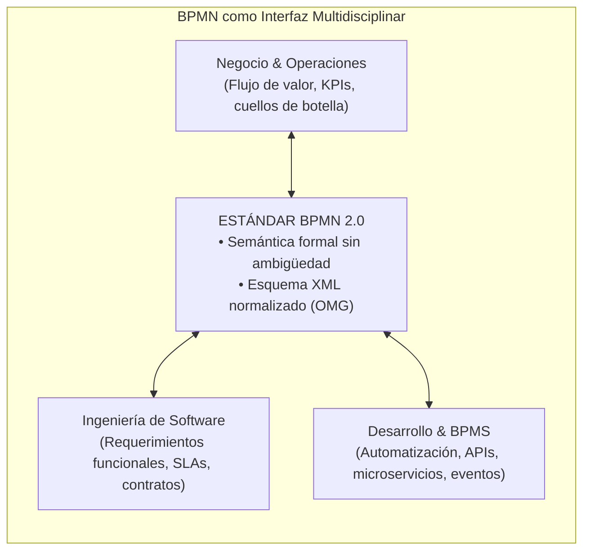
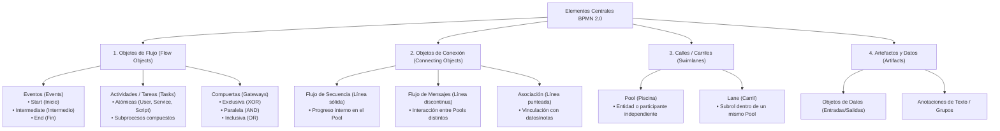
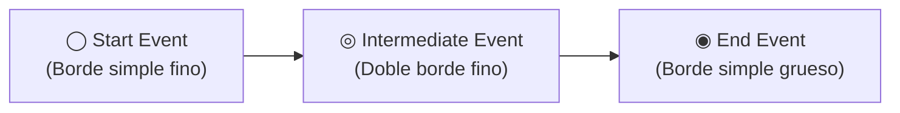
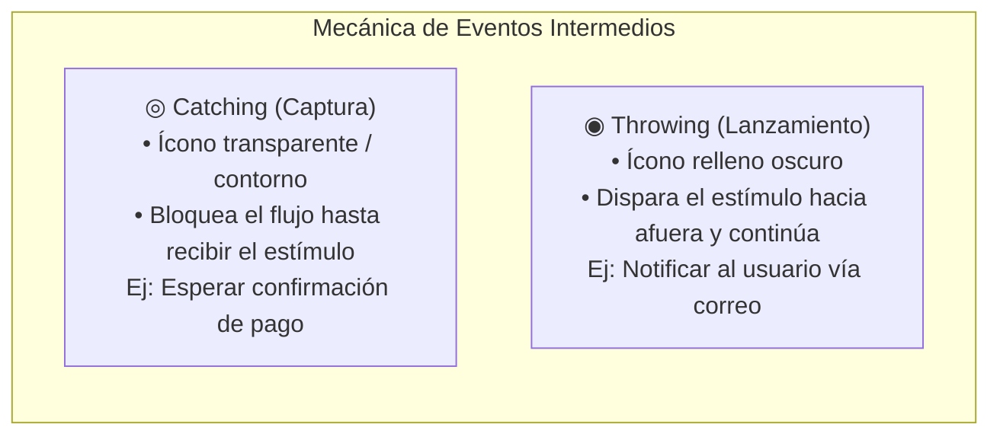
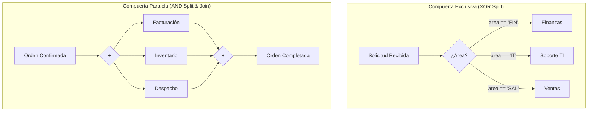
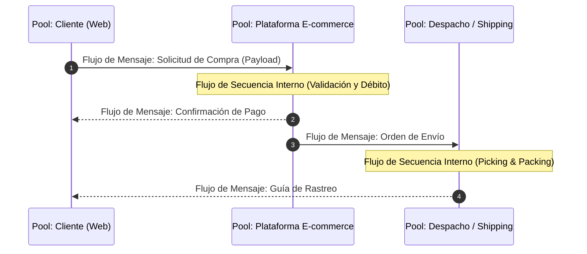
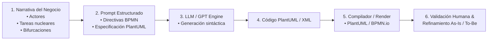
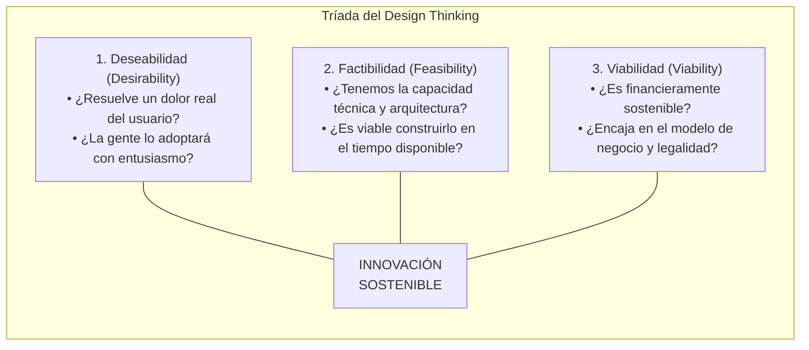
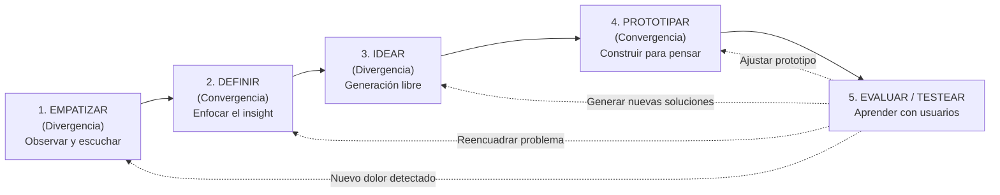
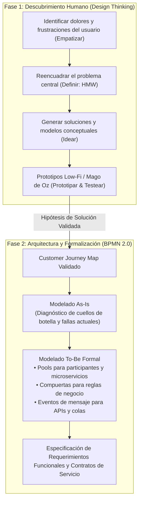

[← Volver a Curso.md](../Curso.md)

# 06. Modelado de Procesos con BPMN 2.0 y Metodología Design Thinking

> **Materia**: Sistemas de Información | **Docente**: PhD Jhon Alexander Garcia Camargo  
> **Fecha de Sesión**: 29 de septiembre de 2026  
> **Fuentes**: [Sesión 6. Guía Esencial para Iniciar con BPMN (Judlup, Medium)](../Documentos/Sesion%206.%20Guía%20Esencial%20para%20Iniciar%20con%20BPMN%20_%20by%20Judlup%20_%20Medium.pdf) | [Design Thinking: qué es y ejemplos de sus 5 etapas (Platzi)](https://youtu.be/Fs_n3g5mrvA?si=gC2BRvGU8mDuwM4v)  
> **Términos Core**: `BPMN 2.0`, `Proceso de Negocio`, `Events (Start, Intermediate, End)`, `Catching vs Throwing`, `Timer Event`, `Signal Event`, `Message Event`, `Error Event`, `Terminate End Event`, `Tasks (User, Service, Script)`, `Gateways (Exclusive XOR, Parallel AND)`, `Pools (Piscinas)`, `Lanes (Carriles)`, `Sequence Flow`, `Message Flow`, `Draw.io`, `BPMN.io`, `ProcessMaker`, `PlantUML`, `Diagram as Code`, `Design Thinking`, `Triple Criterio de Innovación (Deseabilidad, Factibilidad, Viabilidad)`, `Empatizar (Shadowing, Mapas de Empatía)`, `Definir (Problem Framing, HMW)`, `Idear (Brainstorming, Crazy Eights)`, `Prototipar (Low-Fi, Mago de Oz, Figma)`, `Evaluar / Testear`, `Proceso Iterativo / No Lineal`, `BPMN As-Is vs To-Be`.

---

## 1. Fundamentos de BPMN 2.0 (Business Process Model and Notation)

### 1.1 Definición y Propósito Arquitectónico
- **Estándar Gráfico Universal**: Notación estandarizada por la **OMG (Object Management Group)** diseñada para formalizar flujos de trabajo (*workflows*) organizacionales y técnicos de extremo a extremo (*end-to-end*).
- **Rol como Objeto Frontera (*Boundary Object*)**: Sirve de puente semántico unificado entre tres públicos con lenguajes dispares:
  - *Analistas y directivos de negocio*: Comprender el flujo de valor operativo y reglas de gobernanza.
  - *Ingenieros de requerimientos y arquitectos*: Especificar contratos de servicio, dependencias y comportamiento dinámico.
  - *Desarrolladores y motores de ejecución (BPMS)*: Traducir los diagramas directamente a código ejecutable o XML ejecutable (`BPMN 2.0 XML Schema`).
- **Axioma de Modelado**:
  $$\text{Proceso de Negocio} = \text{Secuencia estructurada de actividades que responde a un evento para generar valor observable a un cliente o stakeholder}$$



### 1.2 Taxonomía Estructural de Elementos BPMN



---

## 2. Elementos Básicos de Modelado: Eventos, Tareas y Compuertas

### 2.1 Eventos (Events): Anatomía y Ciclo de Vida
Los eventos representan algo que **sucede** durante el proceso. Se representan exclusivamente con **círculos** y se diferencian por el grosor de su borde y el marcador interno:

| Tipo de Evento | Borde Gráfico | Disparador / Semántica | Comportamiento en el Motor |
| :--- | :--- | :--- | :--- |
| **Start Event (Inicio)** | Línea simple **fina** | Marca el punto exacto donde se instancia e inicia el flujo. | Genera el token inicial del proceso. |
| **Intermediate Event (Intermedio)** | Línea **doble concéntrica fina** | Ocurre entre el inicio y el fin; altera o suspende el flujo. | Pausa el token (espera) o emite una señal sin detener el flujo. |
| **End Event (Fin)** | Línea **única gruesa** | Indica la finalización de una ruta de ejecución o de todo el proceso. | Consume el token; si no restan tokens, concluye la instancia. |



#### Mecánica Crítica: Catching (Captura) vs. Throwing (Lanzamiento)
En eventos intermedios y de frontera, la semántica operativa es antagónica:
- **Catching (Captura / Receptor)**:
  - *Representación visual*: Ícono interior transparente / con contorno blanco sin relleno.
  - *Comportamiento*: El proceso **se detiene y queda a la espera** de que un factor externo ocurra (recibir un mensaje HTTP, vencer un temporizador, recibir una señal broadcast).
- **Throwing (Lanzamiento / Emisor)**:
  - *Representación visual*: Ícono interior relleno / fondo negro u oscuro.
  - *Comportamiento*: El proceso **no se bloquea a esperar**; genera y despacha activamente una acción hacia el entorno (disparar un mensaje saliente, emitir una señal global, levantar un error de negocio).



#### Catálogo de Disparadores de Eventos Frecuentes
- **Message Event (Sobre)**:
  - *Start Message*: Nueva instancia creada al recibir un payload/mensaje.
  - *Intermediate Catch Message*: Espera pasiva de un webhook o respuesta asíncrona.
  - *End Message*: Envía un payload de finalización a un tercero.
- **Timer Event (Reloj)**:
  - *Start Timer*: Proceso batch que corre en un horario definido (cron) o fecha fija.
  - *Intermediate Timer*: Introduce un retardo formal (*delay*), espera de SLA o expiración de sesión.
- **Signal Event (Triángulo)**:
  - Difusión de radiodifusión (*broadcast*) uno-a-muchos (1:N) sin destinatario fijo.
- **Error Event (Relámpago)**:
  - Solo en Throwing (End) o Catching (Boundary). Modela excepciones, fallas técnicas o cancelaciones que interrumpen el flujo normal.
- **Terminate End Event (Círculo negro sólido en el centro)**:
  - **Efecto nuclear**: Aborta y purga inmediatamente todas las ramas paralelas vivas de la instancia, sin esperar a que concluyan.

---

### 2.2 Tareas (Tasks / Activities)
- **Definición**: Unidades de trabajo individuales no divisibles en el nivel actual de abstracción. Se grafican como **rectángulos con bordes redondeados**.
- **Regla de Sintaxis**: Etiquetar obligatoriamente bajo la estructura **[Verbo en Infinitivo] + [Sustantivo/Objeto]** (ej. `Validar Pago`, `Consultar Inventario`, `Despachar Pedido`).
- **Tipos de Tareas según Ejecutor**:
  - `User Task`: Tarea interactiva ejecutada por un ser humano asistido por un sistema informático.
  - `Service Task`: Ejecución automatizada de un servicio backend, API REST o microservicio sin intervención humana.
  - `Script Task`: Bloque de código ejecutado directamente por el motor de procesos.
  - `Manual Task`: Actividad física en el mundo real sin mediación de sistemas (ej. empacar caja física).

---

### 2.3 Compuertas (Gateways): Mecánica de Bifurcación y Fusión
Las compuertas controlan el enrutamiento divergente (*split*) y convergente (*join*) de los flujos de secuencia. Se grafican como **rombos / diamantes**.

| Tipo de Compuerta | Símbolo | Mecánica de Bifurcación (*Divergence / Split*) | Mecánica de Fusión (*Convergence / Join*) |
| :--- | :---: | :--- | :--- |
| **Exclusiva (XOR)** | Rombo con **'X'** o vacío | Evalúa condiciones mutuamente excluyentes. **Solo una ruta** de salida se activa. | Pasa el token directamente hacia la salida sin esperar a ninguna otra rama. |
| **Paralela (AND)** | Rombo con **'+'** | Activa **todas las rutas** de salida de forma simultánea e incondicional. | **Barrera de sincronización**: Espera a que un token arribe desde **cada una** de las ramas entrantes antes de proseguir. |



> [!WARNING] Trampa de Bloqueo Mutuo (*Deadlock*) con Compuertas AND
> Si se utiliza un Gateway AND en convergencia (*join*) pero las ramas previas provenían de un Gateway Exclusivo (XOR), el proceso quedará **congelado para siempre**. El Gateway AND requiere que llegue un token por cada enlace entrante; al venir de un XOR, solo llegará un token y las demás ramas jamás emitirán nada.

---

## 3. Estructuración Organizacional: Pools, Lanes y Reglas de Conexión

### 3.1 Pools (Piscinas) y Lanes (Carriles)
- **Pool (Piscina)**:
  - Representa un participante autónomo, una organización legal independiente, un departamento o un sistema externo independiente.
  - Posee límites de control administrativo propios.
  - La comunicación entre diferentes Pools modela una interacción **B2B o Cliente-Servidor**.
- **Lane (Carril)**:
  - Subdivisión interna vertical u horizontal dentro de un único Pool.
  - Representa roles específicos, unidades operativas o subsistemas internos que comparten el mismo proceso y memoria de control (ej. dentro del Pool *Operaciones*: Lane *Analista*, Lane *Supervisor*).

### 3.2 La Matriz Normativa de Conexiones de Flujo

| Elemento de Conexión | Sintaxis Visual | Ámbito Válido | Regla Normativa Estricta (OMG) |
| :--- | :--- | :--- | :--- |
| **Flujo de Secuencia (*Sequence Flow*)** | Flecha de línea **continua sólida**, cabeza de flecha rellena | **Únicamente dentro del MISMO Pool** (incluso entre diferentes Lanes del mismo Pool). | **TERMINANTEMENTE PROHIBIDO** conectar elementos de un Pool con otro Pool mediante flujo de secuencia. Rompe la semántica de aislamiento de procesos. |
| **Flujo de Mensajes (*Message Flow*)** | Flecha de línea **discontinua / guiones**, inicio con círculo vacío, cabeza abierta | **Exclusivamente ENTRE dos Pools diferentes**. | Conecta actividades, eventos o los bordes mismos de los Pools. **NUNCA** puede utilizarse dentro de un mismo Pool. |



---

## 4. Modelado Asistido por Inteligencia Artificial y Diagramming-as-Code

### 4.1 Flujo Operativo: De la Narrativa de Negocio al Renderizado
El enfoque moderno de ingeniería no requiere diagramar pixel a pixel de forma manual en etapas preliminares; se apoya en modelos de lenguaje (*LLMs*) y motores de generación de diagramas como código:



### 4.2 Plantilla de Prompting Estructurado para Generación BPMN
Para garantizar que el modelo genere diagramas sin fallas de sintaxis ni inconsistencias semánticas:
```text
Rol: Eres un Arquitecto de Procesos de Negocio experto en BPMN 2.0.
Entrada: [Descripción detallada del proceso con roles, entradas, salidas y excepciones].
Restricciones de Generación:
1. Agrupar cada participante autónomo en su propio Pool/Swimlane.
2. Usar exclusivamente flujos de secuencia dentro del mismo Pool.
3. Usar flujos de mensajes para intercambios asíncronos entre Pools.
4. Etiquetar compuertas con preguntas claras y nombrar todas las ramas de salida.
5. Formato de salida: Código limpio compatible con PlantUML (@startuml ... @enduml).
```

### 4.3 Ecosistema Comparativo de Herramientas BPMN

| Herramienta | Tipo | Fortalezas Técnicas | Caso de Uso Óptimo |
| :--- | :--- | :--- | :--- |
| **Draw.io** | Gráfica generalista | Gratuita, sin registro, integración fluida con Google Drive/GitHub, soporte amplio de librerías BPMN 2.0. | Wireframing rápido, documentación preliminar y apuntes académicos. |
| **BPMN.io (bpmn-js)** | Framework web estándar | 100% fiel a la especificación OMG BPMN 2.0; exporta e importa archivos `.bpmn` (XML) limpios. | Validación técnica de modelos, incrustación en aplicaciones web y estándares formales. |
| **ProcessMaker** | Suite corporativa / BPMS | Validación lógica del motor, automatización de pantallas, gobernanza y orquestación con IA nativa. | Procesos empresariales listos para automatización y ejecución en producción. |
| **PlantUML** | Diagram as Code (Texto) | Permite versionado en Git (`git diff`), automatización en pipelines CI/CD y generación directa por LLMs. | Arquitectura ágil, documentación de código y generación masiva asistida por IA. |

---

## 5. Metodología Design Thinking y sus 5 Etapas

### 5.1 Filosofía y Paradigma Centrado en las Personas (*Human-Centered Design*)
- **Premisa Central**: "Dejar el ego de lado; el equipo de ingeniería y producto no es el usuario final".
- **Objetivo**: Resolver problemas complejos e indefinidos (*wicked problems*) mediante empatía activa, pensamiento divergente/convergente y validación empírica iterativa.
- **La Tríada de la Innovación Exitosa**:
  $$\text{Innovación Sostenible} = \text{Deseabilidad (Humanos)} \;\cap\; \text{Factibilidad (Tecnología)} \;\cap\; \text{Viabilidad (Negocio)}$$



---

### 5.2 Las 5 Etapas del Ciclo de Design Thinking



#### 1. Empatizar (*Empathize*)
- **Propósito**: Comprender el contexto social, emocional y funcional de las personas para las que se diseña, descubriendo necesidades latentes no verbalizadas.
- **Técnicas Clave**:
  - *Observación directa y Shadowing*: Acompañar al usuario en su rutina real sin interferir.
  - *Entrevistas en profundidad*: Preguntas abiertas enfocadas en experiencias pasadas recientes ("Cuéntame la última vez que intentaste...").
  - *Mapa de Empatía*: Cuadrantes sistemáticos que categorizan: ¿Qué dice?, ¿Qué hace?, ¿Qué piensa?, ¿Qué siente?
- **Regla de Oro**: Prohibido justificar las fallas actuales del sistema; escuchar y registrar la frustración pura.

#### 2. Definir (*Define*)
- **Propósito**: Procesar la masa de datos cualitativos recopilados para identificar patrones, tensiones y formular **Insights** (revelaciones profundas sobre la conducta humana).
- **Problem Framing**: Transformar un síntoma superficial en la verdadera causa raíz.
- **Formulación Operativa: How Might We? (HMW - ¿Cómo podríamos...?)**:
  - Sintaxis: *"¿Cómo podríamos [acción deseada] para que [usuario específico] logre [beneficio esencial] sin experimentar [fricción/dolor crítico]?"*
  - Convierte un problema pasivo en un disparador activo de diseño sin insinuar una solución prematura.

#### 3. Idear (*Ideate*)
- **Propósito**: Generar el mayor volumen y variedad de ideas posibles (*pensamiento divergente*), postergando todo juicio crítico o análisis de costos en primera instancia.
- **Técnicas Operativas**:
  - *Brainstorming estructurado*: Cantidad sobre calidad; construir sobre las ideas de los demás (*"Sí, y además..."* en lugar de *"No, pero..."*).
  - *Crazy Eights*: Ejercicio de sketching donde cada integrante dibuja 8 ideas distintas en 8 minutos (1 minuto por idea) para romper bloqueos creativos.
  - *Filtrado Convergente*: Matriz de Priorización Impacto vs. Esfuerzo para seleccionar las 2–3 mejores candidatas a prototipar.

#### 4. Prototipar (*Prototype*)
- **Propósito**: Hacer las ideas tangibles de forma rápida y económica para interactuar con ellas, detectar fallas conceptuales y validar supuestos antes de involucrar código de producción.
- **Principio**: *"Construir para pensar, no pensar para construir"*.
- **Especies de Prototipos Rápidos**:
  - *Baja Fidelidad (Low-Fi)*: Bocetos en papel, esquemas en servilletas, maquetas de cartón. Ideales para validar flujos lógicos en minutos.
  - *Digitales Interactivos*: Wireframes navegables en Figma o Marvel. Validan usabilidad y jerarquía visual.
  - *Prototipo Mago de Oz (Wizard of Oz)*:
    - La interfaz simula ser un sistema 100% automatizado, con algoritmos o IA.
    - En la trastienda (*backend* invisible), un operador humano realiza manualmente el procesamiento y responde las solicitudes en tiempo real.
    - Valida si el cliente realmente desea el valor del servicio antes de escribir una sola línea de código backend o entrenar modelos.
  - *Prototipo Conserje (Concierge)*: Se provee el servicio de forma manual y personalizada cara a cara para entender a fondo la dinámica de la lógica de negocio.

#### 5. Evaluar / Testear (*Test*)
- **Propósito**: Enfrentar el prototipo con usuarios reales para validar o refutar las hipótesis críticas de valor y usabilidad.
- **Mecánica de Evaluación**:
  - Proponer escenarios de tareas concretas (ej. *"Intenta agendar una cita para el próximo viernes"*).
  - Pedir al usuario que piense en voz alta (*Think Aloud Protocol*).
  - Observar el lenguaje corporal, vacilaciones, errores de clic y frustraciones.
  - Prohibido vender o defender la interfaz: si el usuario no encuentra el botón, la falla es del diseño, no del usuario.
- **Naturaleza No Lineal e Iterativa**:
  - El resultado del test no es un aprobado/reprobado binario; es telemetría cualitativa que redirige el flujo:
    - ¿La idea resuelve el dolor pero la interfaz confunde? $\rightarrow$ Volver a **Prototipar**.
    - ¿La solución no genera interés real? $\rightarrow$ Volver a **Idear**.
    - ¿El problema planteado no le importa al cliente? $\rightarrow$ Volver a **Empatizar / Definir**.

---

## 6. Sinergia Metodológica: Del Customer Journey al Proceso BPMN To-Be

En la ingeniería de sistemas moderna, el Design Thinking y BPMN no compiten; son fases complementarias del ciclo de descubrimiento y formalización:



| Dimensión | Design Thinking | BPMN 2.0 |
| :--- | :--- | :--- |
| **Foco de Análisis** | Experiencia humana, emociones, dolores, motivación y usabilidad. | Lógica operacional, secuencia temporal, contratos de intercambio y reglas. |
| **Fase del Ciclo** | Problem Space & Exploración temprana del Solution Space. | Especificación formal del Solution Space y arquitectura de ejecución. |
| **Pregunta Central** | ¿Qué necesita verdaderamente la persona y qué solución le genera valor? | ¿Cómo se orquesta paso a paso el flujo de trabajo entre personas y sistemas? |
| **Artefactos Típicos** | Mapas de empatía, Customer Journey Maps, wireframes Figma, prototipos Mago de Oz. | Diagramas de proceso con Pools, Lanes, tareas de servicio, compuertas y eventos. |

---

## 7. Puntos Críticos de Examen, Casos Trampa y Antipatrones

### 7.1 Casos Trampa en Modelado BPMN
1. **Flujo de Secuencia cruzando límites de Pool**:
   - *Error*: Dibujar una flecha continua que sale de una tarea en el `Pool A` y entra directamente a una compuerta en el `Pool B`.
   - *Consecuencia*: Infracción sintáctica invalidante en BPMN 2.0. Un proceso no puede imponer control de secuencia interno a una entidad externa.
   - *Corrección*: Reemplazar por un **Flujo de Mensajes** (flecha punteada con círculo inicial) entre los dos Pools.
2. **Gateway Exclusivo (XOR) sin condición por defecto / no exhaustivo**:
   - *Error*: Establecer ramas condicionales en un XOR (ej. `monto > 100` y `monto < 50`) sin contemplar los valores intermedios (`50 <= monto <= 100`).
   - *Consecuencia*: Pérdida de tokens y congelamiento de la instancia en tiempo de ejecución.
   - *Corrección*: Definir siempre una rama de escape con la condición por defecto (*default flow*, marcada con una barra oblicua inclinada sobre la flecha).
3. **Deadlock por convergencia AND tras divergencia XOR**:
   - *Error*: Abrir con XOR (donde solo viaja un token por una rama) y cerrar esas mismas ramas con un AND join.
   - *Consecuencia*: El gateway AND espera la llegada simultánea de tokens de todas las ramas; como el XOR solo produjo uno, el sistema se bloquea indefinidamente.
4. **Confusión entre Intermediate Catching y Intermediate Throwing**:
   - *Error*: Modelar el envío de una notificación por correo con un evento intermedio de mensaje Catching (blanco).
   - *Consecuencia*: El motor se detendrá a esperar recibir un correo en lugar de enviarlo. Debe usarse un evento intermedio Throwing (relleno) o una `Send Task`.

### 7.2 Antipatrones en Design Thinking
1. **La Trampa del Falso Testeo ("Vender la idea")**:
   - *Error*: El equipo explica al usuario cómo usar la pantalla o lo convence de por qué su idea es buena durante la prueba.
   - *Efecto*: Sesga totalmente la retroalimentación (*sesgo de complacencia*); el usuario dirá que le gusta para no ofender al diseñador.
2. **Prototipar demasiado tarde con código de producción**:
   - *Error*: Asignar desarrolladores a programar el backend antes de testear wireframes en papel o con Mago de Oz.
   - *Efecto*: Incurrir en la **Trampa del Prototipo Costoso** (*Expensive Prototype Trap*). El costo de cambiar una idea codificada es $100\times$ superior al de cambiar un boceto en papel.
3. **Saltarse la Definición (del Dolor a la Solución sin Insight)**:
   - *Error*: Tras hacer entrevistas, pasar inmediatamente a programar la primera idea que se le ocurrió al equipo sin sintetizar los insights con preguntas HMW.
   - *Efecto*: Se termina resolviendo de forma impecable el problema equivocado.

