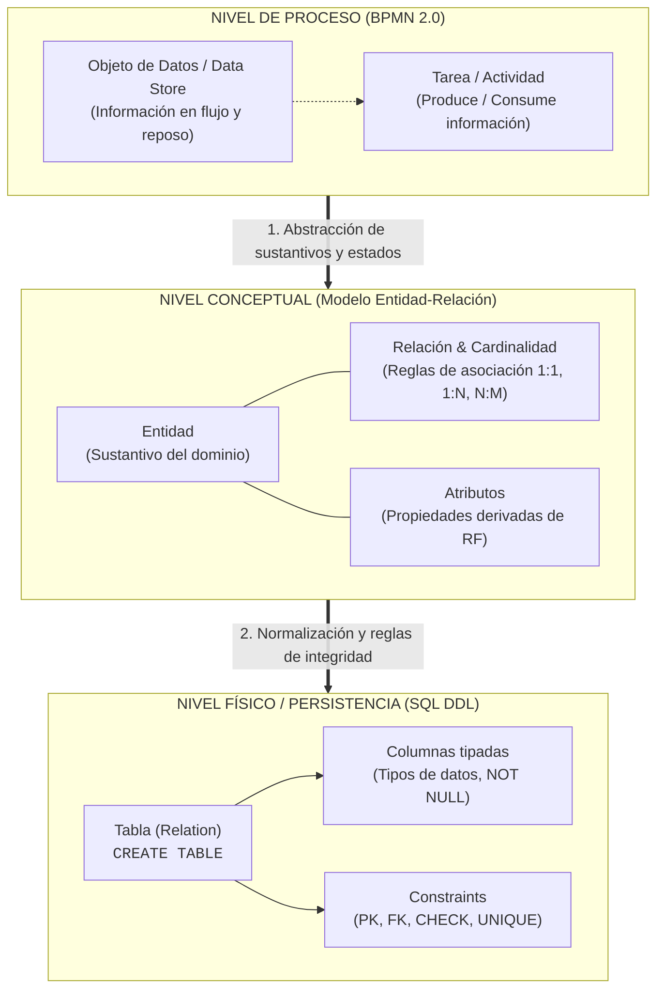
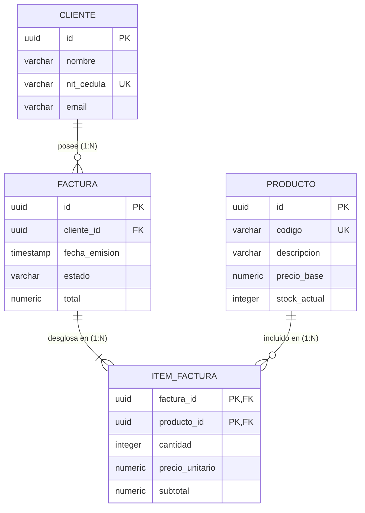
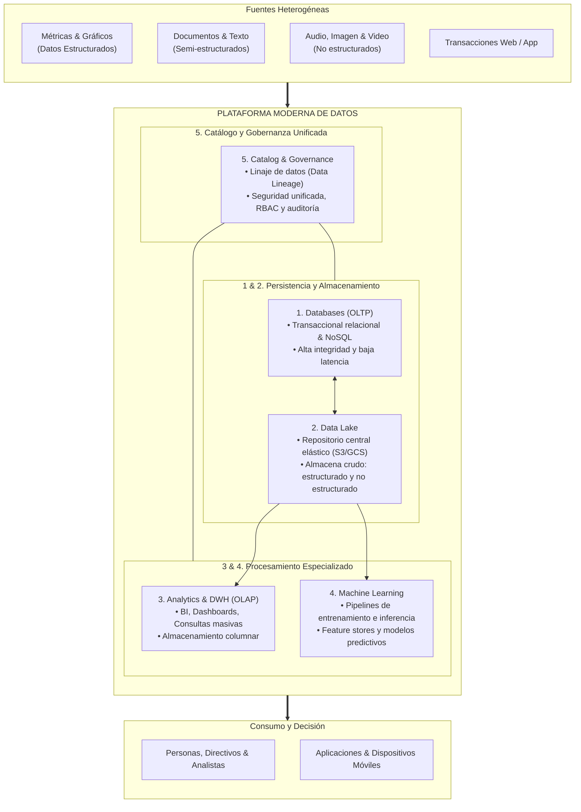
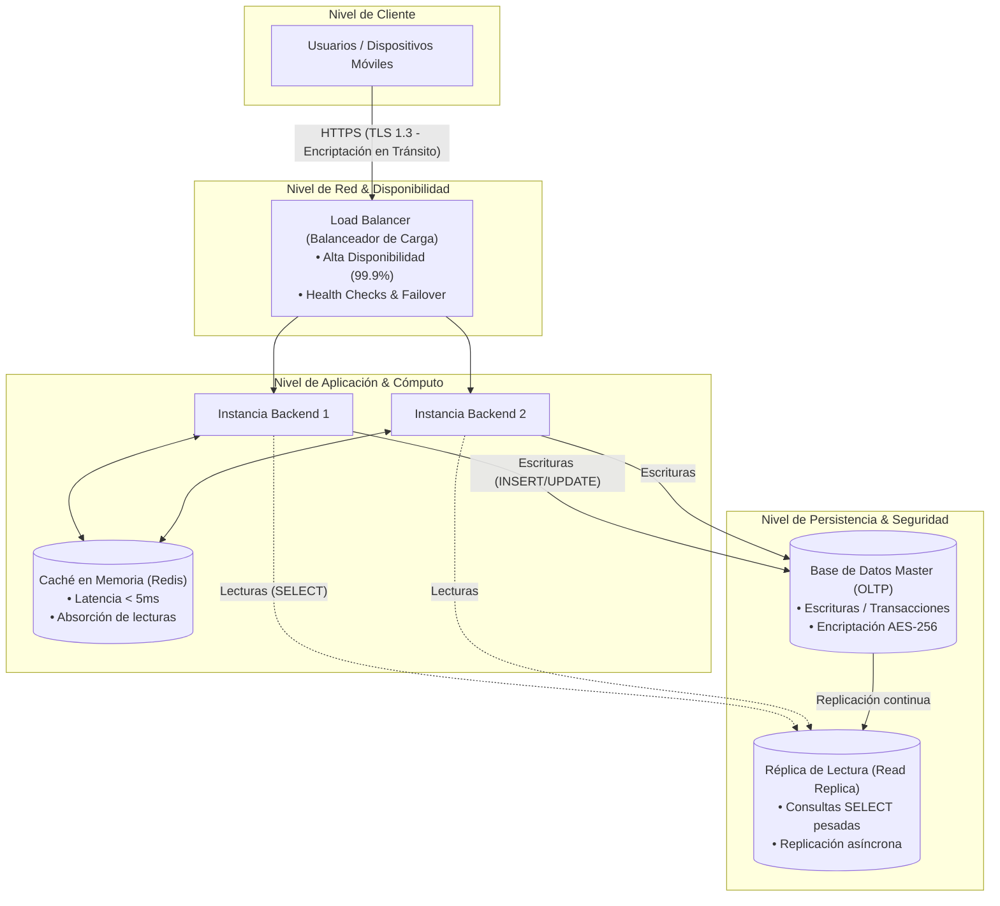
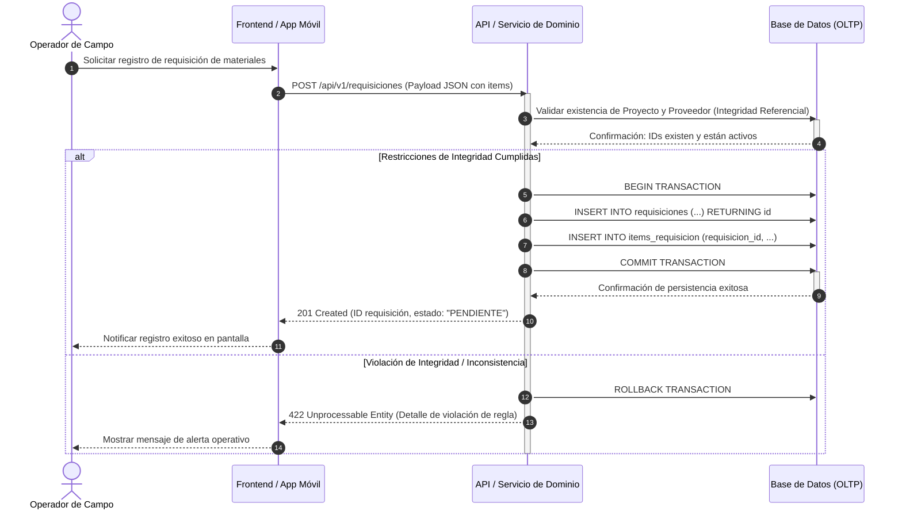

[← Volver a Curso.md](../Curso.md)

# 07. Arquitectura de Datos, Modelado Relacional y Requerimientos No Funcionales

> **Materia**: Sistemas de Información | **Docente**: PhD Jhon Alexander Garcia Camargo  
> **Fecha de Sesión**: 01 de octubre de 2026  
> **Fuentes**: [Sesión 7. Arquitectura de datos.pdf](../Documentos/Sesión%207.%20Arquitectura%20de%20datos.pdf) | [AWS - ¿Qué es la arquitectura de datos?](https://aws.amazon.com/es/what-is/data-architecture/) | [Fundamentals of Data Engineering (Reis & Housley)](https://www.oreilly.com/library/view/fundamentals-of-data/9781098108304/) | [Tutorial SQL y Modelado Relacional](https://www.w3schools.com/sql/)  
> **Términos Core**: `Arquitectura de Datos`, `BPMN to SQL`, `Data Objects (BPMN)`, `Data Store`, `Entidades`, `Atributos`, `Modelo Entidad-Relación (MER/DER)`, `Cardinalidad (1:1, 1:N, N:M)`, `Restricciones de Integridad`, `Integridad de Entidad (PK)`, `Integridad Referencial (FK)`, `Registros Huérfanos`, `ON DELETE CASCADE / RESTRICT / SET NULL`, `Integridad de Dominio (CHECK, NOT NULL)`, `Modern Data Architecture`, `Databases (OLTP)`, `Data Lakes`, `Data Warehouse (OLAP)`, `Analytics`, `Machine Learning`, `Data Governance`, `Data Catalog`, `Requerimientos No Funcionales (RNF)`, `Disponibilidad (Load Balancer, Multi-AZ)`, `Seguridad (Encryption at rest AES-256, In-transit TLS)`, `Escalabilidad (Vertical, Horizontal, Read Replicas, Caching Redis)`, `Diagrama de Secuencia UML`, `Modelado de Comportamiento`, `Hito 2`.

---

## 1. De los Procesos de Negocio a la Persistencia Relacional (BPMN a SQL)

### 1.1 El Problema de Traducción Semántica
- **Pregunta Arquitectónica Central**: ¿Cómo se traduce un flujo gráfico modelado en BPMN (círculos, tareas, compuertas y objetos de datos) a esquemas relacionales tabulares en SQL?
- **Mapeo Ontológico Trilateral**:
  1. **Objetos de Datos en BPMN (`Data Object` / `Data Store`)**: Representan la información que fluye, se produce, se consume o se persiste durante la ejecución de las actividades del proceso de negocio.
  2. **Entidades en Persistencia**: Los sustantivos del dominio identificados en el proceso (`Cliente`, `Factura`, `Inventario`, `Proyecto`, `Requisición`, `Acta`).
  3. **Atributos**: Propiedades cualitativas, cuantitativas e identificadores de las entidades, deducidos a partir de la especificación de los requerimientos funcionales (`RF`).

### 1.2 Correspondencia Metodológica Directa

| Elemento BPMN 2.0 | Elemento Conceptual (MER / DER) | Equivalente Relacional (SQL DDL) | Propósito Técnico |
| :--- | :--- | :--- | :--- |
| **Data Object** *(documento o información temporal)* | **Entidad** o estado de entidad | **Tabla** transaccional o columna de estado (`status`) | Capturar datos generados durante un flujo transitorio de actividad. |
| **Data Store** *(almacén permanente)* | **Conjunto de Entidades** persistentes | **Base de Datos / Esquema Tabular** | Persistir estados inmutables o mutables con garantías ACID. |
| **Línea de Asociación de Datos** | **Relación** formal entre entidades | **Clave Foránea (`FOREIGN KEY`)** | Establecer dependencia referencial entre los datos manipulados. |
| **Requerimiento Funcional (`RF`)** | **Atributos de Entidad** | **Columnas y tipos de datos** (`VARCHAR`, `INT`, `UUID`) | Definir estructura, granularidad y dominio admisible del dato. |
| **Regla de Negocio en Tarea** | **Restricción de Integridad** | `CHECK`, `NOT NULL`, `UNIQUE`, `DEFAULT` | Forzar que la base de datos rechace estados inconsistentes. |

---

## 2. Modelo Entidad-Relación y Reglas de Integridad del Negocio

### 2.1 Principio Rector: «No sólo cajas, sino reglas»
- Un Diagrama Entidad-Relación (DER) no es un diagrama gráfico ilustrativo; es un **contrato formal de invariantes y reglas de negocio**.
- Cada caja (Entidad) encapsula una abstracción cohesiva; cada línea (Relación) impone reglas matemáticas de cardinalidad y restricciones de participación que la capa de persistencia debe hacer cumplir de forma estricta.

### 2.2 Cardinalidad y Multiplicidad Operativa
- Modela cuántas instancias de una entidad B pueden o deben asociarse con una instancia de una entidad A:
  - **$1:1$ (Uno a Uno)**: Una factura pertenece estrictamente a un comprobante fiscal único. Suele implementarse compartiendo la clave primaria (`PK = FK`) o con `UNIQUE` en la clave foránea.
  - **$1:N$ (Uno a Muchos)**: Un cliente puede emitir $N$ facturas; una factura pertenece forzosamente a $1$ cliente. La clave foránea (`FK`) reside siempre en la tabla del lado $N$ (la tabla hija).
  - **$N:M$ (Muchos a Muchos)**: Un pedido contiene $N$ productos; un producto puede estar presente en $M$ pedidos.
    - **Regla Obligatoria de Normalización**: Las relaciones $N:M$ **no pueden persistirse directamente** en el modelo relacional. Deben descomponerse mediante una **tabla asociativa / intermedia** con una clave primaria compuesta formada por las dos FKs (`pedido_id`, `producto_id`), permitiendo además atributos propios de la relación (ej. `cantidad`, `precio_unitario_venta`).

### 2.3 Taxonomía de Restricciones de Integridad
El motor de base de datos debe impedir matemáticamente la corrupción de la información mediante cuatro niveles de restricciones:

1. **Integridad de Entidad**:
   - Garantiza que cada registro sea unívocamente identificable y no nulo.
   - Mecanismo: Clave Primaria (`PRIMARY KEY`), índice único implícito, inmutabilidad de la clave artificial (`UUID` o `BIGINT IDENTITY`).
2. **Integridad Referencial**:
   - Garantiza la consistencia entre tablas vinculadas; ninguna clave foránea puede apuntar a una clave primaria inexistente.
   - **Prevención de Registros Huérfanos**: Un registro hijo no puede existir desvinculado de su padre en el negocio.
   - Políticas declarativas en SQL ante mutación/borrado del padre (`ON DELETE` / `ON UPDATE`):
     - `RESTRICT / NO ACTION`: Rechaza la operación si existen hijos vinculados (**Comportamiento recomendado por defecto para transacciones financieras y contables**).
     - `CASCADE`: Propaga la eliminación o actualización eliminando automáticamente todos los registros hijos dependientes (**Riesgoso**: destruye trazabilidad histórica si se aplica a entidades maestras).
     - `SET NULL`: Establece la FK del hijo en `NULL` (requiere que la columna admita nulos; aplica a dependencias opcionales).
3. **Integridad de Dominio**:
   - Asegura la validez de los valores almacenados en cada columna.
   - Mecanismo: Tipado estricto, cláusulas `NOT NULL`, restricciones de rango o valor permitido mediante `CHECK (precio >= 0)`, y tipos enumerados (`ENUM`).
4. **Integridad Definida por el Usuario / Negocio**:
   - Reglas complejas que involucran múltiples tablas o aserciones contextuales.
   - Mecanismo: Triggers transaccionales, aserciones o validaciones atomizadas en la capa de servicios (*Business Logic Layer*).

---

## 3. Arquitectura Moderna de Datos (Modern Data Architecture)

### 3.1 Separación de Cargas de Trabajo: OLTP vs. OLAP
- **OLTP (OnLine Transaction Processing)**:
  - Optimizado para transacciones atómicas frecuentes, lecturas/escrituras rápidas por registro individual, alta concurrencia e integridad estricta (modelo altamente normalizado en 3NF).
  - Motores: PostgreSQL, MySQL, Amazon Aurora.
- **OLAP (OnLine Analytical Processing)**:
  - Optimizado para consultas de agregación analítica masiva sobre millones de registros (`SUM`, `AVG`, `GROUP BY`), escaneo columnar y generación de reportes gerenciales/BI.
  - Motores: Amazon Redshift, Google BigQuery, Snowflake, ClickHouse.
- **Axioma Arquitectónico**: Jamás ejecutar consultas analíticas masivas no indexadas sobre la base de datos operacional OLTP; degrada el *throughput* y bloquea las transacciones del usuario final.

### 3.2 Los 5 Pilares de la Arquitectura Moderna (Referencia AWS)
La arquitectura moderna desacopla almacenamiento, cómputo y especialización funcional en 5 componentes gobernados:

### 3.3 Síntesis Comparativa de Paradigmas de Almacenamiento

| Dimensión | Base de Datos Relacional (OLTP) | Data Warehouse (OLAP) | Data Lake | Data Lakehouse |
| :--- | :--- | :--- | :--- | :--- |
| **Tipo de Datos** | Estructurados (Tablas, Esquemas rígidos). | Estructurados y semi-estructurados limpios. | Crudos: estructurados, semi-estructurados y no estructurados (imágenes, logs, audio). | Unificado: estructurados y no estructurados con capa transaccional. |
| **Esquema** | *Schema-on-Write* (esquema definido antes de persistir). | *Schema-on-Write* (modelado dimensional en estrella / copo de nieve). | *Schema-on-Read* (el esquema se aplica al momento de consultar). | Híbrido (*Schema Enforcement* + *Evolution* vía Parquet/Delta Lake). |
| **Garantías** | Transacciones ACID estrictas. | ACID analítico o batch transaccional. | Eventual Consistency / Sin transacciones nativas estándar. | Soporte nativo ACID sobre almacenamiento de objetos. |
| **Costo por TB** | Alto (requiere disco SSD de alta velocidad y CPU activa). | Medio a Alto (cómputo y almacenamiento integrados u optimizados). | **Muy Bajo** (almacenamiento de objetos masivo tipo Amazon S3). | **Bajo** (almacenamiento desacoplado en S3 + cómputo bajo demanda). |

---

## 4. Resolución Arquitectónica de Requerimientos No Funcionales (RNF)

Los Requerimientos No Funcionales (especificados mediante **ISO/IEC 25010**) imponen restricciones que no se resuelven en la interfaz de usuario, sino en el **diseño de infraestructura, topología de red y capa de persistencia**:

### 4.1 Disponibilidad (*Availability*)
- **Meta Arquitectónica**: Garantizar acceso continuo al servicio minimizando el tiempo fuera de servicio (*downtime*).
- **Tácticas de Persistencia e Infraestructura**:
  - **Balanceadores de Carga (Load Balancers)**: Distribuyen el tráfico entrante de manera uniforme entre múltiples instancias del servicio mediante algoritmos *Round-Robin* o de menor conexión, aislando instancias caídas mediante chequeos periódicos de salud (*health checks*).
  - **Replicación Multi-AZ / Multi-Región**: Configuración maestro-esclavo (*Primary-Standby*) con réplicas síncronas en zonas de disponibilidad aisladas y conmutación por error automática (*failover* transparente).
  - **Métricas Operativas**:
    $$\text{Disponibilidad (\%)} = \left(\frac{\text{Tiempo Operativo}}{\text{Tiempo Operativo} + \text{Tiempo de Inactividad}}\right) \times 100$$
    - Acuerdos de Nivel de Servicio (SLA) objetivos: $99.9\%$ (8.7 horas de caída anual máxima) o $99.99\%$ (52.6 minutos anuales).

### 4.2 Seguridad (*Security*)
- **Meta Arquitectónica**: Garantizar confidencialidad, integridad, autenticidad y no repudio de la información.
- **Tácticas de Persistencia**:
  - **Encriptación en Tránsito (*Encryption in Transit*)**: Obligatoriedad de canales cifrados criptográficamente con **TLS 1.3** / HTTPS; terminación TLS segura en el balanceador o *mTLS* (mutual TLS) entre microservicios.
  - **Encriptación en Reposo (*Encryption at Rest*)**: Cifrado a nivel de bloque y sistema de archivos mediante algoritmo simétrico **AES-256** para bases de datos relacionales, discos elásticos y backups. Llaves de cifrado gestionadas con rotación automática mediante HSM/KMS.
  - **Control de Acceso Basado en Roles (RBAC)**: Principio de menor privilegio aplicado a nivel de base de datos; usuarios de la aplicación no conectan como superusuario (`postgres`/`root`), sino mediante usuarios técnicos con permisos acotados estrictamente a sentencias específicas por esquema (`GRANT SELECT, INSERT ON ...`).
  - **Pistas de Auditoría (*Audit Trails*)**: Cada tupla sensible contiene metadatos obligatorios de trazabilidad (`created_at`, `created_by`, `updated_at`, `updated_by`) o se respalda mediante CDC (*Change Data Capture*) inmutable.

### 4.3 Escalabilidad (*Scalability*)
- **Meta Arquitectónica**: Capacidad del sistema de soportar incrementos significativos de carga operativa y concurrencia sin degradar los tiempos de respuesta proyectados en el Product Discovery.
- **Tácticas de Persistencia**:
  - **Escalamiento Vertical (*Scale-Up*) vs. Horizontal (*Scale-Out*)**: El escalamiento vertical de bases de datos alcanza rápidamente techos físicos y costos marginales prohibitivos; la arquitectura moderna prioriza el escalamiento horizontal.
  - **Réplicas de Lectura (*Read Replicas*)**: En sistemas con patrón $80/20$ (80% lecturas, 20% escrituras), las sentencias de solo lectura (`SELECT`) se desvían a un grupo de réplicas secundarias, liberando a la base de datos principal exclusivamente para escrituras transaccionales (`INSERT`, `UPDATE`, `DELETE`).
  - **Capa de Almacenamiento en Caché (*In-Memory Caching*)**: Implementación de almacenes de clave-valor ultrarrápidos (Redis / Memcached) frente a la base de datos para desacoplar consultas de alta frecuencia y baja tasa de mutación (ej. catálogos, sesiones de usuario, tokens JWT), reduciendo la latencia de decenas de milisegundos a $< 5\text{ ms}$.
  - **Particionamiento y Sharding**: División horizontal de tablas de alta volumetría por rangos de fecha, regiones geográficas o hashes de identificación.

---

## 5. Modelado de Comportamiento e Integración para Hito 2

### 5.1 Especificación de la Actividad Práctica para Hito 2
Para consolidar la transición entre el análisis de requerimientos/procesos y la arquitectura técnica de la solución, el docente define cuatro entregables encadenados:

1. **Recuperación del BPMN To-Be**: Tomar el proceso futuro modelado en el hito previo.
2. **Identificación de 3 Objetos de Datos Clave**: Extraer tres flujos de información críticos que transiten por las actividades del proceso (ej. `Pedido`, `Cliente`, `Producto` o `Requisición`, `APU`, `Acta de Obra`).
3. **Modelado Conceptual (DER)**: Construir un Diagrama Entidad-Relación que soporte estructuralmente dichos objetos, especificando entidades, claves primarias, atributos clave, cardinalidades y claves foráneas.
4. **Modelado de Comportamiento (Diagrama de Secuencia UML)**: Seleccionar la **Historia de Usuario (HU) más compleja** del backlog y diagramar la interacción dinámica secuencial entre las capas del sistema durante su ejecución.

### 5.2 Estructura y Notación Formal del Diagrama de Secuencia UML
- **Líneas de Vida (*Lifelines*)**: Representan las instancias de componentes o actores que participan en la ejecución (`Actor`, `Frontend/UI`, `API Gateway/Controlador`, `Servicio/Lógica de Negocio`, `Base de Datos/Persistencia`).
- **Tipología de Flechas**:
  - Flecha sólida con punta rellena (`->>`): Mensaje sincrónico bloqueante (el invocador espera la respuesta).
  - Flecha discontinua con punta abierta (`-->>`): Mensaje de retorno / respuesta.
- **Fragmentos Combinados (Operadores de Control)**:
  - `alt / else`: Lógica condicional alternativa (ej. validación exitosa vs. rechazo de integridad).
  - `opt`: Bloque de ejecución opcional.
  - `loop`: Reiteración secuencial.

---

## 6. Puntos Críticos de Evaluación, Antipatrones y Errores Típicos

### 6.1 Antipatrones Graves de Persistencia y Arquitectura
- **El Registro Huérfano (*Orphan Record*)**:
  - *Error*: Crear tablas sin definir explícitamente restricciones de `FOREIGN KEY`, confiando en que "el backend controlará la integridad por código".
  - *Consecuencia*: Ante excepciones no controladas o accesos concurrentes, quedan registros hijos referenciando IDs inexistentes, corrompiendo la consistencia relacional.
- **Uso Indiscriminado de `ON DELETE CASCADE`**:
  - *Error*: Configurar borrado en cascada sobre entidades de auditoría, contabilidad o transacciones críticas de negocio.
  - *Consecuencia*: Eliminar un usuario elimina automáticamente todo su historial de pedidos, facturas y firmas digitales, violando leyes de retención documental y auditoría.
- **Antipatrón de la Entidad Monolítica (*God Table*)**:
  - *Error*: Crear una única tabla gigante con decenas de columnas nulas para evitar crear relaciones y uniones (`JOIN`).
  - *Consecuencia*: Pérdida de normalización, anomalías de inserción, actualización y borrado, y degradación del almacenamiento.
- **Sobrecarga de la Base de Datos con Archivos Binarios (*BLOB Trap*)**:
  - *Error*: Almacenar imágenes, planos arquitectónicos o PDFs escaneados directamente en columnas `BYTEA` / `BLOB` de la base de datos relacional.
  - *Solución Correcta*: Almacenar los binarios en un repositorio de objetos elástico (Data Lake / S3 / Cloud Storage) y persistir en la base de datos relacional únicamente la URL, el hash criptográfico y los metadatos de acceso.

### 6.2 Checklist de Verificación para Entrega de Hito 2
- [ ] **Trazabilidad BPMN $\rightarrow$ DER**: ¿Los 3 objetos de datos seleccionados provienen textualmente de artefactos visibles en el BPMN To-Be?
- [ ] **Normalización y Relaciones $N:M$**: ¿Todas las relaciones de cardinalidad muchos a muchos fueron descompuestas en tablas asociativas con sus correspondientes claves foráneas compuestas?
- [ ] **Reglas de Integridad Declaradas**: ¿El DER documenta explícitamente qué campos son `PK`, `FK`, `NOT NULL`, `UNIQUE` y qué regla de eliminación rige la relación?
- [ ] **Alineación de RNF con Arquitectura**: ¿Se justificó cómo el esquema y la infraestructura responden a la disponibilidad, seguridad (cifrado) y escalabilidad?
- [ ] **Comportamiento Dinámico Completo**: ¿El Diagrama de Secuencia UML de la Historia de Usuario más compleja modela las llamadas entre capas, el manejo transaccional (`BEGIN/COMMIT/ROLLBACK`) y los casos alternativos de error?

